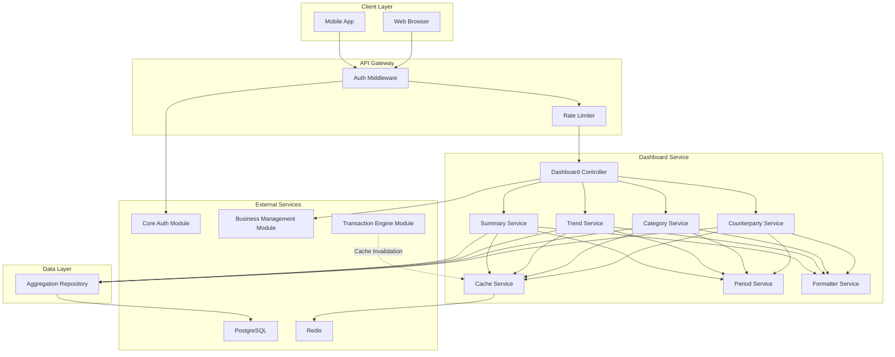
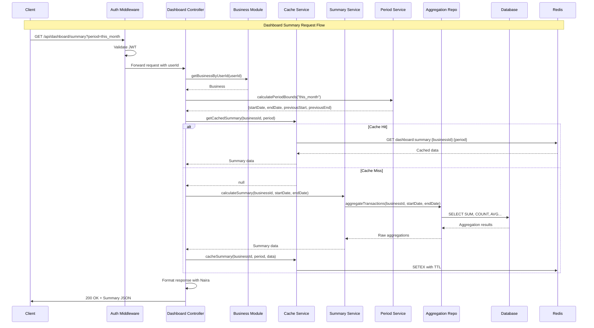
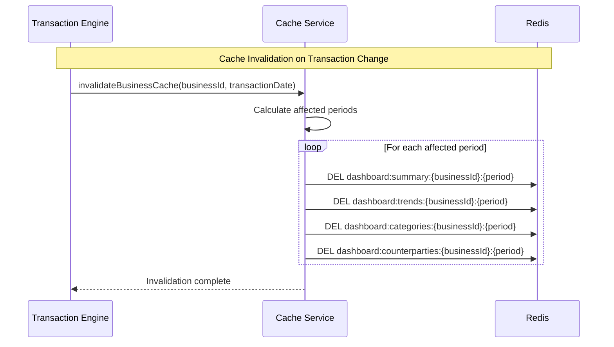

# Design Document: Analytics Dashboard Module

## Overview

The Analytics Dashboard Module (analytics-dashboard) provides comprehensive financial analytics and KPI visualization for CashTrace. This module is designed as a fully modular component that depends on core-auth for user authentication, business-management for business context, and transaction-engine for transaction data. It aggregates transaction data into meaningful KPIs, trend visualizations, and category breakdowns optimized for Nigerian SME business owners.

### Design Goals

1. **Performance**: Sub-3-second dashboard loads with intelligent caching
2. **Accuracy**: Precise financial calculations using kobo (integer) arithmetic
3. **Nigerian Context**: WAT timezone awareness and Naira formatting
4. **Real-time**: Cache invalidation ensures fresh data after transaction changes
5. **Modularity**: Clean separation from transaction storage concerns

### Key Design Decisions

- **Kobo Arithmetic**: All calculations performed in kobo (integers) to avoid floating-point errors
- **Redis Caching**: Pre-computed aggregations cached with 5-minute TTL
- **Event-Driven Invalidation**: Transaction changes trigger targeted cache invalidation
- **SQL Aggregations**: Heavy lifting done in PostgreSQL for efficiency
- **Period Normalization**: All periods normalized to WAT timezone boundaries

## Architecture



### Request Flow - Dashboard Summary



### Cache Invalidation Flow



## Components and Interfaces

### DashboardController

The main entry point for all dashboard operations. Handles HTTP requests and delegates to appropriate services.

```typescript
interface DashboardController {
  // Get dashboard summary with KPIs and period comparison
  getSummary(request: SummaryRequest): Promise<SummaryResponse>;

  // Get cashflow trend data for charts
  getTrends(request: TrendRequest): Promise<TrendResponse>;

  // Get expense category breakdown
  getCategories(request: CategoryRequest): Promise<CategoryResponse>;

  // Get top counterparties (customers and vendors)
  getTopCounterparties(
    request: CounterpartyRequest,
  ): Promise<CounterpartyResponse>;
}
```

### SummaryService

Calculates main dashboard KPIs with period comparison.

```typescript
interface SummaryService {
  // Calculate summary KPIs for a period
  calculateSummary(
    businessId: string,
    startDate: Date,
    endDate: Date,
  ): Promise<SummaryData>;

  // Calculate period comparison
  calculateComparison(
    currentSummary: SummaryData,
    previousSummary: SummaryData,
  ): ComparisonData;

  // Get complete summary with comparison
  getSummaryWithComparison(
    businessId: string,
    period: PeriodType,
    customStart?: Date,
    customEnd?: Date,
  ): Promise<SummaryWithComparison>;
}

interface SummaryData {
  totalRevenueKobo: number;
  totalExpensesKobo: number;
  netCashflowKobo: number;
  transactionCount: number;
  averageTransactionKobo: number;
  periodStart: Date;
  periodEnd: Date;
}

interface ComparisonData {
  revenueChangePercent: number;
  expensesChangePercent: number;
  netCashflowChangePercent: number;
  transactionCountChange: number;
}

interface SummaryWithComparison {
  current: SummaryData;
  previous: SummaryData;
  comparison: ComparisonData;
}
```

### TrendService

Generates time series data for cashflow visualization.

```typescript
interface TrendService {
  // Get trend data for a period
  getTrendData(
    businessId: string,
    startDate: Date,
    endDate: Date,
  ): Promise<TrendData>;

  // Determine appropriate granularity based on period length
  determineGranularity(startDate: Date, endDate: Date): TrendGranularity;

  // Aggregate transactions by time bucket
  aggregateByTimeBucket(
    businessId: string,
    startDate: Date,
    endDate: Date,
    granularity: TrendGranularity,
  ): Promise<TrendDataPoint[]>;
}

type TrendGranularity = "DAILY" | "WEEKLY" | "MONTHLY";

interface TrendDataPoint {
  date: Date;
  label: string; // Human-readable label (e.g., "Mon", "Week 1", "Jan")
  inflowsKobo: number;
  outflowsKobo: number;
  netCashflowKobo: number;
  transactionCount: number;
}

interface TrendData {
  granularity: TrendGranularity;
  dataPoints: TrendDataPoint[];
  periodStart: Date;
  periodEnd: Date;
}
```

### CategoryService

Calculates expense category breakdown.

```typescript
interface CategoryService {
  // Get top expense categories
  getTopExpenseCategories(
    businessId: string,
    startDate: Date,
    endDate: Date,
    limit: number,
  ): Promise<CategoryBreakdown[]>;

  // Get all category totals
  getAllCategoryTotals(
    businessId: string,
    startDate: Date,
    endDate: Date,
    transactionType: "INFLOW" | "OUTFLOW",
  ): Promise<CategoryBreakdown[]>;

  // Calculate percentages
  calculatePercentages(
    categories: CategoryBreakdown[],
    totalAmount: number,
  ): CategoryBreakdown[];
}

interface CategoryBreakdown {
  category: string;
  categoryDisplay: string;
  totalAmountKobo: number;
  transactionCount: number;
  percentageOfTotal: number;
}
```

### CounterpartyService

Identifies top customers and vendors.

```typescript
interface CounterpartyService {
  // Get top revenue sources (customers)
  getTopCustomers(
    businessId: string,
    startDate: Date,
    endDate: Date,
    limit: number,
  ): Promise<CounterpartyBreakdown[]>;

  // Get top expense destinations (vendors)
  getTopVendors(
    businessId: string,
    startDate: Date,
    endDate: Date,
    limit: number,
  ): Promise<CounterpartyBreakdown[]>;

  // Group transactions by counterparty
  groupByCounterparty(
    businessId: string,
    startDate: Date,
    endDate: Date,
    transactionType: "INFLOW" | "OUTFLOW",
  ): Promise<CounterpartyBreakdown[]>;
}

interface CounterpartyBreakdown {
  counterparty: string; // "Unknown" if null
  totalAmountKobo: number;
  transactionCount: number;
  percentageOfTotal: number;
}
```

### PeriodService

Handles period calculations with WAT timezone awareness.

```typescript
interface PeriodService {
  // Calculate period boundaries
  calculatePeriodBounds(
    period: PeriodType,
    customStart?: Date,
    customEnd?: Date,
  ): PeriodBounds;

  // Calculate previous period for comparison
  calculatePreviousPeriod(bounds: PeriodBounds): PeriodBounds;

  // Get current time in WAT
  getCurrentTimeWAT(): Date;

  // Convert UTC to WAT
  toWAT(date: Date): Date;

  // Get start of day in WAT
  getStartOfDayWAT(date: Date): Date;

  // Get start of week (Monday) in WAT
  getStartOfWeekWAT(date: Date): Date;

  // Get start of month in WAT
  getStartOfMonthWAT(date: Date): Date;

  // Get start of quarter in WAT
  getStartOfQuarterWAT(date: Date): Date;

  // Get start of year in WAT
  getStartOfYearWAT(date: Date): Date;
}

type PeriodType =
  | "today"
  | "this_week"
  | "this_month"
  | "this_quarter"
  | "this_year"
  | "custom";

interface PeriodBounds {
  startDate: Date;
  endDate: Date;
  periodType: PeriodType;
  daysInPeriod: number;
}
```

### CacheService

Manages Redis caching for aggregations.

```typescript
interface CacheService {
  // Get cached summary
  getCachedSummary(
    businessId: string,
    period: string,
  ): Promise<SummaryData | null>;

  // Cache summary data
  cacheSummary(
    businessId: string,
    period: string,
    data: SummaryData,
  ): Promise<void>;

  // Get cached trends
  getCachedTrends(
    businessId: string,
    period: string,
  ): Promise<TrendData | null>;

  // Cache trend data
  cacheTrends(
    businessId: string,
    period: string,
    data: TrendData,
  ): Promise<void>;

  // Get cached categories
  getCachedCategories(
    businessId: string,
    period: string,
  ): Promise<CategoryBreakdown[] | null>;

  // Cache category data
  cacheCategories(
    businessId: string,
    period: string,
    data: CategoryBreakdown[],
  ): Promise<void>;

  // Get cached counterparties
  getCachedCounterparties(
    businessId: string,
    period: string,
    type: string,
  ): Promise<CounterpartyBreakdown[] | null>;

  // Cache counterparty data
  cacheCounterparties(
    businessId: string,
    period: string,
    type: string,
    data: CounterpartyBreakdown[],
  ): Promise<void>;

  // Invalidate all caches for a business
  invalidateBusinessCache(businessId: string): Promise<void>;

  // Invalidate caches for specific periods affected by a transaction date
  invalidateAffectedPeriods(
    businessId: string,
    transactionDate: Date,
  ): Promise<void>;

  // Generate cache key
  generateCacheKey(
    type: string,
    businessId: string,
    period: string,
    subtype?: string,
  ): string;
}

const CACHE_TTL_SECONDS = 300; // 5 minutes
```

### FormatterService

Handles Naira formatting and display values.

```typescript
interface FormatterService {
  // Format kobo as Naira string
  formatAsNaira(kobo: number): string;

  // Format with sign for net values
  formatAsNairaWithSign(kobo: number): string;

  // Convert kobo to Naira number
  koboToNaira(kobo: number): number;

  // Format percentage
  formatPercentage(value: number, decimals?: number): string;

  // Format percentage change with sign
  formatPercentageChange(value: number): string;

  // Format date for display
  formatDateWAT(date: Date, format: string): string;
}
```

### AggregationRepository

Data access layer for transaction aggregations.

```typescript
interface AggregationRepository {
  // Get summary aggregations
  getSummaryAggregations(
    businessId: string,
    startDate: Date,
    endDate: Date,
  ): Promise<RawSummaryAggregation>;

  // Get trend aggregations by time bucket
  getTrendAggregations(
    businessId: string,
    startDate: Date,
    endDate: Date,
    granularity: TrendGranularity,
  ): Promise<RawTrendAggregation[]>;

  // Get category aggregations
  getCategoryAggregations(
    businessId: string,
    startDate: Date,
    endDate: Date,
    transactionType: "INFLOW" | "OUTFLOW",
  ): Promise<RawCategoryAggregation[]>;

  // Get counterparty aggregations
  getCounterpartyAggregations(
    businessId: string,
    startDate: Date,
    endDate: Date,
    transactionType: "INFLOW" | "OUTFLOW",
    limit: number,
  ): Promise<RawCounterpartyAggregation[]>;
}

interface RawSummaryAggregation {
  totalInflowKobo: bigint;
  totalOutflowKobo: bigint;
  inflowCount: number;
  outflowCount: number;
}

interface RawTrendAggregation {
  timeBucket: Date;
  totalInflowKobo: bigint;
  totalOutflowKobo: bigint;
  transactionCount: number;
}

interface RawCategoryAggregation {
  category: string;
  totalAmountKobo: bigint;
  transactionCount: number;
}

interface RawCounterpartyAggregation {
  counterparty: string | null;
  totalAmountKobo: bigint;
  transactionCount: number;
}
```

## Data Models

### API Request Types

```typescript
interface SummaryRequest {
  period?: PeriodType; // Default: 'this_month'
  startDate?: string; // ISO 8601, required if period is 'custom'
  endDate?: string; // ISO 8601, required if period is 'custom'
}

interface TrendRequest {
  period?: PeriodType; // Default: 'this_month'
  startDate?: string; // ISO 8601, required if period is 'custom'
  endDate?: string; // ISO 8601, required if period is 'custom'
}

interface CategoryRequest {
  period?: PeriodType; // Default: 'this_month'
  startDate?: string; // ISO 8601, required if period is 'custom'
  endDate?: string; // ISO 8601, required if period is 'custom'
  limit?: number; // Default: 5, max: 10
}

interface CounterpartyRequest {
  period?: PeriodType; // Default: 'this_month'
  startDate?: string; // ISO 8601, required if period is 'custom'
  endDate?: string; // ISO 8601, required if period is 'custom'
  limit?: number; // Default: 5, max: 10
}
```

### API Response Types

```typescript
interface SummaryResponse {
  success: boolean;
  data: {
    period: PeriodInfo;
    current: SummaryKPIs;
    previous: SummaryKPIs;
    comparison: ComparisonKPIs;
  };
  requestId: string;
}

interface PeriodInfo {
  type: PeriodType;
  startDate: string; // ISO 8601
  endDate: string; // ISO 8601
  daysInPeriod: number;
  previousStartDate: string; // ISO 8601
  previousEndDate: string; // ISO 8601
}

interface SummaryKPIs {
  totalRevenue: AmountDisplay;
  totalExpenses: AmountDisplay;
  netCashflow: AmountDisplay;
  transactionCount: number;
  averageTransactionValue: AmountDisplay;
}

interface AmountDisplay {
  kobo: number;
  naira: number;
  formatted: string; // e.g., "₦1,234,567.89"
}

interface ComparisonKPIs {
  revenueChange: PercentageChange;
  expensesChange: PercentageChange;
  netCashflowChange: PercentageChange;
  transactionCountChange: {
    absolute: number;
    percentage: number;
    formatted: string;
  };
}

interface PercentageChange {
  percentage: number;
  formatted: string; // e.g., "+15.5%" or "-8.2%"
  direction: "up" | "down" | "unchanged";
}

interface TrendResponse {
  success: boolean;
  data: {
    period: PeriodInfo;
    granularity: TrendGranularity;
    dataPoints: TrendDataPointDisplay[];
  };
  requestId: string;
}

interface TrendDataPointDisplay {
  date: string; // ISO 8601
  label: string;
  inflows: AmountDisplay;
  outflows: AmountDisplay;
  netCashflow: AmountDisplay;
  transactionCount: number;
}

interface CategoryResponse {
  success: boolean;
  data: {
    period: PeriodInfo;
    totalExpenses: AmountDisplay;
    categories: CategoryDisplay[];
  };
  requestId: string;
}

interface CategoryDisplay {
  category: string;
  categoryDisplay: string;
  amount: AmountDisplay;
  transactionCount: number;
  percentage: number;
  percentageFormatted: string;
}

interface CounterpartyResponse {
  success: boolean;
  data: {
    period: PeriodInfo;
    customers: {
      totalRevenue: AmountDisplay;
      topCounterparties: CounterpartyDisplay[];
    };
    vendors: {
      totalExpenses: AmountDisplay;
      topCounterparties: CounterpartyDisplay[];
    };
  };
  requestId: string;
}

interface CounterpartyDisplay {
  name: string;
  amount: AmountDisplay;
  transactionCount: number;
  percentage: number;
  percentageFormatted: string;
}

interface ErrorResponse {
  success: false;
  error: {
    code: string;
    message: string;
    fields?: Record<string, string[]>;
  };
  requestId: string;
}
```

### Cache Key Patterns

```typescript
// Cache key patterns for Redis
const CACHE_KEYS = {
  summary: "dashboard:summary:{businessId}:{periodKey}",
  trends: "dashboard:trends:{businessId}:{periodKey}",
  categories: "dashboard:categories:{businessId}:{periodKey}",
  counterparties: "dashboard:counterparties:{businessId}:{periodKey}:{type}",
};

// Period key generation
// For predefined periods: "today", "this_week", "this_month", etc.
// For custom periods: "custom:{startDate}:{endDate}" (ISO dates)
```

### SQL Aggregation Queries

```sql
-- Summary aggregation query
SELECT
  COALESCE(SUM(CASE WHEN transaction_type = 'INFLOW' THEN amount_kobo ELSE 0 END), 0) as total_inflow_kobo,
  COALESCE(SUM(CASE WHEN transaction_type = 'OUTFLOW' THEN amount_kobo ELSE 0 END), 0) as total_outflow_kobo,
  COUNT(CASE WHEN transaction_type = 'INFLOW' THEN 1 END) as inflow_count,
  COUNT(CASE WHEN transaction_type = 'OUTFLOW' THEN 1 END) as outflow_count
FROM transactions
WHERE business_id = $1
  AND transaction_date >= $2
  AND transaction_date < $3
  AND is_personal = false
  AND deleted_at IS NULL;

-- Daily trend aggregation query
SELECT
  DATE_TRUNC('day', transaction_date AT TIME ZONE 'Africa/Lagos') as time_bucket,
  COALESCE(SUM(CASE WHEN transaction_type = 'INFLOW' THEN amount_kobo ELSE 0 END), 0) as total_inflow_kobo,
  COALESCE(SUM(CASE WHEN transaction_type = 'OUTFLOW' THEN amount_kobo ELSE 0 END), 0) as total_outflow_kobo,
  COUNT(*) as transaction_count
FROM transactions
WHERE business_id = $1
  AND transaction_date >= $2
  AND transaction_date < $3
  AND is_personal = false
  AND deleted_at IS NULL
GROUP BY DATE_TRUNC('day', transaction_date AT TIME ZONE 'Africa/Lagos')
ORDER BY time_bucket;

-- Weekly trend aggregation query
SELECT
  DATE_TRUNC('week', transaction_date AT TIME ZONE 'Africa/Lagos') as time_bucket,
  COALESCE(SUM(CASE WHEN transaction_type = 'INFLOW' THEN amount_kobo ELSE 0 END), 0) as total_inflow_kobo,
  COALESCE(SUM(CASE WHEN transaction_type = 'OUTFLOW' THEN amount_kobo ELSE 0 END), 0) as total_outflow_kobo,
  COUNT(*) as transaction_count
FROM transactions
WHERE business_id = $1
  AND transaction_date >= $2
  AND transaction_date < $3
  AND is_personal = false
  AND deleted_at IS NULL
GROUP BY DATE_TRUNC('week', transaction_date AT TIME ZONE 'Africa/Lagos')
ORDER BY time_bucket;

-- Monthly trend aggregation query
SELECT
  DATE_TRUNC('month', transaction_date AT TIME ZONE 'Africa/Lagos') as time_bucket,
  COALESCE(SUM(CASE WHEN transaction_type = 'INFLOW' THEN amount_kobo ELSE 0 END), 0) as total_inflow_kobo,
  COALESCE(SUM(CASE WHEN transaction_type = 'OUTFLOW' THEN amount_kobo ELSE 0 END), 0) as total_outflow_kobo,
  COUNT(*) as transaction_count
FROM transactions
WHERE business_id = $1
  AND transaction_date >= $2
  AND transaction_date < $3
  AND is_personal = false
  AND deleted_at IS NULL
GROUP BY DATE_TRUNC('month', transaction_date AT TIME ZONE 'Africa/Lagos')
ORDER BY time_bucket;

-- Category aggregation query
SELECT
  category,
  SUM(amount_kobo) as total_amount_kobo,
  COUNT(*) as transaction_count
FROM transactions
WHERE business_id = $1
  AND transaction_date >= $2
  AND transaction_date < $3
  AND transaction_type = $4
  AND is_personal = false
  AND deleted_at IS NULL
GROUP BY category
ORDER BY total_amount_kobo DESC
LIMIT $5;

-- Counterparty aggregation query
SELECT
  COALESCE(counterparty, 'Unknown') as counterparty,
  SUM(amount_kobo) as total_amount_kobo,
  COUNT(*) as transaction_count
FROM transactions
WHERE business_id = $1
  AND transaction_date >= $2
  AND transaction_date < $3
  AND transaction_type = $4
  AND is_personal = false
  AND deleted_at IS NULL
GROUP BY COALESCE(counterparty, 'Unknown')
ORDER BY total_amount_kobo DESC
LIMIT $5;
```

## Correctness Properties

_A property is a characteristic or behavior that should hold true across all valid executions of a system—essentially, a formal statement about what the system should do. Properties serve as the bridge between human-readable specifications and machine-verifiable correctness guarantees._

### Property 1: Aggregation Correctness

_For any_ set of transactions belonging to a business within a date range, the dashboard summary SHALL return:

- Total revenue equal to the sum of all non-personal, non-deleted INFLOW transactions
- Total expenses equal to the sum of all non-personal, non-deleted OUTFLOW transactions
- Transaction count equal to the count of all non-personal, non-deleted transactions

**Validates: Requirements 1.1, 1.2, 1.4**

### Property 2: Net Cashflow Invariant

_For any_ dashboard summary response, the net cashflow value SHALL equal exactly (total revenue - total expenses), calculated in kobo to avoid floating-point errors.

**Validates: Requirements 1.3**

### Property 3: Average Transaction Calculation

_For any_ dashboard summary with transaction count > 0, the average transaction value SHALL equal (total revenue + total expenses) / transaction count. _For any_ summary with transaction count = 0, the average SHALL be 0.

**Validates: Requirements 1.5**

### Property 4: Transaction Filtering Exclusion

_For any_ aggregation calculation (summary, trends, categories, counterparties), transactions marked as personal (isPersonal = true) OR soft-deleted (deletedAt IS NOT NULL) SHALL NOT be included in the results.

**Validates: Requirements 1.6, 1.7, 4.4, 5.4**

### Property 5: Period Boundary WAT Calculation

_For any_ predefined period type, the calculated start date SHALL be at 00:00:00 WAT (UTC+1) on the appropriate boundary day, and the end date SHALL be the current time in WAT.

**Validates: Requirements 2.3, 2.4, 2.5, 2.6, 2.7, 2.8**

### Property 6: Period Comparison Equal Length

_For any_ period comparison, the previous period SHALL have the same number of elapsed days as the current period. For a current period of N days, the previous period SHALL also span N days and end exactly where the current period starts.

**Validates: Requirements 3.4, 3.5, 3.6, 3.7, 3.8**

### Property 7: Percentage Change Calculation

_For any_ period comparison where the previous period value is non-zero, the percentage change SHALL equal ((current - previous) / |previous|) × 100. _For any_ comparison where the previous value is zero and current is non-zero, the change SHALL be indicated as infinite/new. _For any_ comparison where both are zero, the change SHALL be 0%.

**Validates: Requirements 3.2**

### Property 8: Top N Sorting and Limiting

_For any_ request for top N categories or counterparties, the returned list SHALL be sorted by total amount in descending order AND limited to at most N items. If fewer than N items exist, all available items SHALL be returned.

**Validates: Requirements 4.1, 4.6, 5.1, 5.6**

### Property 9: Category Percentage Sum

_For any_ category breakdown response, the sum of all category percentages SHALL equal 100% (within floating-point tolerance of ±0.1%) when calculated against the total for that transaction type.

**Validates: Requirements 4.2, 4.5**

### Property 10: Null Counterparty Grouping

_For any_ counterparty aggregation, all transactions with null counterparty values SHALL be grouped under a single entry named "Unknown", with the total amount and count reflecting all such transactions.

**Validates: Requirements 5.5**

### Property 11: Trend Granularity Selection

_For any_ trend request:

- Period ≤ 7 days → granularity SHALL be DAILY
- Period 8-90 days → granularity SHALL be WEEKLY
- Period > 90 days → granularity SHALL be MONTHLY

**Validates: Requirements 6.2, 6.3, 6.4**

### Property 12: Trend Data Chronological Order

_For any_ trend response, the data points SHALL be ordered chronologically by date in ascending order, with no gaps in the time series for the selected granularity.

**Validates: Requirements 6.1, 6.6**

### Property 13: Naira Formatting Round-Trip

_For any_ kobo amount (integer), the formatted Naira string SHALL:

- Start with "₦" (or "-₦" for negative amounts)
- Include thousands separators (commas)
- Have exactly 2 decimal places
- When parsed back, equal the original kobo value / 100

**Validates: Requirements 7.1, 7.2, 7.3, 7.4, 7.5, 1.8**

### Property 14: Cache Invalidation on Transaction Changes

_For any_ transaction create, update, or delete operation, the cache service SHALL invalidate all cached aggregations for the affected business that include the transaction's date in their period range.

**Validates: Requirements 8.3, 8.4, 9.1, 9.2, 9.3**

### Property 15: Data Isolation Enforcement

_For any_ dashboard request, the system SHALL only return data for the authenticated user's business. Attempting to access data for a different business SHALL result in a 403 Forbidden error, and no data SHALL be leaked.

**Validates: Requirements 10.5, 10.6, 11.1, 11.2, 11.3**

### Property 16: API Response Format Consistency

_For any_ API response, it SHALL be valid JSON containing either:

- A success response with `success: true`, the expected data structure, and `requestId`
- An error response with `success: false`, error object (code, message, optional fields), and `requestId`

HTTP status codes SHALL match: 200 for success, 400 for validation errors, 403 for forbidden, 404 for not found, 500 for server errors.

**Validates: Requirements 10.8, 12.1, 12.2, 12.3, 12.4, 12.5**

## Error Handling

### Error Response Format

All errors follow a consistent JSON structure:

```typescript
interface ErrorResponse {
  success: false;
  error: {
    code: string; // Machine-readable error code
    message: string; // Human-readable message
    fields?: {
      // Field-specific errors for validation
      [fieldName: string]: string[];
    };
  };
  requestId: string; // Correlation ID for debugging
}
```

### Error Codes

| Code                           | HTTP Status | Description                                   |
| ------------------------------ | ----------- | --------------------------------------------- |
| `DASHBOARD_BUSINESS_NOT_FOUND` | 404         | User does not have a business profile         |
| `DASHBOARD_FORBIDDEN`          | 403         | User does not own the requested business      |
| `DASHBOARD_INVALID_PERIOD`     | 400         | Invalid period type specified                 |
| `DASHBOARD_INVALID_DATE_RANGE` | 400         | Invalid custom date range (start > end, etc.) |
| `DASHBOARD_DATE_REQUIRED`      | 400         | Custom period requires startDate and endDate  |
| `DASHBOARD_LIMIT_EXCEEDED`     | 400         | Limit parameter exceeds maximum (10)          |
| `VALIDATION_ERROR`             | 400         | General validation failure                    |
| `INTERNAL_ERROR`               | 500         | Unexpected server error                       |

### Error Handling Strategies

1. **Validation Errors**: Return 400 with field-specific error messages
2. **Not Found Errors**: Return 404 when user has no business
3. **Authorization Errors**: Return 403 when attempting to access another business
4. **Cache Failures**: Gracefully degrade to database queries (log failure separately)
5. **Database Errors**: Return 500, log full details, return generic message

### Graceful Degradation

- If Redis cache is unavailable, queries fall back to direct database aggregation
- If a specific aggregation fails, other dashboard components should still load
- Cache write failures should not block response delivery

## Testing Strategy

### Dual Testing Approach

This module requires both unit tests and property-based tests for comprehensive coverage:

- **Unit Tests**: Verify specific examples, edge cases, integration points, and error conditions
- **Property Tests**: Verify universal properties across randomly generated inputs

### Property-Based Testing Configuration

- **Library**: fast-check (TypeScript/JavaScript)
- **Minimum Iterations**: 100 per property test
- **Tag Format**: `Feature: analytics-dashboard, Property {N}: {property_text}`

### Unit Test Coverage

| Component             | Test Focus                                                                                                  |
| --------------------- | ----------------------------------------------------------------------------------------------------------- |
| PeriodService         | Boundary calculations for each period type, WAT timezone handling, edge cases (year boundaries, leap years) |
| FormatterService      | Naira formatting edge cases (zero, negative, large numbers, rounding)                                       |
| SummaryService        | KPI calculations with known transaction sets                                                                |
| TrendService          | Granularity selection boundaries (7, 8, 90, 91 days)                                                        |
| CategoryService       | Top N selection, percentage calculations                                                                    |
| CounterpartyService   | Null counterparty grouping, sorting                                                                         |
| CacheService          | Key generation, TTL handling, invalidation patterns                                                         |
| AggregationRepository | SQL query correctness with test data                                                                        |

### Property Test Coverage

| Property    | Test Description                                                                   |
| ----------- | ---------------------------------------------------------------------------------- |
| Property 1  | Generate random transaction sets, verify aggregation sums match manual calculation |
| Property 2  | Generate summaries, verify net = revenue - expenses                                |
| Property 3  | Generate transaction sets, verify average calculation                              |
| Property 4  | Generate transactions with personal/deleted flags, verify exclusion                |
| Property 5  | Generate dates, verify WAT boundary calculations                                   |
| Property 6  | Generate periods, verify previous period has same day count                        |
| Property 7  | Generate current/previous values, verify percentage change formula                 |
| Property 8  | Generate category/counterparty lists, verify sorting and limiting                  |
| Property 9  | Generate category breakdowns, verify percentages sum to 100%                       |
| Property 10 | Generate transactions with null counterparties, verify grouping                    |
| Property 11 | Generate period lengths, verify granularity selection                              |
| Property 12 | Generate trend data, verify chronological ordering                                 |
| Property 13 | Generate kobo amounts, verify formatting round-trip                                |
| Property 14 | Generate transaction changes, verify cache invalidation                            |
| Property 15 | Generate cross-business access attempts, verify rejection                          |
| Property 16 | Generate API responses, verify format consistency                                  |

### Integration Test Scenarios

1. **Full Dashboard Flow**: Create transactions → Request summary → Verify KPIs
2. **Period Comparison**: Create transactions across periods → Verify comparison calculations
3. **Cache Behavior**: Request data → Verify cache hit → Add transaction → Verify cache miss
4. **Multi-Business Isolation**: Create businesses → Verify data isolation
5. **Edge Cases**: Empty business (no transactions) → Verify zero values returned

### Test Data Generators

```typescript
// Example fast-check arbitraries for property tests
const transactionTypeArb = fc.constantFrom("INFLOW", "OUTFLOW");

const amountKoboArb = fc.integer({ min: 1, max: 100_000_000_00 }); // Up to ₦100M

const transactionArb = fc.record({
  amountKobo: amountKoboArb,
  transactionType: transactionTypeArb,
  isPersonal: fc.boolean(),
  deletedAt: fc.option(fc.date(), { nil: null }),
  transactionDate: fc.date({
    min: new Date("2020-01-01"),
    max: new Date("2030-12-31"),
  }),
  category: fc.constantFrom(
    "INVENTORY_STOCK",
    "RENT_UTILITIES",
    "SALARIES_WAGES",
    "TRANSPORTATION_LOGISTICS",
    "MARKETING_ADVERTISING",
    "PROFESSIONAL_SERVICES",
    "EQUIPMENT_MAINTENANCE",
    "BANK_CHARGES_FEES",
    "TAXES_LEVIES",
    "MISCELLANEOUS_EXPENSES",
    "PRODUCT_SALES",
    "SERVICE_REVENUE",
    "OTHER_INCOME",
  ),
  counterparty: fc.option(fc.string({ minLength: 1, maxLength: 100 }), {
    nil: null,
  }),
});

const transactionListArb = fc.array(transactionArb, {
  minLength: 0,
  maxLength: 1000,
});

const periodTypeArb = fc.constantFrom(
  "today",
  "this_week",
  "this_month",
  "this_quarter",
  "this_year",
  "custom",
);

const dateRangeArb = fc
  .tuple(
    fc.date({ min: new Date("2020-01-01"), max: new Date("2030-06-30") }),
    fc.date({ min: new Date("2020-01-01"), max: new Date("2030-12-31") }),
  )
  .filter(([start, end]) => start <= end);

const businessIdArb = fc.uuid();
const userIdArb = fc.uuid();
```
