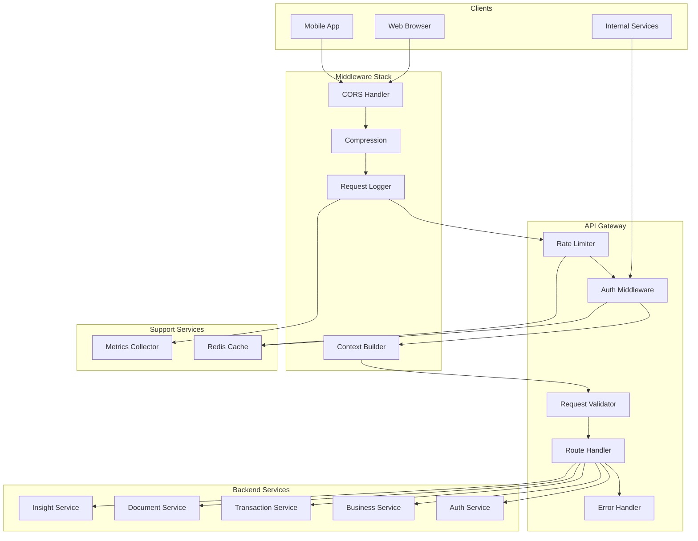

# Design Document: API Gateway Module

## Overview

The API Gateway Module provides centralized API management for CashTrace, handling rate limiting, request validation, authentication verification, and request routing. The design prioritizes security, performance, and developer experience while handling Nigerian network conditions.

### Design Goals

1. **Secure**: Centralized authentication and authorization
2. **Performant**: Sub-100ms overhead for request processing
3. **Reliable**: Graceful degradation when backend services fail
4. **Observable**: Comprehensive logging and metrics
5. **Developer-Friendly**: Clear error messages and documentation

### Key Design Decisions

- **Express.js**: Lightweight, well-understood framework
- **Redis Rate Limiting**: Distributed rate limiting across instances
- **JSON Schema Validation**: Declarative request validation
- **Circuit Breaker**: Prevent cascade failures
- **Correlation IDs**: End-to-end request tracing

## Architecture



````

## Components and Interfaces

### RateLimiter

Distributed rate limiting with Redis backend.

```typescript
interface RateLimiter {
  check(key: string, limit: RateLimit): Promise<RateLimitResult>;
  reset(key: string): Promise<void>;
  getRemaining(key: string, limit: RateLimit): Promise<number>;
}

interface RateLimit {
  requests: number;
  window: number; // seconds
  keyPrefix: string;
}

interface RateLimitResult {
  allowed: boolean;
  remaining: number;
  resetAt: Date;
  retryAfter?: number;
}
````

### RequestValidator

JSON Schema-based request validation.

```typescript
interface RequestValidator {
  validate(schema: string, data: unknown): ValidationResult;
  registerSchema(name: string, schema: JSONSchema): void;
  sanitize(data: unknown, schema: string): unknown;
}

interface ValidationResult {
  valid: boolean;
  errors?: ValidationError[];
}

interface ValidationError {
  path: string;
  message: string;
  keyword: string;
}
```

### AuthMiddleware

JWT and API key authentication.

```typescript
interface AuthMiddleware {
  verifyJWT(token: string): Promise<JWTPayload | null>;
  verifyAPIKey(key: string): Promise<APIKeyPayload | null>;
  extractToken(request: Request): string | null;
  cacheValidation(
    token: string,
    payload: JWTPayload,
    ttl: number,
  ): Promise<void>;
}

interface JWTPayload {
  userId: string;
  email: string;
  businessId: string;
  permissions: string[];
  exp: number;
  iat: number;
}

interface APIKeyPayload {
  serviceId: string;
  serviceName: string;
  permissions: string[];
}
```

### RouteHandler

Request routing with circuit breaker.

```typescript
interface RouteHandler {
  register(route: RouteConfig): void;
  handle(request: Request): Promise<Response>;
  getCircuitState(service: string): CircuitState;
}

interface RouteConfig {
  method: HTTPMethod;
  path: string;
  service: string;
  timeout: number;
  retries: number;
  circuitBreaker: CircuitBreakerConfig;
  rateLimit?: RateLimit;
  auth: AuthRequirement;
  validation?: string; // Schema name
}

interface CircuitBreakerConfig {
  failureThreshold: number;
  resetTimeout: number;
  halfOpenRequests: number;
}

type CircuitState = "closed" | "open" | "half_open";
type HTTPMethod = "GET" | "POST" | "PUT" | "DELETE" | "PATCH";
type AuthRequirement = "none" | "jwt" | "api_key" | "jwt_or_api_key";
```

### RequestContext

Request metadata and context propagation.

```typescript
interface RequestContext {
  correlationId: string;
  userId?: string;
  businessId?: string;
  clientIP: string;
  userAgent: string;
  timestamp: Date;
  permissions: string[];
}

interface ContextBuilder {
  build(request: Request, auth?: JWTPayload | APIKeyPayload): RequestContext;
  attach(request: Request, context: RequestContext): void;
  get(request: Request): RequestContext;
}
```

## Data Models

### RequestLog

```typescript
interface RequestLog {
  id: string;
  correlationId: string;
  method: string;
  path: string;
  statusCode: number;
  duration: number;
  userId?: string;
  businessId?: string;
  clientIP: string;
  userAgent: string;
  requestSize: number;
  responseSize: number;
  timestamp: Date;
}
```

### APIError

```typescript
interface APIError {
  code: string;
  message: string;
  details?: Record<string, unknown>;
  fields?: Record<string, string[]>;
  correlationId: string;
  timestamp: string;
}
```

## Correctness Properties

### Property 1: Rate Limit Accuracy

_For any_ rate-limited endpoint, requests exceeding the limit SHALL be rejected with 429 status within the configured window.

Validates: Requirements 1.1, 1.2, 1.3, 1.4

### Property 2: Validation Completeness

_For any_ request with validation schema, all required fields SHALL be validated before reaching backend services.

Validates: Requirements 2.1, 2.2, 2.3

### Property 3: Authentication Enforcement

_For any_ protected endpoint, requests without valid authentication SHALL be rejected with 401 status.

Validates: Requirements 3.1, 3.2, 3.4

### Property 4: Circuit Breaker Behavior

_For any_ service with consecutive failures exceeding threshold, subsequent requests SHALL fail fast until reset timeout.

Validates: Requirements 4.6

### Property 5: Correlation ID Presence

_For any_ request, a correlation ID SHALL be generated or propagated and included in all logs and responses.

Validates: Requirements 4.5, 6.2

### Property 6: CORS Enforcement

_For any_ cross-origin request from unauthorized origin, it SHALL be rejected with 403 status.

Validates: Requirements 5.6

### Property 7: Request Timeout

_For any_ request exceeding configured timeout, it SHALL be terminated and return 504 status.

Validates: Requirements 4.4

### Property 8: Error Response Consistency

_For any_ error response, it SHALL include code, message, and correlationId in consistent JSON format.

Validates: Requirements 10.1, 10.3

### Property 9: Health Check Accuracy

_For any_ health check request, it SHALL accurately reflect the health of all dependencies.

Validates: Requirements 7.3, 7.4, 7.5

### Property 10: Compression Efficiency

_For any_ response larger than 1KB, it SHALL be compressed if client supports it.

Validates: Requirements 11.1, 11.2

## Error Handling

### Error Codes

| Code                     | HTTP Status | Description                  |
| ------------------------ | ----------- | ---------------------------- |
| `GW_RATE_LIMITED`        | 429         | Rate limit exceeded          |
| `GW_VALIDATION_FAILED`   | 400         | Request validation failed    |
| `GW_AUTH_REQUIRED`       | 401         | Authentication required      |
| `GW_AUTH_INVALID`        | 401         | Invalid authentication token |
| `GW_FORBIDDEN`           | 403         | Insufficient permissions     |
| `GW_NOT_FOUND`           | 404         | Route not found              |
| `GW_TIMEOUT`             | 504         | Backend service timeout      |
| `GW_SERVICE_UNAVAILABLE` | 503         | Backend service unavailable  |
| `GW_CIRCUIT_OPEN`        | 503         | Circuit breaker open         |

## Testing Strategy

### Property Tests

| Property    | Test Description                                    |
| ----------- | --------------------------------------------------- |
| Property 1  | Generate requests exceeding limit, verify rejection |
| Property 2  | Send invalid requests, verify validation            |
| Property 3  | Send unauthenticated requests, verify rejection     |
| Property 4  | Simulate failures, verify circuit breaker           |
| Property 5  | Trace requests, verify correlation ID               |
| Property 6  | Send cross-origin requests, verify CORS             |
| Property 7  | Simulate slow backend, verify timeout               |
| Property 8  | Generate errors, verify response format             |
| Property 9  | Check health endpoints, verify accuracy             |
| Property 10 | Send large responses, verify compression            |
