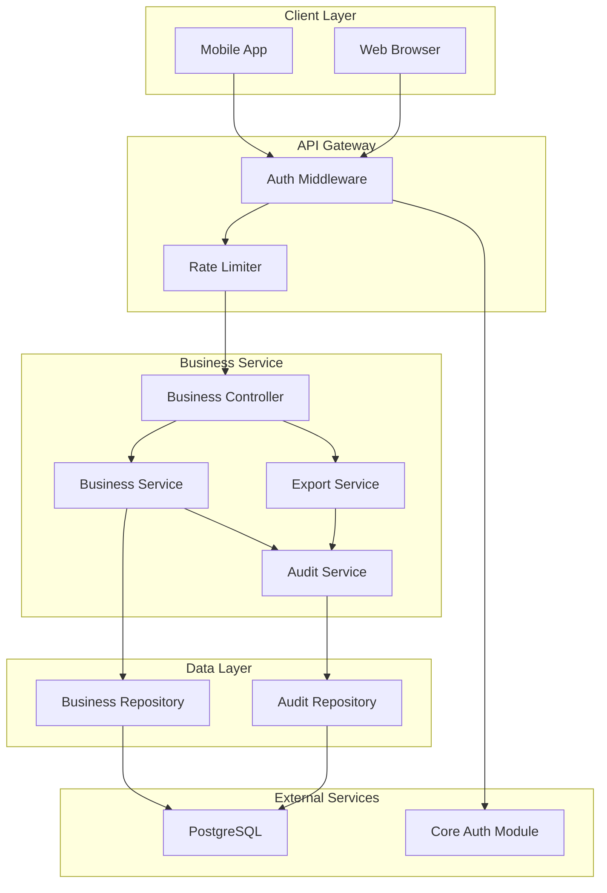
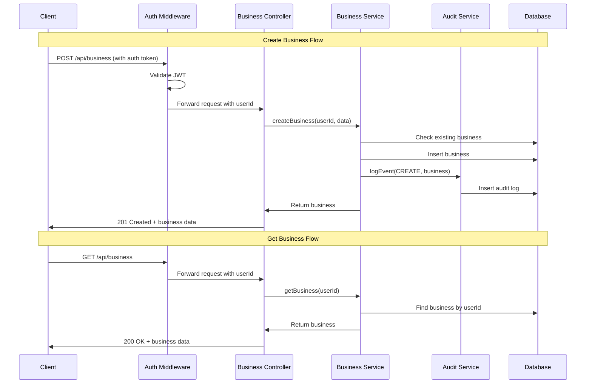

# Design Document: Business Management Module

## Overview

The Business Management Module (business-management) provides comprehensive business profile management for CashTrace. This module is designed as a fully independent, modular component that depends only on core-auth for user context. It manages Nigerian SME business profiles with full NDPR compliance including data export and right to erasure.

### Design Goals

1. **Simplicity**: Straightforward CRUD operations for business profiles
2. **NDPR Compliance**: Built-in soft delete, data export, and audit trail
3. **Modularity**: Depends only on core-auth for user authentication
4. **Future-Ready**: Single business per user for MVP, architected for multi-business
5. **Nigerian Context**: Predefined sectors and NGN currency default

### Key Design Decisions

- **Soft Delete Pattern**: 30-day recovery window before permanent deletion
- **Audit Trail**: All changes tracked with previous/new values for compliance
- **Foreign Key Constraint**: Database-level enforcement of one business per user
- **Sector Enum**: Predefined Nigerian SME sectors stored as enum for type safety
- **Currency Field**: Stored for future multi-currency support (defaults to NGN)

## Architecture



### Request Flow



## Components and Interfaces

### BusinessController

The main entry point for all business operations. Handles HTTP requests and delegates to appropriate services.

```typescript
interface BusinessController {
  // Create business profile
  createBusiness(request: CreateBusinessRequest): Promise<BusinessResponse>;

  // Get current user's business
  getBusiness(request: GetBusinessRequest): Promise<BusinessResponse>;

  // Update business profile
  updateBusiness(request: UpdateBusinessRequest): Promise<BusinessResponse>;

  // Soft delete business
  deleteBusiness(request: DeleteBusinessRequest): Promise<GenericResponse>;

  // Export business data (NDPR)
  exportBusinessData(request: ExportRequest): Promise<ExportResponse>;
}
```

### BusinessService

Core business logic for profile management.

```typescript
interface BusinessService {
  // Create new business for user
  createBusiness(userId: string, data: CreateBusinessData): Promise<Business>;

  // Get business by user ID
  getBusinessByUserId(userId: string): Promise<Business | null>;

  // Get business by ID with ownership check
  getBusinessById(businessId: string, userId: string): Promise<Business | null>;

  // Update business profile
  updateBusiness(
    businessId: string,
    userId: string,
    data: UpdateBusinessData,
  ): Promise<Business>;

  // Soft delete business
  softDeleteBusiness(businessId: string, userId: string): Promise<void>;

  // Restore soft-deleted business
  restoreBusiness(businessId: string, userId: string): Promise<Business>;

  // Check if user has existing business
  userHasBusiness(userId: string): Promise<boolean>;
}
```

### ExportService

Handles NDPR-compliant data export.

```typescript
interface ExportService {
  // Generate complete data export
  generateExport(userId: string): Promise<BusinessExport>;

  // Get export as JSON string
  getExportAsJson(userId: string): Promise<string>;
}

interface BusinessExport {
  exportedAt: Date;
  business: Business;
  auditTrail: AuditLogEntry[];
  metadata: ExportMetadata;
}

interface ExportMetadata {
  version: string;
  format: "json";
  includesDeletedData: boolean;
}
```

### AuditService

Logs all business operations for compliance.

```typescript
interface AuditService {
  // Log business event
  logEvent(event: BusinessAuditEvent): Promise<void>;

  // Get audit history for business
  getBusinessAuditHistory(
    businessId: string,
    from?: Date,
    to?: Date,
  ): Promise<AuditLogEntry[]>;

  // Get audit history for user (NDPR access request)
  getUserAuditHistory(userId: string): Promise<AuditLogEntry[]>;

  // Delete audit logs for business (after hard delete)
  deleteBusinessAuditLogs(businessId: string): Promise<void>;
}

interface BusinessAuditEvent {
  eventType: BusinessEventType;
  userId: string;
  businessId: string;
  ipAddress: string;
  previousValues?: Record<string, unknown>;
  newValues?: Record<string, unknown>;
}

type BusinessEventType =
  | "BUSINESS_CREATED"
  | "BUSINESS_UPDATED"
  | "BUSINESS_SOFT_DELETED"
  | "BUSINESS_RESTORED"
  | "BUSINESS_HARD_DELETED"
  | "BUSINESS_EXPORTED";
```

### BusinessRepository

Data access layer for business entities.

```typescript
interface BusinessRepository {
  // Create business
  create(data: CreateBusinessData & { userId: string }): Promise<Business>;

  // Find by user ID (excludes soft-deleted)
  findByUserId(userId: string): Promise<Business | null>;

  // Find by user ID including soft-deleted
  findByUserIdIncludeDeleted(userId: string): Promise<Business | null>;

  // Find by ID
  findById(id: string): Promise<Business | null>;

  // Update business
  update(id: string, data: UpdateBusinessData): Promise<Business>;

  // Soft delete
  softDelete(id: string): Promise<void>;

  // Restore soft-deleted
  restore(id: string): Promise<Business>;

  // Hard delete (permanent)
  hardDelete(id: string): Promise<void>;

  // Find businesses pending hard delete
  findPendingHardDelete(): Promise<Business[]>;
}
```

## Data Models

### Business

```typescript
interface Business {
  id: string; // UUID v4
  userId: string; // Foreign key to User (from core-auth)
  name: string; // 2-100 characters
  sector: BusinessSector; // Predefined Nigerian SME sector
  currency: Currency; // Default NGN, stored for future multi-currency
  createdAt: Date;
  updatedAt: Date;
  deletedAt: Date | null; // Soft delete timestamp
  hardDeleteAt: Date | null; // Scheduled hard delete (deletedAt + 30 days)
}

type BusinessSector =
  | "RETAIL_TRADING"
  | "PROFESSIONAL_SERVICES"
  | "MANUFACTURING"
  | "AGRICULTURE_AGRIBUSINESS"
  | "TECHNOLOGY_DIGITAL"
  | "HOSPITALITY_FOOD"
  | "TRANSPORTATION_LOGISTICS"
  | "HEALTHCARE_PHARMA"
  | "EDUCATION_TRAINING"
  | "CONSTRUCTION_REAL_ESTATE"
  | "OTHER";

type Currency = "NGN" | "USD" | "GBP";
```

### BusinessAuditLog

```typescript
interface BusinessAuditLog {
  id: string; // UUID v4
  eventType: BusinessEventType;
  userId: string; // User who performed action
  businessId: string; // Business affected
  ipAddress: string;
  userAgent: string;
  requestId: string; // Correlation ID
  previousValues: Record<string, unknown> | null; // For updates
  newValues: Record<string, unknown> | null; // For creates/updates
  createdAt: Date;
}
```

### API Request/Response Types

```typescript
// Requests
interface CreateBusinessRequest {
  name: string; // Required, 2-100 characters
  sector?: BusinessSector; // Optional, defaults to OTHER
}

interface UpdateBusinessRequest {
  name?: string; // Optional, 2-100 characters if provided
  sector?: BusinessSector; // Optional
}

// Responses
interface BusinessResponse {
  success: boolean;
  business: BusinessPublic;
  requestId: string;
}

interface BusinessPublic {
  id: string;
  name: string;
  sector: BusinessSector;
  sectorDisplay: string; // Human-readable sector name
  currency: Currency;
  createdAt: string; // ISO 8601
  updatedAt: string; // ISO 8601
}

interface ExportResponse {
  success: boolean;
  data: BusinessExport;
  requestId: string;
}

interface GenericResponse {
  success: boolean;
  message: string;
  requestId: string;
}

interface ErrorResponse {
  success: false;
  error: {
    code: string;
    message: string;
    fields?: Record<string, string[]>;
  };
  requestId: string;
}
```

### Database Schema

```sql
-- Business sectors enum
CREATE TYPE business_sector AS ENUM (
  'RETAIL_TRADING',
  'PROFESSIONAL_SERVICES',
  'MANUFACTURING',
  'AGRICULTURE_AGRIBUSINESS',
  'TECHNOLOGY_DIGITAL',
  'HOSPITALITY_FOOD',
  'TRANSPORTATION_LOGISTICS',
  'HEALTHCARE_PHARMA',
  'EDUCATION_TRAINING',
  'CONSTRUCTION_REAL_ESTATE',
  'OTHER'
);

-- Currency enum
CREATE TYPE currency AS ENUM ('NGN', 'USD', 'GBP');

-- Business event types enum
CREATE TYPE business_event_type AS ENUM (
  'BUSINESS_CREATED',
  'BUSINESS_UPDATED',
  'BUSINESS_SOFT_DELETED',
  'BUSINESS_RESTORED',
  'BUSINESS_HARD_DELETED',
  'BUSINESS_EXPORTED'
);

-- Businesses table
CREATE TABLE businesses (
  id UUID PRIMARY KEY DEFAULT gen_random_uuid(),
  user_id UUID NOT NULL UNIQUE,  -- UNIQUE enforces one business per user
  name VARCHAR(100) NOT NULL,
  sector business_sector NOT NULL DEFAULT 'OTHER',
  currency currency NOT NULL DEFAULT 'NGN',
  created_at TIMESTAMP WITH TIME ZONE DEFAULT NOW(),
  updated_at TIMESTAMP WITH TIME ZONE DEFAULT NOW(),
  deleted_at TIMESTAMP WITH TIME ZONE,
  hard_delete_at TIMESTAMP WITH TIME ZONE,

  CONSTRAINT name_length CHECK (char_length(name) >= 2)
);

CREATE INDEX idx_businesses_user_id ON businesses(user_id);
CREATE INDEX idx_businesses_deleted_at ON businesses(deleted_at) WHERE deleted_at IS NOT NULL;
CREATE INDEX idx_businesses_hard_delete_at ON businesses(hard_delete_at) WHERE hard_delete_at IS NOT NULL;

-- Business audit logs table
CREATE TABLE business_audit_logs (
  id UUID PRIMARY KEY DEFAULT gen_random_uuid(),
  event_type business_event_type NOT NULL,
  user_id UUID NOT NULL,
  business_id UUID NOT NULL,
  ip_address VARCHAR(45) NOT NULL,
  user_agent TEXT,
  request_id VARCHAR(36) NOT NULL,
  previous_values JSONB,
  new_values JSONB,
  created_at TIMESTAMP WITH TIME ZONE DEFAULT NOW()
);

CREATE INDEX idx_business_audit_logs_business_id ON business_audit_logs(business_id);
CREATE INDEX idx_business_audit_logs_user_id ON business_audit_logs(user_id);
CREATE INDEX idx_business_audit_logs_created_at ON business_audit_logs(created_at);
```

### Prisma Schema

```prisma
enum BusinessSector {
  RETAIL_TRADING
  PROFESSIONAL_SERVICES
  MANUFACTURING
  AGRICULTURE_AGRIBUSINESS
  TECHNOLOGY_DIGITAL
  HOSPITALITY_FOOD
  TRANSPORTATION_LOGISTICS
  HEALTHCARE_PHARMA
  EDUCATION_TRAINING
  CONSTRUCTION_REAL_ESTATE
  OTHER
}

enum Currency {
  NGN
  USD
  GBP
}

enum BusinessEventType {
  BUSINESS_CREATED
  BUSINESS_UPDATED
  BUSINESS_SOFT_DELETED
  BUSINESS_RESTORED
  BUSINESS_HARD_DELETED
  BUSINESS_EXPORTED
}

model Business {
  id           String         @id @default(uuid())
  userId       String         @unique @map("user_id")
  name         String         @db.VarChar(100)
  sector       BusinessSector @default(OTHER)
  currency     Currency       @default(NGN)
  createdAt    DateTime       @default(now()) @map("created_at")
  updatedAt    DateTime       @updatedAt @map("updated_at")
  deletedAt    DateTime?      @map("deleted_at")
  hardDeleteAt DateTime?      @map("hard_delete_at")

  auditLogs BusinessAuditLog[]

  @@index([userId])
  @@index([deletedAt])
  @@index([hardDeleteAt])
  @@map("businesses")
}

model BusinessAuditLog {
  id             String            @id @default(uuid())
  eventType      BusinessEventType @map("event_type")
  userId         String            @map("user_id")
  businessId     String            @map("business_id")
  ipAddress      String            @map("ip_address") @db.VarChar(45)
  userAgent      String?           @map("user_agent")
  requestId      String            @map("request_id") @db.VarChar(36)
  previousValues Json?             @map("previous_values")
  newValues      Json?             @map("new_values")
  createdAt      DateTime          @default(now()) @map("created_at")

  business Business @relation(fields: [businessId], references: [id], onDelete: Cascade)

  @@index([businessId])
  @@index([userId])
  @@index([createdAt])
  @@map("business_audit_logs")
}
```

## Correctness Properties

_A property is a characteristic or behavior that should hold true across all valid executions of a system—essentially, a formal statement about what the system should do. Properties serve as the bridge between human-readable specifications and machine-verifiable correctness guarantees._

### Property 1: Name Validation Correctness

_For any_ string input, the business name validator SHALL accept it if and only if it contains between 2 and 100 characters inclusive.

**Validates: Requirements 1.2, 3.2**

### Property 2: Sector Validation Correctness

_For any_ string input, the sector validator SHALL accept it if and only if it matches one of the 11 predefined Nigerian SME sector values.

**Validates: Requirements 2.1, 2.3**

### Property 3: Default Values on Creation

_For any_ business creation request that does not specify currency, the created business SHALL have currency set to NGN. _For any_ business creation request that does not specify sector, the created business SHALL have sector set to OTHER.

**Validates: Requirements 1.4, 2.4**

### Property 4: Single Business Per User Constraint

_For any_ user who already has a business profile, attempting to create another business SHALL fail with a validation error, and the user SHALL still have exactly one business.

**Validates: Requirements 1.3, 9.1, 9.3**

### Property 5: Ownership Enforcement

_For any_ business operation (update, delete, restore, export), if the requesting user's ID does not match the business's userId, the operation SHALL be rejected with a 403 Forbidden error and the business SHALL remain unchanged.

**Validates: Requirements 3.1, 3.6, 5.7**

### Property 6: Business Retrieval Correctness

_For any_ authenticated user with a non-deleted business, retrieving their business SHALL return exactly that business with all fields populated. _For any_ user whose business is soft-deleted, normal retrieval SHALL return 404 Not Found.

**Validates: Requirements 4.1, 4.4**

### Property 7: Soft Delete Behavior

_For any_ business deletion request by the owner, the business SHALL be marked with deletedAt timestamp and hardDeleteAt set to exactly 30 days after deletedAt, but the business record SHALL still exist in the database.

**Validates: Requirements 5.1, 5.2**

### Property 8: Business Restore Within Recovery Window

_For any_ soft-deleted business where the current time is before hardDeleteAt, a restore request by the owner SHALL succeed, clearing deletedAt and hardDeleteAt, and the business SHALL be retrievable again.

**Validates: Requirements 5.5**

### Property 9: Hard Delete Cascade

_For any_ business where the current time is past hardDeleteAt, the hard delete process SHALL permanently remove the business record AND all associated audit log entries from the database.

**Validates: Requirements 5.3, 5.6**

### Property 10: Data Export Completeness

_For any_ data export request, the generated export SHALL contain the complete business profile, all audit trail entries for that business, and export metadata. _For any_ soft-deleted business within recovery window, the export SHALL include the data with deletion status indicated.

**Validates: Requirements 6.1, 6.2, 6.5**

### Property 11: Audit Trail Completeness

_For any_ business operation (create, update, delete, restore, export), an audit log entry SHALL be created containing: event type, user ID, business ID, timestamp, IP address, and request ID. _For any_ update operation, the audit log SHALL additionally contain both previous and new values for all changed fields.

**Validates: Requirements 1.5, 3.4, 5.4, 6.3, 7.1, 7.2, 7.3, 7.5**

### Property 12: API Response Consistency

_For any_ API response, it SHALL be valid JSON containing either a success response with the expected data structure (including requestId) OR an error response with error code, message, field-specific details (if applicable), and requestId. HTTP status codes SHALL match the response type (201 for creation, 200 for success, 400 for validation errors, 403 for forbidden, 404 for not found).

**Validates: Requirements 1.6, 1.7, 3.5, 4.3, 8.1, 8.2, 8.3, 8.4**

## Error Handling

### Error Response Format

All errors follow a consistent JSON structure:

```typescript
interface ErrorResponse {
  success: false;
  error: {
    code: string; // Machine-readable error code
    message: string; // Human-readable message
    fields?: {
      // Field-specific errors for validation
      [fieldName: string]: string[];
    };
  };
  requestId: string; // Correlation ID for debugging
}
```

### Error Codes

| Code                        | HTTP Status | Description                         |
| --------------------------- | ----------- | ----------------------------------- |
| `BUSINESS_ALREADY_EXISTS`   | 400         | User already has a business profile |
| `BUSINESS_NOT_FOUND`        | 404         | No business found for user          |
| `BUSINESS_DELETED`          | 404         | Business has been deleted           |
| `BUSINESS_FORBIDDEN`        | 403         | User does not own this business     |
| `BUSINESS_INVALID_NAME`     | 400         | Name must be 2-100 characters       |
| `BUSINESS_INVALID_SECTOR`   | 400         | Invalid sector value                |
| `BUSINESS_RECOVERY_EXPIRED` | 400         | Recovery window has expired         |
| `VALIDATION_ERROR`          | 400         | General validation failure          |
| `INTERNAL_ERROR`            | 500         | Unexpected server error             |

### Error Handling Strategies

1. **Validation Errors**: Return 400 with field-specific error messages
2. **Not Found Errors**: Return 404 with clear message about missing resource
3. **Authorization Errors**: Return 403 with ownership error message
4. **Constraint Violations**: Return 400 with specific constraint error (e.g., already has business)
5. **Internal Errors**: Return 500, log full details, return generic message

### Graceful Degradation

- If audit logging fails, the primary operation should still succeed (log failure separately)
- Export generation should handle missing audit logs gracefully
- Hard delete scheduler should handle individual failures without stopping batch

## Testing Strategy

### Dual Testing Approach

This module requires both unit tests and property-based tests for comprehensive coverage:

- **Unit Tests**: Verify specific examples, edge cases, integration points, and error conditions
- **Property Tests**: Verify universal properties across randomly generated inputs

### Property-Based Testing Configuration

- **Library**: fast-check (TypeScript/JavaScript)
- **Minimum Iterations**: 100 per property test
- **Tag Format**: `Feature: business-management, Property {N}: {property_text}`

### Unit Test Coverage

| Component          | Test Focus                                                                       |
| ------------------ | -------------------------------------------------------------------------------- |
| NameValidator      | Boundary conditions (1 char, 2 chars, 100 chars, 101 chars), unicode, whitespace |
| SectorValidator    | All 11 valid sectors, case sensitivity, invalid values                           |
| BusinessService    | CRUD operations, ownership checks, soft delete timing                            |
| ExportService      | JSON structure, completeness, soft-deleted business handling                     |
| AuditService       | Log entry creation, previous/new value capture, query functionality              |
| BusinessRepository | Database operations, unique constraint handling                                  |

### Property Test Coverage

| Property    | Test Description                                                             |
| ----------- | ---------------------------------------------------------------------------- |
| Property 1  | Generate random strings, verify name validation accepts only 2-100 chars     |
| Property 2  | Generate random strings, verify sector validation accepts only valid enums   |
| Property 3  | Generate business creation requests without defaults, verify NGN and OTHER   |
| Property 4  | Generate users with businesses, attempt second creation, verify rejection    |
| Property 5  | Generate operations with mismatched user IDs, verify 403 responses           |
| Property 6  | Generate users with businesses, verify retrieval returns correct data        |
| Property 7  | Generate delete operations, verify soft delete timestamps                    |
| Property 8  | Generate soft-deleted businesses within window, verify restore works         |
| Property 9  | Generate expired businesses, verify hard delete removes all data             |
| Property 10 | Generate export requests, verify completeness of exported data               |
| Property 11 | Generate all operation types, verify audit logs created with required fields |
| Property 12 | Generate API calls, verify response format consistency                       |

### Integration Test Scenarios

1. **Full Business Lifecycle**: Create → Update → Delete → Restore → Hard Delete
2. **NDPR Compliance Flow**: Create → Export → Delete → Export within window
3. **Ownership Validation**: Create as User A → Attempt operations as User B
4. **Constraint Enforcement**: Create business → Attempt second creation
5. **Audit Trail Verification**: Perform operations → Query audit history → Verify completeness

### Test Data Generators

```typescript
// Example fast-check arbitraries for property tests
const validBusinessNameArb = fc
  .string({ minLength: 2, maxLength: 100 })
  .filter((s) => s.trim().length >= 2);

const invalidBusinessNameArb = fc.oneof(
  fc.string({ maxLength: 1 }), // Too short
  fc.string({ minLength: 101 }), // Too long
  fc.constant(""), // Empty
  fc.constant(" "), // Whitespace only
);

const validSectorArb = fc.constantFrom(
  "RETAIL_TRADING",
  "PROFESSIONAL_SERVICES",
  "MANUFACTURING",
  "AGRICULTURE_AGRIBUSINESS",
  "TECHNOLOGY_DIGITAL",
  "HOSPITALITY_FOOD",
  "TRANSPORTATION_LOGISTICS",
  "HEALTHCARE_PHARMA",
  "EDUCATION_TRAINING",
  "CONSTRUCTION_REAL_ESTATE",
  "OTHER",
);

const invalidSectorArb = fc.string().filter((s) => !validSectors.includes(s));

const businessArb = fc.record({
  name: validBusinessNameArb,
  sector: validSectorArb,
});

const userIdArb = fc.uuid();
```
