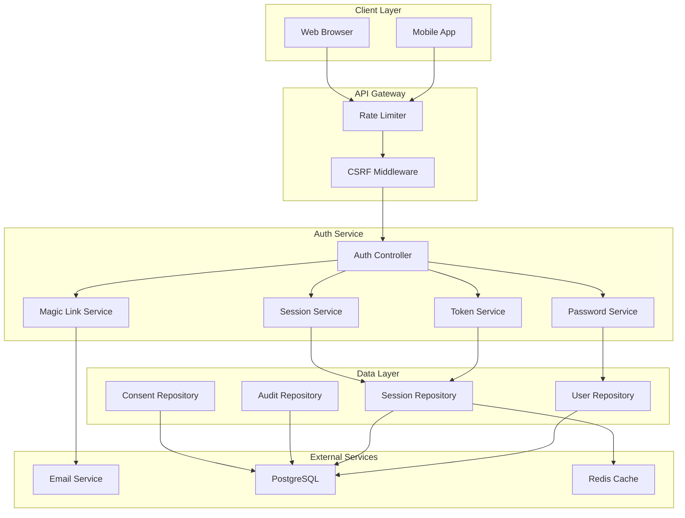
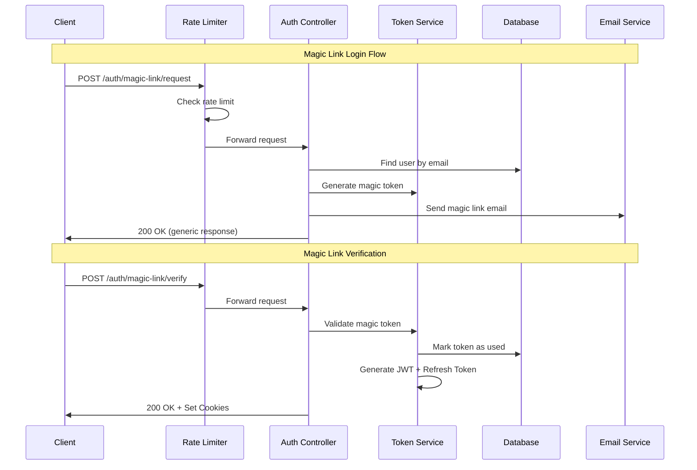

# Design Document: Core Authentication Module

## Overview

The Core Authentication Module (core-auth) provides a secure, mobile-first authentication system for CashTrace. This module is designed as a fully independent, modular component that can be deployed and scaled separately from other CashTrace modules.

### Design Goals

1. **Simplicity**: Non-technical Nigerian SME owners should find authentication intuitive
2. **Mobile-First**: Optimized for low-end Android devices with potentially unreliable networks
3. **Security**: JWT-based authentication with refresh token rotation and comprehensive audit logging
4. **NDPR Compliance**: Built-in consent tracking and data access logging
5. **Modularity**: Zero dependencies on other CashTrace modules

### Key Design Decisions

- **Passwordless Priority**: Magic link authentication is promoted as the primary method for mobile users
- **Refresh Token Rotation**: Each token refresh issues a new refresh token, limiting exposure window
- **Device Fingerprinting**: Detects suspicious token usage across different devices
- **Graceful Degradation**: Falls back to password auth if email service is unavailable

## Architecture



### Request Flow



## Components and Interfaces

### AuthController

The main entry point for all authentication operations. Handles HTTP requests and delegates to appropriate services.

```typescript
interface AuthController {
  // Registration
  signup(request: SignupRequest): Promise<AuthResponse>;

  // Password Authentication
  login(request: LoginRequest): Promise<AuthResponse>;

  // Magic Link Authentication
  requestMagicLink(request: MagicLinkRequest): Promise<GenericResponse>;
  verifyMagicLink(request: MagicLinkVerifyRequest): Promise<AuthResponse>;

  // Password Reset
  requestPasswordReset(request: PasswordResetRequest): Promise<GenericResponse>;
  resetPassword(request: ResetPasswordRequest): Promise<GenericResponse>;

  // Session Management
  refresh(request: RefreshRequest): Promise<AuthResponse>;
  logout(request: LogoutRequest): Promise<GenericResponse>;
  logoutAll(request: LogoutAllRequest): Promise<GenericResponse>;
}
```

### TokenService

Manages JWT generation, validation, and refresh token rotation.

```typescript
interface TokenService {
  // Generate access and refresh token pair
  generateTokenPair(
    userId: string,
    deviceFingerprint: string,
  ): Promise<TokenPair>;

  // Validate access token
  validateAccessToken(token: string): Promise<TokenPayload | null>;

  // Refresh tokens with rotation
  refreshTokens(
    refreshToken: string,
    deviceFingerprint: string,
  ): Promise<TokenPair>;

  // Revoke tokens
  revokeRefreshToken(tokenId: string): Promise<void>;
  revokeAllUserTokens(userId: string): Promise<void>;

  // Magic link tokens
  generateMagicToken(userId: string): Promise<string>;
  validateMagicToken(token: string): Promise<MagicTokenPayload | null>;
  invalidateMagicToken(token: string): Promise<void>;
}
```

### PasswordService

Handles password hashing, validation, and verification.

```typescript
interface PasswordService {
  // Hash password with bcrypt (cost factor 12)
  hashPassword(plaintext: string): Promise<string>;

  // Verify password against hash
  verifyPassword(plaintext: string, hash: string): Promise<boolean>;

  // Validate password meets requirements
  validatePasswordStrength(password: string): ValidationResult;

  // Generate secure reset token
  generateResetToken(userId: string): Promise<string>;

  // Validate and consume reset token
  validateResetToken(token: string): Promise<ResetTokenPayload | null>;
}
```

### SessionService

Manages user sessions and device tracking.

```typescript
interface SessionService {
  // Create new session
  createSession(userId: string, deviceInfo: DeviceInfo): Promise<Session>;

  // Get active sessions for user
  getUserSessions(userId: string): Promise<Session[]>;

  // Invalidate single session
  invalidateSession(sessionId: string): Promise<void>;

  // Invalidate all user sessions
  invalidateAllUserSessions(userId: string): Promise<void>;

  // Check device fingerprint match
  validateDeviceFingerprint(
    sessionId: string,
    fingerprint: string,
  ): Promise<boolean>;
}
```

### RateLimiter

Controls request rates to prevent brute force attacks.

```typescript
interface RateLimiter {
  // Check if request is allowed
  checkLimit(
    key: string,
    limit: number,
    windowSeconds: number,
  ): Promise<RateLimitResult>;

  // Get remaining attempts
  getRemainingAttempts(key: string): Promise<number>;

  // Reset limit for key (admin use)
  resetLimit(key: string): Promise<void>;
}

interface RateLimitResult {
  allowed: boolean;
  remaining: number;
  resetAt: Date;
}
```

### AuditService

Logs all authentication events for compliance and security monitoring.

```typescript
interface AuditService {
  // Log authentication event
  logAuthEvent(event: AuthEvent): Promise<void>;

  // Get user's auth history (for NDPR data access requests)
  getUserAuthHistory(
    userId: string,
    from: Date,
    to: Date,
  ): Promise<AuthEvent[]>;

  // Get security events (for monitoring)
  getSecurityEvents(filter: SecurityEventFilter): Promise<AuthEvent[]>;
}

interface AuthEvent {
  eventType: AuthEventType;
  userId: string | null;
  ipAddress: string;
  userAgent: string;
  timestamp: Date;
  success: boolean;
  metadata: Record<string, unknown>;
}

type AuthEventType =
  | "SIGNUP"
  | "LOGIN_PASSWORD"
  | "LOGIN_MAGIC_LINK"
  | "LOGOUT"
  | "LOGOUT_ALL"
  | "PASSWORD_RESET_REQUEST"
  | "PASSWORD_RESET_COMPLETE"
  | "TOKEN_REFRESH"
  | "RATE_LIMIT_EXCEEDED";
```

## Data Models

### User

```typescript
interface User {
  id: string; // UUID v4
  email: string; // Unique, lowercase, validated
  passwordHash: string | null; // bcrypt hash, null for magic-link-only users
  emailVerified: boolean; // True after first successful login
  createdAt: Date;
  updatedAt: Date;
  lastLoginAt: Date | null;
  status: UserStatus;
}

type UserStatus = "ACTIVE" | "SUSPENDED" | "DELETED";
```

### RefreshToken

```typescript
interface RefreshToken {
  id: string; // UUID v4
  userId: string; // Foreign key to User
  tokenHash: string; // SHA-256 hash of token
  deviceFingerprint: string; // Hash of device characteristics
  expiresAt: Date; // 7 days from creation
  createdAt: Date;
  revokedAt: Date | null;
  revokedReason: string | null;
}
```

### MagicLinkToken

```typescript
interface MagicLinkToken {
  id: string; // UUID v4
  userId: string; // Foreign key to User
  tokenHash: string; // SHA-256 hash of token
  expiresAt: Date; // 15 minutes from creation
  createdAt: Date;
  usedAt: Date | null;
}
```

### PasswordResetToken

```typescript
interface PasswordResetToken {
  id: string; // UUID v4
  userId: string; // Foreign key to User
  tokenHash: string; // SHA-256 hash of token
  expiresAt: Date; // 1 hour from creation
  createdAt: Date;
  usedAt: Date | null;
}
```

### ConsentRecord

```typescript
interface ConsentRecord {
  id: string; // UUID v4
  userId: string; // Foreign key to User
  consentType: ConsentType; // Type of consent given
  consentVersion: string; // Version of terms consented to
  ipAddress: string; // IP at time of consent
  userAgent: string; // Browser/device info
  grantedAt: Date;
  revokedAt: Date | null;
}

type ConsentType = "TERMS_OF_SERVICE" | "PRIVACY_POLICY" | "DATA_PROCESSING";
```

### AuditLog

```typescript
interface AuditLog {
  id: string; // UUID v4
  eventType: AuthEventType;
  userId: string | null; // Null for failed attempts on unknown emails
  ipAddress: string;
  userAgent: string;
  requestId: string; // Correlation ID
  success: boolean;
  errorCode: string | null;
  metadata: Record<string, unknown>; // Encrypted at rest
  createdAt: Date;
}
```

### API Request/Response Types

```typescript
// Requests
interface SignupRequest {
  email: string;
  password: string;
  consentToTerms: boolean;
  consentToPrivacy: boolean;
}

interface LoginRequest {
  email: string;
  password: string;
  deviceFingerprint: string;
}

interface MagicLinkRequest {
  email: string;
}

interface MagicLinkVerifyRequest {
  token: string;
  deviceFingerprint: string;
}

interface PasswordResetRequest {
  email: string;
}

interface ResetPasswordRequest {
  token: string;
  newPassword: string;
}

interface RefreshRequest {
  deviceFingerprint: string;
  // Refresh token read from httpOnly cookie
}

// Responses
interface AuthResponse {
  success: boolean;
  user: UserPublic;
  expiresAt: Date;
  // Tokens set via httpOnly cookies
}

interface UserPublic {
  id: string;
  email: string;
  emailVerified: boolean;
}

interface GenericResponse {
  success: boolean;
  message: string;
}

interface ErrorResponse {
  success: false;
  error: {
    code: string;
    message: string;
    fields?: Record<string, string[]>;
  };
  requestId: string;
}
```

### Database Schema

```sql
-- Users table
CREATE TABLE users (
  id UUID PRIMARY KEY DEFAULT gen_random_uuid(),
  email VARCHAR(255) UNIQUE NOT NULL,
  password_hash VARCHAR(255),
  email_verified BOOLEAN DEFAULT FALSE,
  status VARCHAR(20) DEFAULT 'ACTIVE',
  created_at TIMESTAMP WITH TIME ZONE DEFAULT NOW(),
  updated_at TIMESTAMP WITH TIME ZONE DEFAULT NOW(),
  last_login_at TIMESTAMP WITH TIME ZONE
);

CREATE INDEX idx_users_email ON users(email);

-- Refresh tokens table
CREATE TABLE refresh_tokens (
  id UUID PRIMARY KEY DEFAULT gen_random_uuid(),
  user_id UUID NOT NULL REFERENCES users(id) ON DELETE CASCADE,
  token_hash VARCHAR(64) NOT NULL,
  device_fingerprint VARCHAR(64) NOT NULL,
  expires_at TIMESTAMP WITH TIME ZONE NOT NULL,
  created_at TIMESTAMP WITH TIME ZONE DEFAULT NOW(),
  revoked_at TIMESTAMP WITH TIME ZONE,
  revoked_reason VARCHAR(255)
);

CREATE INDEX idx_refresh_tokens_user_id ON refresh_tokens(user_id);
CREATE INDEX idx_refresh_tokens_token_hash ON refresh_tokens(token_hash);

-- Magic link tokens table
CREATE TABLE magic_link_tokens (
  id UUID PRIMARY KEY DEFAULT gen_random_uuid(),
  user_id UUID NOT NULL REFERENCES users(id) ON DELETE CASCADE,
  token_hash VARCHAR(64) NOT NULL,
  expires_at TIMESTAMP WITH TIME ZONE NOT NULL,
  created_at TIMESTAMP WITH TIME ZONE DEFAULT NOW(),
  used_at TIMESTAMP WITH TIME ZONE
);

CREATE INDEX idx_magic_link_tokens_token_hash ON magic_link_tokens(token_hash);

-- Password reset tokens table
CREATE TABLE password_reset_tokens (
  id UUID PRIMARY KEY DEFAULT gen_random_uuid(),
  user_id UUID NOT NULL REFERENCES users(id) ON DELETE CASCADE,
  token_hash VARCHAR(64) NOT NULL,
  expires_at TIMESTAMP WITH TIME ZONE NOT NULL,
  created_at TIMESTAMP WITH TIME ZONE DEFAULT NOW(),
  used_at TIMESTAMP WITH TIME ZONE
);

CREATE INDEX idx_password_reset_tokens_token_hash ON password_reset_tokens(token_hash);

-- Consent records table
CREATE TABLE consent_records (
  id UUID PRIMARY KEY DEFAULT gen_random_uuid(),
  user_id UUID NOT NULL REFERENCES users(id) ON DELETE CASCADE,
  consent_type VARCHAR(50) NOT NULL,
  consent_version VARCHAR(20) NOT NULL,
  ip_address VARCHAR(45) NOT NULL,
  user_agent TEXT,
  granted_at TIMESTAMP WITH TIME ZONE DEFAULT NOW(),
  revoked_at TIMESTAMP WITH TIME ZONE
);

CREATE INDEX idx_consent_records_user_id ON consent_records(user_id);

-- Audit logs table
CREATE TABLE audit_logs (
  id UUID PRIMARY KEY DEFAULT gen_random_uuid(),
  event_type VARCHAR(50) NOT NULL,
  user_id UUID REFERENCES users(id) ON DELETE SET NULL,
  ip_address VARCHAR(45) NOT NULL,
  user_agent TEXT,
  request_id VARCHAR(36) NOT NULL,
  success BOOLEAN NOT NULL,
  error_code VARCHAR(50),
  metadata BYTEA,  -- Encrypted JSON
  created_at TIMESTAMP WITH TIME ZONE DEFAULT NOW()
);

CREATE INDEX idx_audit_logs_user_id ON audit_logs(user_id);
CREATE INDEX idx_audit_logs_event_type ON audit_logs(event_type);
CREATE INDEX idx_audit_logs_created_at ON audit_logs(created_at);
```

## Correctness Properties

_A property is a characteristic or behavior that should hold true across all valid executions of a system—essentially, a formal statement about what the system should do. Properties serve as the bridge between human-readable specifications and machine-verifiable correctness guarantees._

### Property 1: Email Validation Correctness

_For any_ string input, the email validator SHALL accept it if and only if it conforms to RFC 5322 email format standards.

**Validates: Requirements 1.1**

### Property 2: Password Validation Correctness

_For any_ string input, the password validator SHALL accept it if and only if it contains at least 8 characters AND at least 1 numeric digit.

**Validates: Requirements 1.3**

### Property 3: Password Hashing Round-Trip

_For any_ valid password string, hashing it with bcrypt (cost factor 12) and then verifying the original password against the hash SHALL return true, AND verifying any different password against the hash SHALL return false.

**Validates: Requirements 1.4, 2.1**

### Property 4: Email Uniqueness Enforcement

_For any_ existing user in the system, attempting to register a new user with the same email (case-insensitive) SHALL fail with a validation error.

**Validates: Requirements 1.2**

### Property 5: Successful Authentication Issues Valid Tokens

_For any_ successful authentication (password login or magic link verification), the system SHALL issue a JWT access token with 15-minute expiration AND a refresh token with 7-day expiration, both associated with the authenticated user.

**Validates: Requirements 2.2, 3.4, 4.1, 4.2**

### Property 6: Magic Link Single-Use Enforcement

_For any_ magic link token, after it has been used once for authentication, subsequent attempts to use the same token SHALL fail with an invalid token error.

**Validates: Requirements 3.5**

### Property 7: Magic Link Expiration Enforcement

_For any_ magic link token, verification attempts after 15 minutes from creation SHALL fail with an expiration error.

**Validates: Requirements 3.2, 3.6**

### Property 8: Refresh Token Rotation

_For any_ token refresh operation, the system SHALL invalidate the old refresh token AND issue a new refresh token, such that the old token cannot be used again.

**Validates: Requirements 4.4**

### Property 9: Device Fingerprint Security

_For any_ refresh token, if it is used from a device with a different fingerprint than the one it was issued to, the system SHALL invalidate ALL refresh tokens for that user.

**Validates: Requirements 4.6**

### Property 10: Password Reset Token Expiration

_For any_ password reset token, verification attempts after 1 hour from creation SHALL fail with an expiration error.

**Validates: Requirements 5.2**

### Property 11: Password Reset Invalidates Sessions

_For any_ successful password reset operation, ALL existing refresh tokens for that user SHALL be invalidated.

**Validates: Requirements 5.5**

### Property 12: Logout Invalidates Current Session

_For any_ logout operation, the current session's access token and refresh token SHALL be invalidated and cannot be used for subsequent requests.

**Validates: Requirements 6.1**

### Property 13: Logout-All Invalidates All Sessions

_For any_ logout-all operation, ALL refresh tokens for that user SHALL be invalidated, regardless of which device they were issued to.

**Validates: Requirements 6.2**

### Property 14: Rate Limiting Enforcement

_For any_ IP address, after 5 failed login attempts within a 15-minute window, subsequent login attempts SHALL be rejected with HTTP 429 status until the window expires.

**Validates: Requirements 7.1, 7.2**

### Property 15: Rate Limit Independence

_For any_ IP address, rate limits for password login and magic link requests SHALL be tracked independently, such that exhausting one limit does not affect the other.

**Validates: Requirements 7.3**

### Property 16: CSRF Protection

_For any_ state-changing request (POST, PUT, DELETE), the request SHALL be rejected if it does not include a valid CSRF token matching the double-submit cookie.

**Validates: Requirements 8.1**

### Property 17: Audit Trail Completeness

_For any_ authentication event (signup, login, logout, logout-all, password reset, token refresh, rate limit exceeded), an audit log entry SHALL be created with event type, timestamp, IP address, user agent, and success status.

**Validates: Requirements 2.5, 6.4, 7.4, 8.2**

### Property 18: Consent Record Creation

_For any_ successful user registration, consent records SHALL be created for all required consent types (terms of service, privacy policy, data processing) with timestamp, IP address, and consent version.

**Validates: Requirements 1.5, 8.4**

### Property 19: API Response Consistency

_For any_ API response, it SHALL be valid JSON containing either a success response with the expected data structure OR an error response with error code, message, and request correlation ID.

**Validates: Requirements 1.6, 9.1, 9.2, 9.4**

### Property 20: Error Message Uniformity for Security

_For any_ failed authentication attempt (whether due to wrong password or non-existent email), the error response SHALL be identical to prevent email enumeration attacks.

**Validates: Requirements 2.4, 5.6**

### Property 21: Secure Cookie Attributes

_For any_ authentication cookie set by the system, it SHALL have httpOnly=true, secure=true, and sameSite=strict attributes.

**Validates: Requirements 2.3**

## Error Handling

### Error Response Format

All errors follow a consistent JSON structure:

```typescript
interface ErrorResponse {
  success: false;
  error: {
    code: string; // Machine-readable error code
    message: string; // Human-readable message
    fields?: {
      // Field-specific errors for validation
      [fieldName: string]: string[];
    };
  };
  requestId: string; // Correlation ID for debugging
}
```

### Error Codes

| Code                       | HTTP Status | Description                        |
| -------------------------- | ----------- | ---------------------------------- |
| `AUTH_INVALID_CREDENTIALS` | 401         | Email or password is incorrect     |
| `AUTH_EMAIL_EXISTS`        | 400         | Email already registered           |
| `AUTH_INVALID_EMAIL`       | 400         | Email format is invalid            |
| `AUTH_WEAK_PASSWORD`       | 400         | Password doesn't meet requirements |
| `AUTH_TOKEN_EXPIRED`       | 401         | Token has expired                  |
| `AUTH_TOKEN_INVALID`       | 401         | Token is invalid or revoked        |
| `AUTH_TOKEN_USED`          | 401         | Magic link already used            |
| `AUTH_RATE_LIMITED`        | 429         | Too many attempts                  |
| `AUTH_CSRF_INVALID`        | 403         | CSRF token missing or invalid      |
| `AUTH_CONSENT_REQUIRED`    | 400         | User must accept terms             |
| `AUTH_SESSION_INVALID`     | 401         | Session not found or expired       |
| `AUTH_DEVICE_MISMATCH`     | 401         | Device fingerprint mismatch        |
| `EMAIL_SERVICE_ERROR`      | 503         | Email service unavailable          |
| `INTERNAL_ERROR`           | 500         | Unexpected server error            |

### Error Handling Strategies

1. **Validation Errors**: Return 400 with field-specific error messages
2. **Authentication Errors**: Return 401 with generic message (security)
3. **Authorization Errors**: Return 403 with reason
4. **Rate Limiting**: Return 429 with `Retry-After` header
5. **External Service Failures**: Return 503 with fallback suggestion
6. **Internal Errors**: Return 500, log full details, return generic message

### Graceful Degradation

When the email service is unavailable:

- Magic link requests return a friendly error suggesting password login
- Password reset requests queue the email for retry
- System logs the failure for monitoring
- No user data is lost

## Testing Strategy

### Dual Testing Approach

This module requires both unit tests and property-based tests for comprehensive coverage:

- **Unit Tests**: Verify specific examples, edge cases, integration points, and error conditions
- **Property Tests**: Verify universal properties across randomly generated inputs

### Property-Based Testing Configuration

- **Library**: fast-check (TypeScript/JavaScript)
- **Minimum Iterations**: 100 per property test
- **Tag Format**: `Feature: core-auth, Property {N}: {property_text}`

### Unit Test Coverage

| Component         | Test Focus                                                       |
| ----------------- | ---------------------------------------------------------------- |
| EmailValidator    | RFC 5322 edge cases, international domains, special characters   |
| PasswordValidator | Boundary conditions (7 chars, 8 chars), various number positions |
| PasswordService   | Bcrypt cost factor verification, timing consistency              |
| TokenService      | JWT structure, claims validation, expiration handling            |
| MagicLinkService  | Token generation entropy, expiration edge cases                  |
| SessionService    | Device fingerprint hashing, session lookup                       |
| RateLimiter       | Window boundary conditions, counter reset                        |
| AuditService      | Log entry completeness, encryption verification                  |

### Property Test Coverage

| Property    | Test Description                                                |
| ----------- | --------------------------------------------------------------- |
| Property 1  | Generate random strings, verify email validation correctness    |
| Property 2  | Generate random strings, verify password validation correctness |
| Property 3  | Generate random passwords, verify hash/verify round-trip        |
| Property 4  | Generate users, verify duplicate email rejection                |
| Property 5  | Generate auth scenarios, verify token issuance                  |
| Property 6  | Generate magic links, verify single-use enforcement             |
| Property 7  | Generate magic links with various ages, verify expiration       |
| Property 8  | Generate refresh operations, verify token rotation              |
| Property 9  | Generate cross-device scenarios, verify security response       |
| Property 10 | Generate reset tokens with various ages, verify expiration      |
| Property 11 | Generate password resets, verify session invalidation           |
| Property 12 | Generate logout operations, verify token invalidation           |
| Property 13 | Generate logout-all operations, verify all tokens invalidated   |
| Property 14 | Generate login attempts, verify rate limiting                   |
| Property 15 | Generate mixed endpoint attempts, verify independent limits     |
| Property 16 | Generate requests with/without CSRF, verify protection          |
| Property 17 | Generate auth events, verify audit log creation                 |
| Property 18 | Generate registrations, verify consent records                  |
| Property 19 | Generate API calls, verify response format                      |
| Property 20 | Generate failed auths, verify uniform error messages            |
| Property 21 | Generate token issuances, verify cookie attributes              |

### Integration Test Scenarios

1. **Full Registration Flow**: Signup → Email verification → Login
2. **Magic Link Flow**: Request → Email sent → Click link → Authenticated
3. **Password Reset Flow**: Request → Email sent → Reset → Old sessions invalidated
4. **Token Refresh Flow**: Login → Token expires → Refresh → New tokens
5. **Security Flow**: Multiple failed logins → Rate limited → Wait → Retry succeeds
6. **Multi-Device Flow**: Login device A → Login device B → Logout-all → Both invalidated

### Test Data Generators

```typescript
// Example fast-check arbitraries for property tests
const validEmailArb = fc.emailAddress();
const invalidEmailArb = fc.string().filter((s) => !isValidEmail(s));

const validPasswordArb = fc
  .string({ minLength: 8 })
  .filter((s) => /\d/.test(s));

const invalidPasswordArb = fc.oneof(
  fc.string({ maxLength: 7 }), // Too short
  fc.string({ minLength: 8 }).filter((s) => !/\d/.test(s)), // No number
);

const userArb = fc.record({
  email: validEmailArb,
  password: validPasswordArb,
});

const deviceFingerprintArb = fc.hexaString({ minLength: 64, maxLength: 64 });
```
