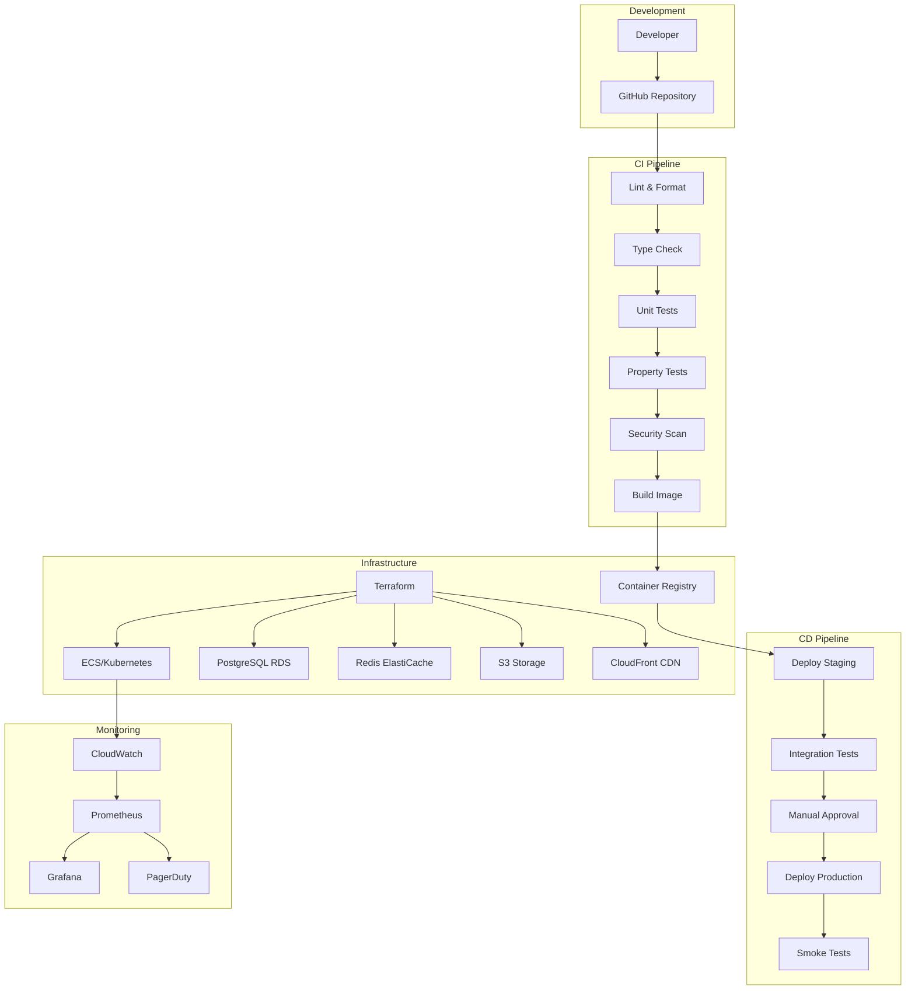

# Design Document: Deployment Infrastructure Module

## Overview

The Deployment Infrastructure Module provides CI/CD pipelines, environment management, infrastructure as code, and deployment automation for CashTrace. The design prioritizes reliability, security, and cost-efficiency while supporting Nigerian data residency requirements.

### Design Goals

1. **Automated**: Minimal manual intervention in deployments
2. **Reliable**: Zero-downtime deployments with easy rollback
3. **Secure**: Secrets management and security scanning
4. **Compliant**: Nigerian data residency requirements
5. **Cost-Effective**: Right-sized resources with auto-scaling

### Key Design Decisions

- **GitHub Actions**: CI/CD pipeline orchestration
- **Terraform**: Infrastructure as code
- **ECS/Kubernetes**: Container orchestration
- **AWS Africa (Cape Town)**: Primary region for data residency
- **Blue-Green Deployments**: Zero-downtime releases

## Architecture



````

## Components and Interfaces

### CIPipeline

Continuous integration pipeline configuration.

```typescript
interface CIPipeline {
  trigger: PipelineTrigger;
  stages: CIStage[];
  artifacts: Artifact[];
  notifications: PipelineNotification[];
}

interface CIStage {
  name: string;
  jobs: CIJob[];
  dependsOn?: string[];
}

interface CIJob {
  name: string;
  runner: string;
  steps: JobStep[];
  timeout: number;
  retries: number;
}

interface JobStep {
  name: string;
  run?: string;
  uses?: string;
  with?: Record<string, string>;
  env?: Record<string, string>;
}

type PipelineTrigger = 'push' | 'pull_request' | 'schedule' | 'manual';
````

### CDPipeline

Continuous deployment pipeline configuration.

```typescript
interface CDPipeline {
  environments: Environment[];
  deploymentStrategy: DeploymentStrategy;
  approvals: ApprovalGate[];
  rollback: RollbackConfig;
}

interface Environment {
  name: string;
  url: string;
  variables: EnvironmentVariable[];
  secrets: SecretReference[];
  autoDeployBranch?: string;
  requiresApproval: boolean;
}

interface DeploymentStrategy {
  type: "rolling" | "blue_green" | "canary";
  maxUnavailable?: number;
  canaryPercentage?: number;
  healthCheckPath: string;
  healthCheckTimeout: number;
}

interface RollbackConfig {
  automatic: boolean;
  healthCheckFailures: number;
  rollbackTimeout: number;
}
```

### InfrastructureConfig

Terraform infrastructure configuration.

```typescript
interface InfrastructureConfig {
  provider: CloudProvider;
  region: string;
  resources: ResourceConfig[];
  networking: NetworkConfig;
  security: SecurityConfig;
}

interface ResourceConfig {
  type: ResourceType;
  name: string;
  size: string;
  replicas?: number;
  autoScaling?: AutoScalingConfig;
}

interface AutoScalingConfig {
  minReplicas: number;
  maxReplicas: number;
  targetCPU: number;
  targetMemory: number;
  scaleDownDelay: number;
}

type CloudProvider = "aws" | "gcp" | "azure";
type ResourceType = "compute" | "database" | "cache" | "storage" | "cdn";
```

### SecretManager

Secure secrets management.

```typescript
interface SecretManager {
  getSecret(name: string): Promise<string>;
  setSecret(name: string, value: string): Promise<void>;
  rotateSecret(name: string): Promise<void>;
  listSecrets(): Promise<SecretMetadata[]>;
  auditAccess(name: string): Promise<SecretAccessLog[]>;
}

interface SecretMetadata {
  name: string;
  version: string;
  createdAt: Date;
  rotatedAt: Date;
  expiresAt?: Date;
}

interface SecretAccessLog {
  timestamp: Date;
  principal: string;
  action: "read" | "write" | "rotate";
  success: boolean;
}
```

## Data Models

### Deployment

```typescript
interface Deployment {
  id: string;
  environment: string;
  version: string;
  commitSha: string;
  status: DeploymentStatus;
  strategy: DeploymentStrategy;
  startedAt: Date;
  completedAt?: Date;
  initiatedBy: string;
  approvedBy?: string;
  rollbackOf?: string;
  healthChecks: HealthCheckResult[];
}

type DeploymentStatus =
  | "pending"
  | "in_progress"
  | "succeeded"
  | "failed"
  | "rolled_back";

interface HealthCheckResult {
  timestamp: Date;
  endpoint: string;
  status: number;
  latency: number;
  healthy: boolean;
}
```

## Correctness Properties

### Property 1: CI Gate Enforcement

_For any_ pull request, merge SHALL be blocked until all CI stages pass.

Validates: Requirements 1.7

### Property 2: Test Coverage Requirement

_For any_ CI run, code coverage SHALL be at least 80% or the pipeline SHALL fail.

Validates: Requirements 1.3

### Property 3: Security Scan Enforcement

_For any_ build, security vulnerabilities above configured severity SHALL block deployment.

Validates: Requirements 1.5

### Property 4: Staging Validation

_For any_ production deployment, it SHALL be preceded by successful staging deployment and integration tests.

Validates: Requirements 2.3

### Property 5: Rollback Capability

_For any_ failed production deployment, rollback to previous version SHALL complete within 5 minutes.

Validates: Requirements 2.4

### Property 6: Secret Isolation

_For any_ secret, it SHALL only be accessible to the environment it's configured for.

Validates: Requirements 6.1, 6.4

### Property 7: Data Residency Compliance

_For any_ user data, it SHALL be stored in African region (Cape Town) only.

Validates: Requirements 13.1, 13.2

### Property 8: Backup Verification

_For any_ database backup, restore capability SHALL be verified weekly.

Validates: Requirements 11.4

### Property 9: Auto-Scaling Response

_For any_ load increase exceeding threshold, additional capacity SHALL be provisioned within 3 minutes.

Validates: Requirements 5.2

### Property 10: Zero-Downtime Deployment

_For any_ deployment, there SHALL be no request failures during the deployment process.

Validates: Requirements 5.4

## Error Handling

### Error Codes

| Code                          | Description                         |
| ----------------------------- | ----------------------------------- |
| `DEPLOY_CI_FAILED`            | CI pipeline stage failed            |
| `DEPLOY_APPROVAL_REQUIRED`    | Manual approval needed              |
| `DEPLOY_HEALTH_CHECK_FAILED`  | Post-deployment health check failed |
| `DEPLOY_ROLLBACK_FAILED`      | Rollback operation failed           |
| `DEPLOY_SECRET_ACCESS_DENIED` | Secret access unauthorized          |
| `DEPLOY_RESOURCE_LIMIT`       | Resource quota exceeded             |

## Testing Strategy

### Property Tests

| Property    | Test Description                          |
| ----------- | ----------------------------------------- |
| Property 1  | Submit failing PR, verify merge blocked   |
| Property 2  | Submit low-coverage code, verify failure  |
| Property 3  | Introduce vulnerability, verify blocking  |
| Property 4  | Skip staging, verify production blocked   |
| Property 5  | Trigger rollback, verify timing           |
| Property 6  | Access cross-env secret, verify denial    |
| Property 7  | Check data location, verify region        |
| Property 8  | Restore backup, verify success            |
| Property 9  | Increase load, verify scaling             |
| Property 10 | Deploy during traffic, verify no failures |
