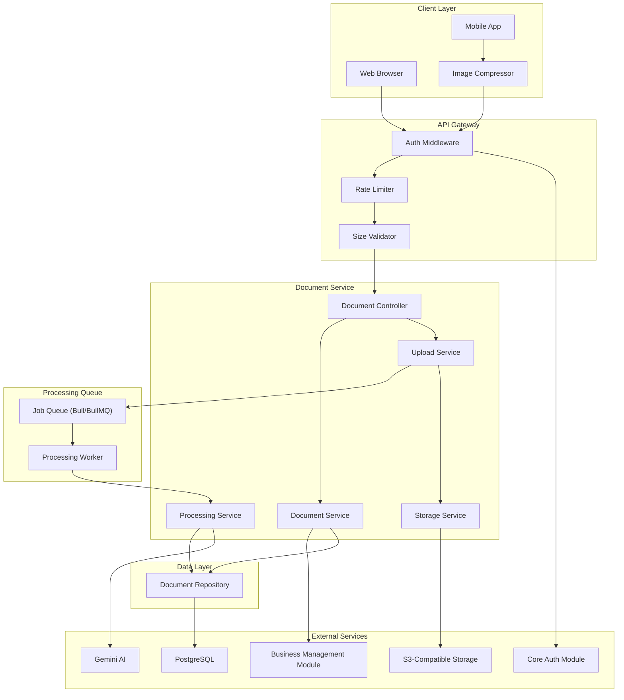
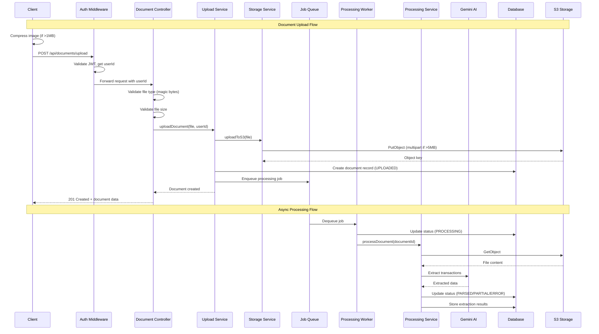

# Design Document: Document Processing Module

## Overview

The Document Processing Module (document-processing) provides comprehensive document upload and processing capabilities for CashTrace. This module is designed as a fully modular component that depends on core-auth for user authentication and business-management for business context. It handles receipt images, bank statements, and POS exports with secure cloud storage and asynchronous AI-powered transaction extraction.

### Design Goals

1. **Mobile-First**: Optimized for camera capture and file picker on low-end Android devices
2. **Reliability**: Multipart uploads, retry logic, and idempotent processing
3. **Security**: No public file access, presigned URLs, magic byte validation
4. **Scalability**: Async processing queue decouples upload from extraction
5. **Nigerian Context**: Support for major Nigerian banks and POS providers

### Key Design Decisions

- **S3-Compatible Storage**: Flexible deployment (AWS S3, Cloudflare R2, MinIO)
- **Magic Byte Validation**: Prevents file type spoofing attacks
- **Client-Side Compression**: Reduces upload time and storage costs for images
- **Idempotency Keys**: Prevents duplicate transactions during retries
- **Job Queue Pattern**: Decouples upload response from processing time
- **Presigned URLs**: Secure, time-limited access without exposing storage credentials

## Architecture



### Request Flow



## Components and Interfaces

### DocumentController

The main entry point for all document operations. Handles HTTP requests and delegates to appropriate services.

```typescript
interface DocumentController {
  // Upload single or multiple files
  uploadDocuments(request: UploadRequest): Promise<UploadResponse>;

  // List documents for business
  listDocuments(request: ListDocumentsRequest): Promise<DocumentListResponse>;

  // Get document details
  getDocument(request: GetDocumentRequest): Promise<DocumentResponse>;

  // Retry failed processing
  retryProcessing(request: RetryRequest): Promise<DocumentResponse>;

  // Delete document
  deleteDocument(request: DeleteDocumentRequest): Promise<GenericResponse>;

  // Get presigned download URL
  getDownloadUrl(request: DownloadUrlRequest): Promise<DownloadUrlResponse>;
}
```

### UploadService

Handles file upload orchestration including validation, storage, and queue submission.

```typescript
interface UploadService {
  // Upload single file
  uploadFile(
    file: UploadedFile,
    userId: string,
    businessId: string,
  ): Promise<Document>;

  // Upload multiple files (batch)
  uploadBatch(
    files: UploadedFile[],
    userId: string,
    businessId: string,
  ): Promise<Document[]>;

  // Validate file type using magic bytes
  validateFileType(file: UploadedFile): FileTypeValidation;

  // Validate file size
  validateFileSize(file: UploadedFile): SizeValidation;

  // Validate batch total size
  validateBatchSize(files: UploadedFile[]): SizeValidation;
}

interface UploadedFile {
  buffer: Buffer;
  originalname: string;
  mimetype: string;
  size: number;
}

interface FileTypeValidation {
  valid: boolean;
  detectedType: DocumentType | null;
  detectedMime: string | null;
  error?: string;
}

interface SizeValidation {
  valid: boolean;
  size: number;
  limit: number;
  error?: string;
}
```

### StorageService

Manages S3-compatible storage operations.

```typescript
interface StorageService {
  // Upload file to S3
  uploadFile(
    buffer: Buffer,
    key: string,
    contentType: string,
  ): Promise<UploadResult>;

  // Upload large file using multipart
  uploadMultipart(
    buffer: Buffer,
    key: string,
    contentType: string,
  ): Promise<UploadResult>;

  // Generate presigned download URL
  getPresignedUrl(key: string, expiresIn: number): Promise<string>;

  // Delete file from S3
  deleteFile(key: string): Promise<void>;

  // Check if file exists
  fileExists(key: string): Promise<boolean>;

  // Get file content
  getFile(key: string): Promise<Buffer>;
}

interface UploadResult {
  key: string;
  bucket: string;
  etag: string;
  size: number;
}
```

### DocumentService

Core business logic for document management.

```typescript
interface DocumentService {
  // Create document record
  createDocument(data: CreateDocumentData): Promise<Document>;

  // Get document by ID with ownership check
  getDocumentById(documentId: string, userId: string): Promise<Document | null>;

  // List documents for business
  listDocuments(
    businessId: string,
    options: ListOptions,
  ): Promise<PaginatedDocuments>;

  // Update document status
  updateStatus(
    documentId: string,
    status: DocumentStatus,
    metadata?: ProcessingMetadata,
  ): Promise<Document>;

  // Delete document
  deleteDocument(documentId: string, userId: string): Promise<void>;

  // Check document ownership
  verifyOwnership(documentId: string, userId: string): Promise<boolean>;
}

interface ListOptions {
  page: number;
  pageSize: number;
  sortBy: "uploadedAt" | "filename" | "status";
  sortOrder: "asc" | "desc";
  status?: DocumentStatus;
  type?: DocumentType;
}

interface PaginatedDocuments {
  documents: Document[];
  total: number;
  page: number;
  pageSize: number;
  totalPages: number;
}
```

### ProcessingService

Handles document processing and transaction extraction.

```typescript
interface ProcessingService {
  // Process document (called by worker)
  processDocument(documentId: string): Promise<ProcessingResult>;

  // Extract transactions from receipt image
  extractFromReceipt(buffer: Buffer): Promise<ExtractionResult>;

  // Extract transactions from bank statement
  extractFromBankStatement(buffer: Buffer): Promise<ExtractionResult>;

  // Extract transactions from POS export
  extractFromPosExport(buffer: Buffer): Promise<ExtractionResult>;

  // Retry processing with idempotency
  retryProcessing(
    documentId: string,
    idempotencyKey: string,
  ): Promise<ProcessingResult>;
}

interface ProcessingResult {
  success: boolean;
  status: DocumentStatus;
  transactionsExtracted: number;
  warnings: string[];
  errors: string[];
  processingTimeMs: number;
}

interface ExtractionResult {
  transactions: ExtractedTransaction[];
  warnings: string[];
  errors: string[];
  confidence: number;
}

interface ExtractedTransaction {
  date: Date;
  description: string;
  amount: number;
  type: "credit" | "debit";
  category?: string;
  reference?: string;
  metadata: Record<string, unknown>;
}
```

### FileTypeValidator

Validates file types using magic bytes.

```typescript
interface FileTypeValidator {
  // Detect file type from buffer
  detectFileType(buffer: Buffer): DetectedFileType;

  // Validate file matches expected type
  validateType(buffer: Buffer, expectedType: DocumentType): ValidationResult;

  // Check if file type is supported
  isSupportedType(buffer: Buffer): boolean;
}

interface DetectedFileType {
  mime: string;
  ext: string;
  documentType: DocumentType | null;
}

interface ValidationResult {
  valid: boolean;
  detected: DetectedFileType;
  expected: DocumentType;
  error?: string;
}
```

## Data Models

### Document

```typescript
interface Document {
  id: string; // UUID v4
  businessId: string; // Foreign key to Business
  userId: string; // User who uploaded (from core-auth)
  filename: string; // Sanitized filename for storage
  originalFilename: string; // Original filename from upload
  documentType: DocumentType; // RECEIPT_IMAGE, BANK_STATEMENT, POS_EXPORT
  mimeType: string; // Detected MIME type
  fileSize: number; // Size in bytes
  s3Key: string; // S3 object key
  s3Bucket: string; // S3 bucket name
  status: DocumentStatus; // Processing status
  processingStartedAt: Date | null;
  processingCompletedAt: Date | null;
  processingDurationMs: number | null;
  transactionsExtracted: number | null;
  processingWarnings: string[];
  processingErrors: string[];
  idempotencyKey: string | null; // For retry deduplication
  uploadedAt: Date;
  updatedAt: Date;
}

type DocumentType = "RECEIPT_IMAGE" | "BANK_STATEMENT" | "POS_EXPORT";

type DocumentStatus =
  | "UPLOADED"
  | "PROCESSING"
  | "PARSED"
  | "PARTIAL"
  | "ERROR";
```

### ProcessingJob

```typescript
interface ProcessingJob {
  id: string; // UUID v4
  documentId: string; // Foreign key to Document
  status: JobStatus; // Job queue status
  attempts: number; // Number of processing attempts
  maxAttempts: number; // Maximum retry attempts (3)
  lastError: string | null; // Last error message
  nextRetryAt: Date | null; // Next retry timestamp (exponential backoff)
  createdAt: Date;
  updatedAt: Date;
}

type JobStatus = "PENDING" | "ACTIVE" | "COMPLETED" | "FAILED" | "RETRYING";
```

### API Request/Response Types

```typescript
// Requests
interface UploadRequest {
  files: UploadedFile[]; // Multipart form data
}

interface ListDocumentsRequest {
  page?: number; // Default 1
  pageSize?: number; // Default 20, max 100
  status?: DocumentStatus; // Filter by status
  type?: DocumentType; // Filter by type
}

interface GetDocumentRequest {
  documentId: string;
}

interface RetryRequest {
  documentId: string;
}

interface DeleteDocumentRequest {
  documentId: string;
}

interface DownloadUrlRequest {
  documentId: string;
}

// Responses
interface UploadResponse {
  success: boolean;
  documents: DocumentPublic[];
  requestId: string;
}

interface DocumentListResponse {
  success: boolean;
  documents: DocumentPublic[];
  pagination: PaginationInfo;
  requestId: string;
}

interface DocumentResponse {
  success: boolean;
  document: DocumentPublic;
  requestId: string;
}

interface DownloadUrlResponse {
  success: boolean;
  url: string;
  expiresAt: string; // ISO 8601
  requestId: string;
}

interface DocumentPublic {
  id: string;
  filename: string;
  originalFilename: string;
  documentType: DocumentType;
  documentTypeDisplay: string; // Human-readable type
  fileSize: number;
  fileSizeDisplay: string; // Human-readable size (e.g., "2.5 MB")
  status: DocumentStatus;
  statusDisplay: string; // Human-readable status
  transactionsExtracted: number | null;
  processingWarnings: string[];
  processingErrors: string[];
  uploadedAt: string; // ISO 8601
  updatedAt: string; // ISO 8601
}

interface PaginationInfo {
  page: number;
  pageSize: number;
  total: number;
  totalPages: number;
  hasNext: boolean;
  hasPrevious: boolean;
}

interface GenericResponse {
  success: boolean;
  message: string;
  requestId: string;
}

interface ErrorResponse {
  success: false;
  error: {
    code: string;
    message: string;
    fields?: Record<string, string[]>;
  };
  requestId: string;
}
```

### Database Schema

```sql
-- Document types enum
CREATE TYPE document_type AS ENUM (
  'RECEIPT_IMAGE',
  'BANK_STATEMENT',
  'POS_EXPORT'
);

-- Document status enum
CREATE TYPE document_status AS ENUM (
  'UPLOADED',
  'PROCESSING',
  'PARSED',
  'PARTIAL',
  'ERROR'
);

-- Job status enum
CREATE TYPE job_status AS ENUM (
  'PENDING',
  'ACTIVE',
  'COMPLETED',
  'FAILED',
  'RETRYING'
);

-- Documents table
CREATE TABLE documents (
  id UUID PRIMARY KEY DEFAULT gen_random_uuid(),
  business_id UUID NOT NULL,
  user_id UUID NOT NULL,
  filename VARCHAR(255) NOT NULL,
  original_filename VARCHAR(255) NOT NULL,
  document_type document_type NOT NULL,
  mime_type VARCHAR(100) NOT NULL,
  file_size INTEGER NOT NULL,
  s3_key VARCHAR(500) NOT NULL,
  s3_bucket VARCHAR(100) NOT NULL,
  status document_status NOT NULL DEFAULT 'UPLOADED',
  processing_started_at TIMESTAMP WITH TIME ZONE,
  processing_completed_at TIMESTAMP WITH TIME ZONE,
  processing_duration_ms INTEGER,
  transactions_extracted INTEGER,
  processing_warnings TEXT[] DEFAULT '{}',
  processing_errors TEXT[] DEFAULT '{}',
  idempotency_key VARCHAR(64),
  uploaded_at TIMESTAMP WITH TIME ZONE DEFAULT NOW(),
  updated_at TIMESTAMP WITH TIME ZONE DEFAULT NOW(),

  CONSTRAINT file_size_limit CHECK (file_size <= 10485760)  -- 10MB
);

CREATE INDEX idx_documents_business_id ON documents(business_id);
CREATE INDEX idx_documents_user_id ON documents(user_id);
CREATE INDEX idx_documents_status ON documents(status);
CREATE INDEX idx_documents_uploaded_at ON documents(uploaded_at DESC);
CREATE INDEX idx_documents_idempotency_key ON documents(idempotency_key) WHERE idempotency_key IS NOT NULL;

-- Processing jobs table
CREATE TABLE processing_jobs (
  id UUID PRIMARY KEY DEFAULT gen_random_uuid(),
  document_id UUID NOT NULL REFERENCES documents(id) ON DELETE CASCADE,
  status job_status NOT NULL DEFAULT 'PENDING',
  attempts INTEGER NOT NULL DEFAULT 0,
  max_attempts INTEGER NOT NULL DEFAULT 3,
  last_error TEXT,
  next_retry_at TIMESTAMP WITH TIME ZONE,
  created_at TIMESTAMP WITH TIME ZONE DEFAULT NOW(),
  updated_at TIMESTAMP WITH TIME ZONE DEFAULT NOW()
);

CREATE INDEX idx_processing_jobs_document_id ON processing_jobs(document_id);
CREATE INDEX idx_processing_jobs_status ON processing_jobs(status);
CREATE INDEX idx_processing_jobs_next_retry_at ON processing_jobs(next_retry_at) WHERE status = 'RETRYING';
```

### Prisma Schema

```prisma
enum DocumentType {
  RECEIPT_IMAGE
  BANK_STATEMENT
  POS_EXPORT
}

enum DocumentStatus {
  UPLOADED
  PROCESSING
  PARSED
  PARTIAL
  ERROR
}

enum JobStatus {
  PENDING
  ACTIVE
  COMPLETED
  FAILED
  RETRYING
}

model Document {
  id                    String         @id @default(uuid())
  businessId            String         @map("business_id")
  userId                String         @map("user_id")
  filename              String         @db.VarChar(255)
  originalFilename      String         @map("original_filename") @db.VarChar(255)
  documentType          DocumentType   @map("document_type")
  mimeType              String         @map("mime_type") @db.VarChar(100)
  fileSize              Int            @map("file_size")
  s3Key                 String         @map("s3_key") @db.VarChar(500)
  s3Bucket              String         @map("s3_bucket") @db.VarChar(100)
  status                DocumentStatus @default(UPLOADED)
  processingStartedAt   DateTime?      @map("processing_started_at")
  processingCompletedAt DateTime?      @map("processing_completed_at")
  processingDurationMs  Int?           @map("processing_duration_ms")
  transactionsExtracted Int?           @map("transactions_extracted")
  processingWarnings    String[]       @default([]) @map("processing_warnings")
  processingErrors      String[]       @default([]) @map("processing_errors")
  idempotencyKey        String?        @map("idempotency_key") @db.VarChar(64)
  uploadedAt            DateTime       @default(now()) @map("uploaded_at")
  updatedAt             DateTime       @updatedAt @map("updated_at")

  processingJobs ProcessingJob[]

  @@index([businessId])
  @@index([userId])
  @@index([status])
  @@index([uploadedAt(sort: Desc)])
  @@index([idempotencyKey])
  @@map("documents")
}

model ProcessingJob {
  id          String    @id @default(uuid())
  documentId  String    @map("document_id")
  status      JobStatus @default(PENDING)
  attempts    Int       @default(0)
  maxAttempts Int       @default(3) @map("max_attempts")
  lastError   String?   @map("last_error")
  nextRetryAt DateTime? @map("next_retry_at")
  createdAt   DateTime  @default(now()) @map("created_at")
  updatedAt   DateTime  @updatedAt @map("updated_at")

  document Document @relation(fields: [documentId], references: [id], onDelete: Cascade)

  @@index([documentId])
  @@index([status])
  @@index([nextRetryAt])
  @@map("processing_jobs")
}
```

### Magic Bytes Reference

```typescript
const MAGIC_BYTES: Record<
  string,
  { bytes: number[]; mime: string; documentType: DocumentType }
> = {
  // JPEG
  jpeg: {
    bytes: [0xff, 0xd8, 0xff],
    mime: "image/jpeg",
    documentType: "RECEIPT_IMAGE",
  },
  // PNG
  png: {
    bytes: [0x89, 0x50, 0x4e, 0x47, 0x0d, 0x0a, 0x1a, 0x0a],
    mime: "image/png",
    documentType: "RECEIPT_IMAGE",
  },
  // PDF
  pdf: {
    bytes: [0x25, 0x50, 0x44, 0x46], // %PDF
    mime: "application/pdf",
    documentType: "BANK_STATEMENT",
  },
};

// CSV is text-based, validated by structure not magic bytes
const CSV_VALIDATION = {
  mime: "text/csv",
  documentType: "POS_EXPORT" as DocumentType,
};
```

### S3 Key Structure

```
documents/
  {businessId}/
    {documentType}/
      {year}/{month}/
        {documentId}_{sanitizedFilename}

Example:
documents/550e8400-e29b-41d4-a716-446655440000/RECEIPT_IMAGE/2024/01/abc123_receipt.jpg
```

## Correctness Properties

_A property is a characteristic or behavior that should hold true across all valid executions of a system—essentially, a formal statement about what the system should do. Properties serve as the bridge between human-readable specifications and machine-verifiable correctness guarantees._

### Property 1: File Type Validation Correctness

_For any_ file buffer, the file type validator SHALL accept it as a valid receipt image if and only if its magic bytes match JPEG (0xFF 0xD8 0xFF) or PNG (0x89 0x50 0x4E 0x47) signatures. _For any_ file buffer, the validator SHALL accept it as a valid bank statement if and only if its magic bytes match PDF (0x25 0x50 0x44 0x46) signature. _For any_ text content, the validator SHALL accept it as a valid POS export if and only if it contains valid CSV structure.

**Validates: Requirements 1.1, 1.2, 2.1, 2.2, 3.1, 3.2**

### Property 2: File Size Limit Enforcement

_For any_ file upload, if the file size exceeds 10MB (10,485,760 bytes), the upload SHALL be rejected with a size limit error. _For any_ batch upload, if the total size of all files exceeds 50MB (52,428,800 bytes), the entire batch SHALL be rejected with a batch size limit error.

**Validates: Requirements 4.1, 4.2, 4.3, 4.4**

### Property 3: Multipart Upload Threshold

_For any_ file upload where the file size exceeds 5MB (5,242,880 bytes), the storage service SHALL use multipart upload instead of single-part upload.

**Validates: Requirements 4.5**

### Property 4: Unique S3 Key Generation

_For any_ two documents uploaded to the system (regardless of having the same filename or content), their S3 keys SHALL be different. _For any_ document, its S3 key SHALL contain the business ID as a path component.

**Validates: Requirements 1.4, 2.4, 3.3, 8.5**

### Property 5: Business Association Invariant

_For any_ document in the system, it SHALL have a non-null businessId that references a valid business. _For any_ document upload by a user, the document SHALL be associated with that user's business.

**Validates: Requirements 1.5**

### Property 6: Document Status State Machine

_For any_ newly uploaded document, its initial status SHALL be UPLOADED. _For any_ document, valid status transitions SHALL be: UPLOADED → PROCESSING, PROCESSING → PARSED, PROCESSING → PARTIAL, PROCESSING → ERROR, ERROR → PROCESSING (retry). No other status transitions SHALL be allowed.

**Validates: Requirements 5.2, 5.3, 5.4, 5.5, 5.6, 6.3**

### Property 7: Idempotent Retry Processing

_For any_ document retry operation with the same idempotency key, the system SHALL NOT create duplicate transactions. _For any_ retry operation, the number of transactions associated with the document SHALL be the same whether the operation is performed once or multiple times with the same idempotency key.

**Validates: Requirements 6.4**

### Property 8: Retry Eligibility

_For any_ document with ERROR status, retry processing SHALL be allowed. _For any_ document with status other than ERROR, retry processing SHALL be rejected.

**Validates: Requirements 6.1, 6.2**

### Property 9: Document Listing Business Isolation

_For any_ document listing request by a user, the returned documents SHALL contain only documents belonging to that user's business. _For any_ document belonging to a different business, it SHALL NOT appear in the listing results.

**Validates: Requirements 7.1**

### Property 10: Pagination Correctness

_For any_ paginated document listing with page P and page size S, the returned documents SHALL be at most S documents. _For any_ two consecutive pages, the documents SHALL not overlap. _For any_ complete pagination through all pages, the union of all returned documents SHALL equal the total set of documents for that business.

**Validates: Requirements 7.4**

### Property 11: Default Sort Order

_For any_ document listing without explicit sort parameters, the documents SHALL be sorted by uploadedAt in descending order (newest first).

**Validates: Requirements 7.5**

### Property 12: Ownership Enforcement

_For any_ document operation (get details, download, delete, retry) where the requesting user's business ID does not match the document's business ID, the operation SHALL be rejected with a 403 Forbidden error and the document SHALL remain unchanged.

**Validates: Requirements 8.4, 9.1, 9.5**

### Property 13: Presigned URL Expiration

_For any_ presigned URL generated for document download, the URL SHALL have an expiration time of exactly 15 minutes from generation.

**Validates: Requirements 8.3**

### Property 14: Document Deletion Cascade

_For any_ document deletion, the S3 object SHALL be removed from storage AND the document record SHALL be removed from the database. _For any_ transactions that were extracted from the deleted document, they SHALL remain in the database after deletion.

**Validates: Requirements 9.2, 9.3, 9.4**

### Property 15: Upload Metadata Completeness

_For any_ uploaded document, the following fields SHALL be populated: id (valid UUID v4), businessId, userId, filename, originalFilename, documentType, mimeType, fileSize, s3Key, s3Bucket, status, and uploadedAt.

**Validates: Requirements 10.1, 10.4, 10.5**

### Property 16: Processing Metadata Completeness

_For any_ document that has completed processing (status PARSED, PARTIAL, or ERROR), the following fields SHALL be populated: processingStartedAt, processingCompletedAt, and processingDurationMs. _For any_ document with status PARSED or PARTIAL, transactionsExtracted SHALL be a non-negative integer.

**Validates: Requirements 10.2, 10.3**

### Property 17: Retry Behavior with Exponential Backoff

_For any_ processing job that fails, the system SHALL retry up to 3 times. _For any_ retry attempt N (where N is 1, 2, or 3), the delay before retry SHALL follow exponential backoff. _For any_ document where all 3 retry attempts have failed, the status SHALL be ERROR.

**Validates: Requirements 11.5, 11.6**

### Property 18: Async Upload Response

_For any_ document upload, the API SHALL return a success response with the document in UPLOADED status before processing completes. The processing SHALL occur asynchronously after the upload response is sent.

**Validates: Requirements 11.1, 11.4**

### Property 19: API Response Consistency

_For any_ API response, it SHALL be valid JSON containing either a success response with the expected data structure (including requestId) OR an error response with error code, message, and requestId. HTTP status codes SHALL match the response type (201 for upload creation, 200 for success, 400 for validation errors, 403 for forbidden, 404 for not found, 413 for payload too large).

**Validates: Requirements 1.6, 2.5, 3.4, 12.1, 12.2, 12.3, 12.4**

### Property 20: Document Listing Field Completeness

_For any_ document in a listing response, it SHALL include: id, filename, documentType, fileSize, uploadedAt, and status.

**Validates: Requirements 7.2, 7.3**

## Error Handling

### Error Response Format

All errors follow a consistent JSON structure:

```typescript
interface ErrorResponse {
  success: false;
  error: {
    code: string; // Machine-readable error code
    message: string; // Human-readable message
    fields?: {
      // Field-specific errors for validation
      [fieldName: string]: string[];
    };
  };
  requestId: string; // Correlation ID for debugging
}
```

### Error Codes

| Code                     | HTTP Status | Description                                    |
| ------------------------ | ----------- | ---------------------------------------------- |
| `DOC_INVALID_FILE_TYPE`  | 400         | File type not supported (not JPEG/PNG/PDF/CSV) |
| `DOC_FILE_TOO_LARGE`     | 413         | File exceeds 10MB limit                        |
| `DOC_BATCH_TOO_LARGE`    | 413         | Batch exceeds 50MB total limit                 |
| `DOC_INVALID_CSV`        | 400         | CSV file has invalid structure                 |
| `DOC_NOT_FOUND`          | 404         | Document not found                             |
| `DOC_FORBIDDEN`          | 403         | User does not own this document                |
| `DOC_ALREADY_PROCESSING` | 400         | Document is already being processed            |
| `DOC_RETRY_NOT_ALLOWED`  | 400         | Document status does not allow retry           |
| `DOC_UPLOAD_FAILED`      | 500         | Failed to upload to storage                    |
| `DOC_PROCESSING_FAILED`  | 500         | Document processing failed                     |
| `VALIDATION_ERROR`       | 400         | General validation failure                     |
| `INTERNAL_ERROR`         | 500         | Unexpected server error                        |

### Error Handling Strategies

1. **File Validation Errors**: Return 400 with specific error about file type or size
2. **Size Limit Errors**: Return 413 with clear message about the limit exceeded
3. **Not Found Errors**: Return 404 with message about missing document
4. **Authorization Errors**: Return 403 with ownership error message
5. **Processing Errors**: Return 500, log full details, update document status to ERROR
6. **Storage Errors**: Return 500, attempt cleanup of partial uploads

### Graceful Degradation

- If S3 upload fails, return error immediately without creating database record
- If processing queue is unavailable, still accept upload and mark for later processing
- If Gemini AI is unavailable, mark document as ERROR with retry available
- If presigned URL generation fails, return error without exposing storage details

## Testing Strategy

### Dual Testing Approach

This module requires both unit tests and property-based tests for comprehensive coverage:

- **Unit Tests**: Verify specific examples, edge cases, integration points, and error conditions
- **Property Tests**: Verify universal properties across randomly generated inputs

### Property-Based Testing Configuration

- **Library**: fast-check (TypeScript/JavaScript)
- **Minimum Iterations**: 100 per property test
- **Tag Format**: `Feature: document-processing, Property {N}: {property_text}`

### Unit Test Coverage

| Component         | Test Focus                                                        |
| ----------------- | ----------------------------------------------------------------- |
| FileTypeValidator | Magic byte detection for JPEG, PNG, PDF; CSV structure validation |
| SizeValidator     | Boundary conditions (9.9MB, 10MB, 10.1MB), batch totals           |
| StorageService    | S3 operations, multipart threshold, presigned URL generation      |
| DocumentService   | CRUD operations, ownership checks, status transitions             |
| ProcessingService | Extraction logic, retry behavior, idempotency                     |
| UploadService     | File validation orchestration, batch handling                     |

### Property Test Coverage

| Property    | Test Description                                                   |
| ----------- | ------------------------------------------------------------------ |
| Property 1  | Generate random buffers, verify magic byte detection accuracy      |
| Property 2  | Generate files of various sizes, verify size limit enforcement     |
| Property 3  | Generate files around 5MB threshold, verify multipart selection    |
| Property 4  | Generate multiple uploads, verify S3 key uniqueness                |
| Property 5  | Generate uploads, verify business association                      |
| Property 6  | Generate status transitions, verify state machine rules            |
| Property 7  | Generate retry operations with same key, verify no duplicates      |
| Property 8  | Generate documents with various statuses, verify retry eligibility |
| Property 9  | Generate multi-business scenarios, verify listing isolation        |
| Property 10 | Generate large document sets, verify pagination correctness        |
| Property 11 | Generate listings without sort params, verify default order        |
| Property 12 | Generate cross-business operations, verify 403 responses           |
| Property 13 | Generate presigned URLs, verify 15-minute expiration               |
| Property 14 | Generate deletions, verify cascade behavior                        |
| Property 15 | Generate uploads, verify metadata completeness                     |
| Property 16 | Generate processed documents, verify processing metadata           |
| Property 17 | Generate failing jobs, verify retry behavior                       |
| Property 18 | Generate uploads, verify async response timing                     |
| Property 19 | Generate API calls, verify response format consistency             |
| Property 20 | Generate listings, verify field completeness                       |

### Integration Test Scenarios

1. **Full Upload Flow**: Upload → Queue → Process → PARSED status
2. **Retry Flow**: Upload → Process fails → ERROR → Retry → PARSED
3. **Batch Upload**: Upload multiple files → All queued → All processed
4. **Ownership Validation**: Upload as User A → Attempt access as User B → 403
5. **Deletion Flow**: Upload → Process → Delete → Verify S3 removed, transactions remain
6. **Pagination Flow**: Upload 50 documents → Paginate through all → Verify completeness

### Test Data Generators

```typescript
// Example fast-check arbitraries for property tests

// Valid JPEG magic bytes
const jpegBufferArb = fc
  .tuple(
    fc.constant(Buffer.from([0xff, 0xd8, 0xff])),
    fc.uint8Array({ minLength: 100, maxLength: 1000 }),
  )
  .map(([header, body]) => Buffer.concat([header, Buffer.from(body)]));

// Valid PNG magic bytes
const pngBufferArb = fc
  .tuple(
    fc.constant(Buffer.from([0x89, 0x50, 0x4e, 0x47, 0x0d, 0x0a, 0x1a, 0x0a])),
    fc.uint8Array({ minLength: 100, maxLength: 1000 }),
  )
  .map(([header, body]) => Buffer.concat([header, Buffer.from(body)]));

// Valid PDF magic bytes
const pdfBufferArb = fc
  .tuple(
    fc.constant(Buffer.from([0x25, 0x50, 0x44, 0x46])), // %PDF
    fc.uint8Array({ minLength: 100, maxLength: 1000 }),
  )
  .map(([header, body]) => Buffer.concat([header, Buffer.from(body)]));

// Invalid file (random bytes)
const invalidBufferArb = fc
  .uint8Array({ minLength: 100, maxLength: 1000 })
  .filter((arr) => {
    // Ensure it doesn't accidentally match valid signatures
    const buf = Buffer.from(arr);
    return (
      !buf.slice(0, 3).equals(Buffer.from([0xff, 0xd8, 0xff])) &&
      !buf
        .slice(0, 8)
        .equals(
          Buffer.from([0x89, 0x50, 0x4e, 0x47, 0x0d, 0x0a, 0x1a, 0x0a]),
        ) &&
      !buf.slice(0, 4).equals(Buffer.from([0x25, 0x50, 0x44, 0x46]))
    );
  })
  .map((arr) => Buffer.from(arr));

// Valid CSV content
const csvRowArb = fc
  .array(fc.string(), { minLength: 2, maxLength: 5 })
  .map((cols) => cols.map((c) => `"${c.replace(/"/g, '""')}"`).join(","));

const validCsvArb = fc
  .array(csvRowArb, { minLength: 2, maxLength: 10 })
  .map((rows) => rows.join("\n"));

// File size generators
const underLimitSizeArb = fc.integer({ min: 1, max: 10485759 }); // < 10MB
const overLimitSizeArb = fc.integer({ min: 10485761, max: 20000000 }); // > 10MB

// Document status
const documentStatusArb = fc.constantFrom(
  "UPLOADED",
  "PROCESSING",
  "PARSED",
  "PARTIAL",
  "ERROR",
);

// Document type
const documentTypeArb = fc.constantFrom(
  "RECEIPT_IMAGE",
  "BANK_STATEMENT",
  "POS_EXPORT",
);

// Business and user IDs
const businessIdArb = fc.uuid();
const userIdArb = fc.uuid();
const documentIdArb = fc.uuid();
```
