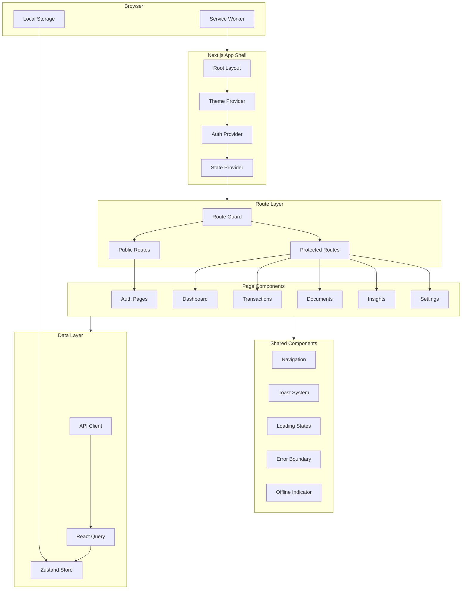

# Design Document: Frontend Shell Module

## Overview

The Frontend Shell Module provides the Next.js application foundation for CashTrace, including routing, state management, authentication flows, and shared UI components. The design prioritizes mobile-first responsive layouts optimized for low-end Android devices common among Nigerian SME owners.

### Design Goals

1. **Mobile-First**: Optimized for small screens and touch interactions
2. **Offline-Capable**: Core functionality available without network
3. **Fast**: Sub-3-second initial load on 3G networks
4. **Accessible**: WCAG 2.1 AA compliant
5. **Consistent**: Unified design system across all pages

### Key Design Decisions

- **Next.js App Router**: File-based routing with server components
- **Zustand**: Lightweight state management over Redux
- **Tailwind CSS**: Utility-first styling with custom design tokens
- **PWA**: Service worker for offline support and installability
- **WAT Timezone**: All dates/times displayed in West Africa Time

## Architecture



````

## Components and Interfaces

### AuthProvider

Manages authentication state and token refresh.

```typescript
interface AuthProvider {
  user: User | null;
  isAuthenticated: boolean;
  isLoading: boolean;
  login(credentials: LoginCredentials): Promise<void>;
  logout(): Promise<void>;
  refreshToken(): Promise<void>;
}

interface User {
  id: string;
  email: string;
  businessId: string;
  businessName: string;
}
````

### GlobalStore

Zustand store for application-wide state.

```typescript
interface GlobalStore {
  // User state
  user: User | null;
  setUser: (user: User | null) => void;

  // Business context
  activeBusiness: Business | null;
  setActiveBusiness: (business: Business | null) => void;

  // UI preferences
  theme: "light" | "dark" | "system";
  setTheme: (theme: "light" | "dark" | "system") => void;

  // Notifications
  unreadCount: number;
  setUnreadCount: (count: number) => void;

  // Offline state
  isOnline: boolean;
  setIsOnline: (online: boolean) => void;
  pendingActions: PendingAction[];
  addPendingAction: (action: PendingAction) => void;
  clearPendingActions: () => void;
}
```

### RouteGuard

Protects routes based on authentication and permissions.

```typescript
interface RouteGuard {
  requireAuth: boolean;
  requiredPermissions?: Permission[];
  fallbackPath: string;
}

type Permission =
  | "read:transactions"
  | "write:transactions"
  | "read:insights"
  | "manage:business";
```

### ToastService

Manages toast notifications.

```typescript
interface ToastService {
  show(toast: ToastOptions): string;
  dismiss(toastId: string): void;
  dismissAll(): void;
}

interface ToastOptions {
  type: "success" | "error" | "warning" | "info";
  title: string;
  message?: string;
  duration?: number;
  action?: ToastAction;
}

interface ToastAction {
  label: string;
  onClick: () => void;
}
```

### APIClient

Configured HTTP client for backend communication.

```typescript
interface APIClient {
  get<T>(path: string, options?: RequestOptions): Promise<T>;
  post<T>(path: string, data: unknown, options?: RequestOptions): Promise<T>;
  put<T>(path: string, data: unknown, options?: RequestOptions): Promise<T>;
  delete<T>(path: string, options?: RequestOptions): Promise<T>;
}

interface RequestOptions {
  headers?: Record<string, string>;
  timeout?: number;
  retry?: boolean;
}
```

## Data Models

### Theme Configuration

```typescript
interface ThemeConfig {
  colors: {
    primary: string;
    secondary: string;
    accent: string;
    background: string;
    surface: string;
    text: string;
    textSecondary: string;
    error: string;
    warning: string;
    success: string;
    info: string;
  };
  typography: {
    fontFamily: string;
    fontSize: Record<string, string>;
    fontWeight: Record<string, number>;
    lineHeight: Record<string, number>;
  };
  spacing: Record<string, string>;
  borderRadius: Record<string, string>;
  breakpoints: {
    mobile: string;
    tablet: string;
    desktop: string;
  };
}
```

### Offline Action

```typescript
interface PendingAction {
  id: string;
  type: "create" | "update" | "delete";
  resource: string;
  data: unknown;
  createdAt: Date;
  retryCount: number;
}
```

## Correctness Properties

### Property 1: Authentication State Consistency

_For any_ protected route access, the user SHALL be redirected to login if not authenticated, and returned to original destination after successful login.

Validates: Requirements 2.5, 2.6

### Property 2: Token Refresh Timing

_For any_ authenticated session, token refresh SHALL occur before expiration to prevent session interruption.

Validates: Requirements 2.4

### Property 3: Offline Action Persistence

_For any_ action performed while offline, it SHALL be persisted to localStorage and synced when connection is restored.

Validates: Requirements 10.3, 10.5

### Property 4: Theme Persistence

_For any_ theme preference change, it SHALL be persisted to localStorage and applied on subsequent visits.

Validates: Requirements 12.3

### Property 5: Responsive Breakpoint Behavior

_For any_ screen width, the appropriate layout (mobile/tablet/desktop) SHALL be rendered based on defined breakpoints.

Validates: Requirements 5.2

### Property 6: Toast Stacking

_For any_ multiple simultaneous toasts, they SHALL stack without overlap and auto-dismiss in order.

Validates: Requirements 7.4

### Property 7: Loading State Timeout

_For any_ loading state exceeding 30 seconds, an error state SHALL be displayed with retry option.

Validates: Requirements 8.5

### Property 8: WAT Timezone Display

_For any_ date/time displayed in the UI, it SHALL be formatted in WAT (UTC+1) timezone.

Validates: Requirements 15.1

### Property 9: Currency Formatting

_For any_ monetary amount displayed, it SHALL be formatted as Naira (₦) with proper thousands separators.

Validates: Requirements 15.2

### Property 10: Accessibility Compliance

_For any_ interactive element, it SHALL have appropriate ARIA attributes and be keyboard navigable.

Validates: Requirements 13.1, 13.2

## Error Handling

### Error Boundary Behavior

| Error Type    | Fallback UI           | Recovery Action   |
| ------------- | --------------------- | ----------------- |
| Render Error  | Error page with retry | Reload component  |
| Network Error | Offline indicator     | Retry when online |
| Auth Error    | Login redirect        | Re-authenticate   |
| API Error     | Toast notification    | Retry request     |

## Testing Strategy

### Property Tests

| Property    | Test Description                                       |
| ----------- | ------------------------------------------------------ |
| Property 1  | Navigate to protected routes, verify redirect behavior |
| Property 2  | Simulate token expiration, verify refresh timing       |
| Property 3  | Perform actions offline, verify persistence and sync   |
| Property 4  | Change theme, verify persistence across sessions       |
| Property 5  | Resize viewport, verify layout changes                 |
| Property 6  | Trigger multiple toasts, verify stacking               |
| Property 7  | Simulate slow loading, verify timeout behavior         |
| Property 8  | Display dates, verify WAT formatting                   |
| Property 9  | Display amounts, verify Naira formatting               |
| Property 10 | Navigate with keyboard, verify accessibility           |
