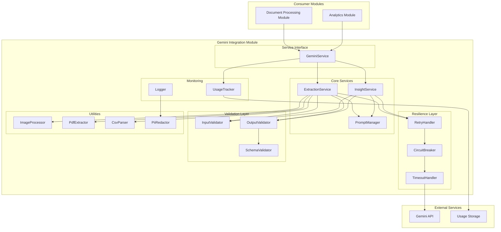
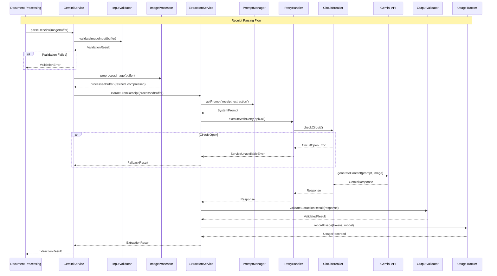
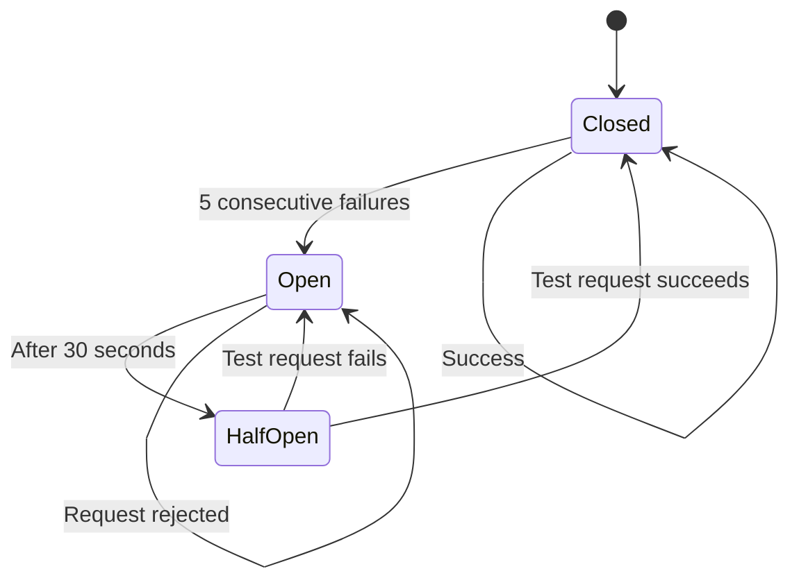

# Design Document: Gemini Integration Module

## Overview

The Gemini Integration Module (gemini-integration) provides an isolated AI service layer for all Gemini API interactions in CashTrace. This module is designed as a fully modular component with no dependencies on other CashTrace modules except for shared type definitions. It handles document parsing (receipts, bank statements, POS exports) and narrative insights generation with robust error handling, cost efficiency, and consistent structured outputs.

### Design Goals

1. **Isolation**: Fully independent module with no CashTrace module dependencies
2. **Reliability**: Retry logic, circuit breaker, and graceful degradation
3. **Cost Efficiency**: Token optimization, image preprocessing, model selection
4. **Consistency**: Structured JSON outputs with schema validation
5. **Nigerian Context**: Optimized prompts for Nigerian business formats
6. **Observability**: Comprehensive logging, usage tracking, and monitoring

### Key Design Decisions

- **Gemini 2.0 Flash Default**: Use Flash model for cost efficiency, Pro for complex documents
- **Structured Output Mode**: Leverage Gemini's native JSON mode when available
- **Image Preprocessing**: Resize and compress images to reduce token usage
- **Circuit Breaker**: Prevent cascade failures when Gemini is unavailable
- **Prompt Versioning**: Enable A/B testing and safe rollback of prompts
- **PII Redaction**: Automatic redaction in logs for compliance

## Architecture



### Request Flow - Receipt Parsing



### Circuit Breaker State Machine



## Components and Interfaces

### GeminiService

The main entry point for all Gemini operations. Provides a clean interface for consumers.

```typescript
interface GeminiService {
  // Parse receipt image and extract transactions
  parseReceipt(imageBuffer: Buffer): Promise<ExtractionResult>;

  // Parse bank statement PDF and extract transactions
  parseBankStatement(pdfBuffer: Buffer): Promise<ExtractionResult>;

  // Parse POS export CSV and extract transactions
  parsePosExport(csvContent: string): Promise<ExtractionResult>;

  // Generate business insights from transaction data
  generateInsights(context: BusinessContext): Promise<InsightResult>;

  // Get API usage statistics
  getUsageStats(options?: UsageStatsOptions): Promise<UsageStats>;

  // Get circuit breaker status
  getCircuitBreakerStatus(): CircuitBreakerStatus;
}
```

### ExtractionService

Handles document extraction operations with Gemini.

```typescript
interface ExtractionService {
  // Extract transactions from receipt image
  extractFromReceipt(
    imageBuffer: Buffer,
    options?: ExtractionOptions,
  ): Promise<ExtractionResult>;

  // Extract transactions from bank statement PDF
  extractFromBankStatement(
    pdfBuffer: Buffer,
    options?: ExtractionOptions,
  ): Promise<ExtractionResult>;

  // Extract transactions from POS CSV
  extractFromPosExport(
    csvContent: string,
    options?: ExtractionOptions,
  ): Promise<ExtractionResult>;
}

interface ExtractionOptions {
  model?: GeminiModel;
  temperature?: number;
  timeout?: number;
  skipPreprocessing?: boolean;
}
```

### InsightService

Handles insight generation operations with Gemini.

```typescript
interface InsightService {
  // Generate insights from business context
  generateInsights(
    context: BusinessContext,
    options?: InsightOptions,
  ): Promise<InsightResult>;
}

interface InsightOptions {
  model?: GeminiModel;
  temperature?: number;
  timeout?: number;
  insightTypes?: InsightType[];
  maxInsights?: number;
}

interface BusinessContext {
  businessId: string;
  businessName: string;
  businessType: string;
  transactions: TransactionSummary[];
  period: { start: string; end: string };
  previousPeriodComparison?: TransactionSummary[];
  customPromptContext?: string;
}

interface TransactionSummary {
  id: string;
  date: string;
  description: string;
  amount: number;
  type: "credit" | "debit";
  category?: string;
  isPersonal?: boolean;
}
```

### PromptManager

Manages system prompts with versioning and Nigerian context.

```typescript
interface PromptManager {
  // Get prompt by type and version
  getPrompt(type: PromptType, version?: string): SystemPrompt;

  // Get current active version for prompt type
  getActiveVersion(type: PromptType): string;

  // List all available versions for prompt type
  listVersions(type: PromptType): PromptVersion[];

  // Set active version for prompt type
  setActiveVersion(type: PromptType, version: string): void;
}

type PromptType =
  | "receipt_extraction"
  | "bank_statement_extraction"
  | "pos_export_extraction"
  | "insight_generation";

interface SystemPrompt {
  type: PromptType;
  version: string;
  systemInstruction: string;
  exampleOutputs: string[];
  jsonSchema: object;
}

interface PromptVersion {
  version: string;
  createdAt: Date;
  description: string;
  isActive: boolean;
}
```

### RetryHandler

Implements retry logic with exponential backoff.

```typescript
interface RetryHandler {
  // Execute function with retry logic
  executeWithRetry<T>(fn: () => Promise<T>, options?: RetryOptions): Promise<T>;
}

interface RetryOptions {
  maxRetries?: number; // Default: 3
  initialDelayMs?: number; // Default: 1000
  maxDelayMs?: number; // Default: 10000
  backoffMultiplier?: number; // Default: 2
  jitterMs?: number; // Default: 500
  retryableErrors?: string[]; // Error codes to retry
}

interface RetryResult<T> {
  success: boolean;
  result?: T;
  error?: Error;
  attempts: number;
  totalDelayMs: number;
}
```

### CircuitBreaker

Implements circuit breaker pattern for graceful degradation.

```typescript
interface CircuitBreaker {
  // Check if circuit allows request
  canExecute(): boolean;

  // Record successful execution
  recordSuccess(): void;

  // Record failed execution
  recordFailure(error: Error): void;

  // Get current circuit state
  getState(): CircuitState;

  // Get circuit breaker status
  getStatus(): CircuitBreakerStatus;

  // Force circuit state (for testing/admin)
  forceState(state: CircuitState): void;
}

type CircuitState = "CLOSED" | "OPEN" | "HALF_OPEN";

interface CircuitBreakerStatus {
  state: CircuitState;
  failureCount: number;
  successCount: number;
  lastFailureTime: Date | null;
  lastSuccessTime: Date | null;
  nextRetryTime: Date | null;
}

interface CircuitBreakerConfig {
  failureThreshold: number; // Default: 5
  resetTimeoutMs: number; // Default: 30000
  halfOpenMaxRequests: number; // Default: 1
}
```

### InputValidator

Validates inputs before API calls.

```typescript
interface InputValidator {
  // Validate image buffer for receipt parsing
  validateImageInput(buffer: Buffer): ValidationResult;

  // Validate PDF buffer for bank statement parsing
  validatePdfInput(buffer: Buffer): ValidationResult;

  // Validate CSV content for POS export parsing
  validateCsvInput(content: string): ValidationResult;

  // Validate business context for insight generation
  validateBusinessContext(context: BusinessContext): ValidationResult;
}

interface ValidationResult {
  valid: boolean;
  errors: ValidationError[];
  warnings: string[];
}

interface ValidationError {
  field: string;
  code: string;
  message: string;
}
```

### OutputValidator

Validates and repairs Gemini outputs.

```typescript
interface OutputValidator {
  // Validate extraction result against schema
  validateExtractionResult(raw: unknown): ValidatedExtractionResult;

  // Validate insight result against schema
  validateInsightResult(raw: unknown): ValidatedInsightResult;

  // Attempt to repair malformed JSON
  repairJson(raw: string): RepairResult;
}

interface ValidatedExtractionResult {
  valid: boolean;
  result: ExtractionResult | null;
  errors: ValidationError[];
  warnings: string[];
  excludedTransactions: number;
}

interface ValidatedInsightResult {
  valid: boolean;
  result: InsightResult | null;
  errors: ValidationError[];
  warnings: string[];
  excludedInsights: number;
}

interface RepairResult {
  success: boolean;
  repairedJson: object | null;
  repairs: string[];
}
```

### ImageProcessor

Handles image preprocessing for token optimization.

```typescript
interface ImageProcessor {
  // Preprocess image for Gemini (resize, compress)
  preprocess(buffer: Buffer, options?: ImageOptions): Promise<Buffer>;

  // Get image metadata
  getMetadata(buffer: Buffer): Promise<ImageMetadata>;

  // Validate image format using magic bytes
  validateFormat(buffer: Buffer): ImageFormatResult;
}

interface ImageOptions {
  maxWidth?: number; // Default: 1024
  maxHeight?: number; // Default: 1024
  quality?: number; // Default: 80 (JPEG quality)
  format?: "jpeg" | "png"; // Default: jpeg
}

interface ImageMetadata {
  width: number;
  height: number;
  format: string;
  sizeBytes: number;
}

interface ImageFormatResult {
  valid: boolean;
  format: string | null;
  mimeType: string | null;
}
```

### PdfExtractor

Handles PDF text extraction as fallback.

```typescript
interface PdfExtractor {
  // Extract text from PDF buffer
  extractText(buffer: Buffer): Promise<PdfExtractionResult>;

  // Validate PDF format using magic bytes
  validateFormat(buffer: Buffer): PdfFormatResult;

  // Get PDF metadata
  getMetadata(buffer: Buffer): Promise<PdfMetadata>;
}

interface PdfExtractionResult {
  success: boolean;
  text: string;
  pages: number;
  warnings: string[];
}

interface PdfFormatResult {
  valid: boolean;
  isEncrypted: boolean;
  version: string | null;
}

interface PdfMetadata {
  pages: number;
  title: string | null;
  author: string | null;
  createdAt: Date | null;
  sizeBytes: number;
}
```

### CsvParser

Handles CSV parsing as fallback.

```typescript
interface CsvParser {
  // Parse CSV content to structured data
  parse(content: string, options?: CsvOptions): CsvParseResult;

  // Validate CSV structure
  validateStructure(content: string): CsvValidationResult;

  // Detect CSV dialect (delimiter, quote char)
  detectDialect(content: string): CsvDialect;
}

interface CsvOptions {
  delimiter?: string; // Default: auto-detect
  hasHeader?: boolean; // Default: true
  skipEmptyLines?: boolean; // Default: true
}

interface CsvParseResult {
  success: boolean;
  headers: string[];
  rows: Record<string, string>[];
  warnings: string[];
}

interface CsvValidationResult {
  valid: boolean;
  rowCount: number;
  columnCount: number;
  errors: string[];
}

interface CsvDialect {
  delimiter: string;
  quoteChar: string;
  escapeChar: string;
}
```

### UsageTracker

Tracks API usage and costs.

```typescript
interface UsageTracker {
  // Record API usage
  recordUsage(usage: ApiUsage): Promise<void>;

  // Get usage statistics
  getStats(options?: UsageStatsOptions): Promise<UsageStats>;

  // Get usage by operation type
  getStatsByOperation(
    operation: OperationType,
    options?: UsageStatsOptions,
  ): Promise<UsageStats>;
}

interface ApiUsage {
  operationType: OperationType;
  model: GeminiModel;
  inputTokens: number;
  outputTokens: number;
  latencyMs: number;
  success: boolean;
  timestamp: Date;
}

type OperationType =
  | "receipt_extraction"
  | "bank_statement_extraction"
  | "pos_export_extraction"
  | "insight_generation";

interface UsageStatsOptions {
  startDate?: Date;
  endDate?: Date;
  operationType?: OperationType;
  model?: GeminiModel;
  groupBy?: "hour" | "day" | "month";
}

interface UsageStats {
  totalCalls: number;
  successfulCalls: number;
  failedCalls: number;
  totalInputTokens: number;
  totalOutputTokens: number;
  totalTokens: number;
  estimatedCostUsd: number;
  averageLatencyMs: number;
  byOperation?: Record<OperationType, OperationStats>;
  byModel?: Record<GeminiModel, ModelStats>;
  timeSeries?: TimeSeriesStats[];
}

interface OperationStats {
  calls: number;
  tokens: number;
  costUsd: number;
  avgLatencyMs: number;
}

interface ModelStats {
  calls: number;
  tokens: number;
  costUsd: number;
}

interface TimeSeriesStats {
  period: string;
  calls: number;
  tokens: number;
  costUsd: number;
}
```

### PiiRedactor

Handles PII redaction for logging.

```typescript
interface PiiRedactor {
  // Redact PII from text
  redact(text: string): string;

  // Redact PII from object (deep)
  redactObject<T>(obj: T): T;

  // Check if text contains PII
  containsPii(text: string): boolean;
}

// PII patterns to redact:
// - Nigerian phone numbers: 080x, 081x, 070x, 090x, 091x
// - Account numbers: 10-digit numbers
// - Email addresses
// - Names (when preceded by common prefixes)
// - BVN numbers: 11-digit numbers
```

## Data Models

### ExtractedTransaction

```typescript
interface ExtractedTransaction {
  date: string; // ISO 8601 or parseable date string
  description: string;
  amount: number; // in Naira
  type: "credit" | "debit";
  counterparty?: string;
  reference?: string;
  category_hint?: string;
  confidence: number; // 0-100
}
```

### ExtractionResult

```typescript
interface ExtractionResult {
  transactions: ExtractedTransaction[];
  document_type: "receipt" | "bank_statement" | "pos_export";
  extraction_confidence: number; // 0-100
  warnings: string[];
  raw_text_preview?: string;
  metadata: ExtractionMetadata;
}

interface ExtractionMetadata {
  model: GeminiModel;
  inputTokens: number;
  outputTokens: number;
  latencyMs: number;
  promptVersion: string;
  fallbackUsed: boolean;
}
```

### GeneratedInsight

```typescript
interface GeneratedInsight {
  type: InsightType;
  severity: InsightSeverity;
  title: string;
  body: string;
  action_items?: string[];
  related_transactions?: string[]; // transaction IDs
}

type InsightType =
  | "tax_exposure"
  | "personal_spend"
  | "cashflow_risk"
  | "cost_optimization"
  | "revenue_opportunity";

type InsightSeverity = "info" | "warning" | "alert";
```

### InsightResult

```typescript
interface InsightResult {
  insights: GeneratedInsight[];
  analysis_period: { start: string; end: string };
  confidence: number; // 0-100
  metadata: InsightMetadata;
}

interface InsightMetadata {
  model: GeminiModel;
  inputTokens: number;
  outputTokens: number;
  latencyMs: number;
  promptVersion: string;
  transactionsAnalyzed: number;
}
```

### GeminiModel

```typescript
type GeminiModel = "gemini-2.0-flash" | "gemini-2.0-pro";

interface ModelConfig {
  model: GeminiModel;
  temperature: number;
  maxOutputTokens: number;
  topP: number;
  topK: number;
}

const DEFAULT_EXTRACTION_CONFIG: ModelConfig = {
  model: "gemini-2.0-flash",
  temperature: 0.1,
  maxOutputTokens: 4096,
  topP: 0.95,
  topK: 40,
};

const DEFAULT_INSIGHT_CONFIG: ModelConfig = {
  model: "gemini-2.0-flash",
  temperature: 0.5,
  maxOutputTokens: 2048,
  topP: 0.95,
  topK: 40,
};
```

### Error Types

```typescript
// Base error class
class GeminiServiceError extends Error {
  code: string;
  retryable: boolean;
  context?: Record<string, unknown>;
}

// Specific error types
class ValidationError extends GeminiServiceError {
  code = "VALIDATION_ERROR";
  retryable = false;
  field: string;
}

class CircuitOpenError extends GeminiServiceError {
  code = "CIRCUIT_OPEN";
  retryable = false;
  nextRetryTime: Date;
}

class TimeoutError extends GeminiServiceError {
  code = "TIMEOUT";
  retryable = true;
  timeoutMs: number;
}

class RateLimitError extends GeminiServiceError {
  code = "RATE_LIMIT";
  retryable = true;
  retryAfterMs: number;
}

class QuotaExceededError extends GeminiServiceError {
  code = "QUOTA_EXCEEDED";
  retryable = false;
}

class InvalidResponseError extends GeminiServiceError {
  code = "INVALID_RESPONSE";
  retryable = true;
  rawResponse: string;
}

class FallbackUsedError extends GeminiServiceError {
  code = "FALLBACK_USED";
  retryable = false;
  fallbackType: "pdf_text" | "csv_parse";
}
```

### Configuration

```typescript
interface GeminiServiceConfig {
  // API Configuration
  apiKey: string;
  apiKeyBackup?: string; // For rotation
  baseUrl?: string;

  // Model Defaults
  defaultExtractionModel: GeminiModel;
  defaultInsightModel: GeminiModel;

  // Timeout Settings
  extractionTimeoutMs: number; // Default: 30000
  insightTimeoutMs: number; // Default: 60000

  // Temperature Settings
  extractionTemperature: number; // Default: 0.1
  insightTemperature: number; // Default: 0.5

  // Retry Settings
  maxRetries: number; // Default: 3
  initialRetryDelayMs: number; // Default: 1000
  maxRetryDelayMs: number; // Default: 10000

  // Circuit Breaker Settings
  circuitBreakerFailureThreshold: number; // Default: 5
  circuitBreakerResetTimeoutMs: number; // Default: 30000

  // Image Processing
  maxImageWidth: number; // Default: 1024
  maxImageHeight: number; // Default: 1024
  imageQuality: number; // Default: 80

  // File Size Limits
  maxImageSizeBytes: number; // Default: 10MB
  maxPdfSizeBytes: number; // Default: 10MB
  maxCsvSizeBytes: number; // Default: 5MB

  // Logging
  logLevel: "debug" | "info" | "warn" | "error";
  redactPii: boolean; // Default: true

  // Usage Tracking
  enableUsageTracking: boolean; // Default: true
  usageStorageType: "memory" | "database";
}
```

### Prompt Templates

```typescript
const RECEIPT_EXTRACTION_PROMPT = `You are a financial document parser specialized in Nigerian business receipts.

TASK: Extract all transactions from the provided receipt image.

CONTEXT:
- This is a Nigerian business receipt
- Currency is Nigerian Naira (₦, NGN, or N)
- Dates may be in DD/MM/YYYY format
- Common Nigerian merchants and vendors

OUTPUT FORMAT:
Return a JSON object with this exact structure:
{
  "transactions": [
    {
      "date": "YYYY-MM-DD",
      "description": "item or service description",
      "amount": 1234.56,
      "type": "debit",
      "counterparty": "merchant name if visible",
      "reference": "receipt number if visible",
      "category_hint": "suggested category",
      "confidence": 85
    }
  ],
  "extraction_confidence": 90,
  "warnings": ["any issues encountered"]
}

RULES:
1. Convert all dates to YYYY-MM-DD format
2. Convert all amounts to numeric Naira values (no currency symbols)
3. Set type to "debit" for purchases/expenses
4. Confidence should reflect how clearly the data was readable (0-100)
5. Include warnings for any ambiguous or unclear data
6. If no transactions found, return empty transactions array with warning`;

const BANK_STATEMENT_EXTRACTION_PROMPT = `You are a financial document parser specialized in Nigerian bank statements.

TASK: Extract all transactions from the provided bank statement.

CONTEXT:
- This is a Nigerian bank statement (GTBank, Access, Zenith, First Bank, UBA, or other)
- Currency is Nigerian Naira
- Dates may be in DD/MM/YYYY or DD-MMM-YYYY format
- Credits are money received, Debits are money spent

OUTPUT FORMAT:
Return a JSON object with this exact structure:
{
  "transactions": [
    {
      "date": "YYYY-MM-DD",
      "description": "transaction narration",
      "amount": 1234.56,
      "type": "credit" or "debit",
      "counterparty": "other party if identifiable",
      "reference": "transaction reference",
      "category_hint": "suggested category",
      "confidence": 85
    }
  ],
  "extraction_confidence": 90,
  "warnings": ["any issues encountered"],
  "raw_text_preview": "first 200 chars of statement"
}

RULES:
1. Convert all dates to YYYY-MM-DD format
2. Convert all amounts to numeric Naira values
3. Determine type from CR/DR indicators or column position
4. Extract counterparty from narration when possible
5. Include reference numbers when visible
6. Confidence reflects data clarity (0-100)`;

const POS_EXPORT_EXTRACTION_PROMPT = `You are a financial document parser specialized in Nigerian POS terminal exports.

TASK: Extract all transactions from the provided POS CSV export.

CONTEXT:
- This is a Nigerian POS terminal export
- All transactions are card payments received (credits)
- Currency is Nigerian Naira
- Common POS providers: Paystack, Flutterwave, Interswitch, NIBSS

OUTPUT FORMAT:
Return a JSON object with this exact structure:
{
  "transactions": [
    {
      "date": "YYYY-MM-DD",
      "description": "POS payment",
      "amount": 1234.56,
      "type": "credit",
      "counterparty": "customer name if available",
      "reference": "transaction ID",
      "category_hint": "PRODUCT_SALES",
      "confidence": 95
    }
  ],
  "extraction_confidence": 90,
  "warnings": ["any issues encountered"]
}

RULES:
1. All POS transactions are credits (money received)
2. Convert dates to YYYY-MM-DD format
3. Extract transaction IDs as references
4. Default category_hint to PRODUCT_SALES
5. High confidence for structured CSV data`;

const INSIGHT_GENERATION_PROMPT = `You are a Nigerian business financial advisor analyzing transaction data.

TASK: Generate actionable insights for a Nigerian SME based on their transaction history.

CONTEXT:
- Business operates in Nigeria
- Currency is Nigerian Naira
- Consider Nigerian tax obligations (VAT, WHT, Company Income Tax)
- Consider Nigerian business challenges (cash flow, forex, inflation)

INSIGHT TYPES:
- tax_exposure: Potential tax liabilities or compliance issues
- personal_spend: Personal expenses mixed with business
- cashflow_risk: Cash flow concerns or patterns
- cost_optimization: Opportunities to reduce costs
- revenue_opportunity: Potential revenue improvements

SEVERITY LEVELS:
- info: Informational, no action required
- warning: Should be addressed soon
- alert: Requires immediate attention

OUTPUT FORMAT:
{
  "insights": [
    {
      "type": "tax_exposure",
      "severity": "warning",
      "title": "Potential VAT Liability",
      "body": "Your monthly revenue exceeds ₦25M threshold...",
      "action_items": ["Register for VAT", "Consult tax advisor"],
      "related_transactions": ["txn_id_1", "txn_id_2"]
    }
  ],
  "confidence": 85
}

RULES:
1. Provide 3-5 most relevant insights
2. Be specific with Nigerian context
3. Include actionable recommendations
4. Reference specific transactions when relevant
5. Prioritize by business impact`;
```

## Correctness Properties

_A property is a characteristic or behavior that should hold true across all valid executions of a system—essentially, a formal statement about what the system should do. Properties serve as the bridge between human-readable specifications and machine-verifiable correctness guarantees._

### Property 1: Image Preprocessing Bounds

_For any_ image buffer with dimensions exceeding 1024px in width or height, after preprocessing, the resulting image SHALL have both dimensions ≤ 1024px while maintaining aspect ratio.

**Validates: Requirements 1.4**

### Property 2: Schema Validation Completeness

_For any_ Gemini API response (extraction or insight), the output validator SHALL either:

- Accept the response if it conforms to the expected schema (ExtractedTransaction or GeneratedInsight)
- Reject non-conforming items and include them in the warnings array

**Validates: Requirements 1.5, 2.5, 3.4, 5.3, 5.6**

### Property 3: Receipt Document Type

_For any_ successful receipt extraction, the returned ExtractionResult SHALL have document_type equal to 'receipt'.

**Validates: Requirements 1.6**

### Property 4: Bank Statement Document Type

_For any_ successful bank statement extraction, the returned ExtractionResult SHALL have document_type equal to 'bank_statement'.

**Validates: Requirements 2.6**

### Property 5: POS Export Document Type

_For any_ successful POS export extraction, the returned ExtractionResult SHALL have document_type equal to 'pos_export'.

**Validates: Requirements 3.5**

### Property 6: Warning Propagation

_For any_ extraction that produces warnings (from Gemini or validation), all warnings SHALL be included in the ExtractionResult.warnings array.

**Validates: Requirements 1.7**

### Property 7: Invalid Input Graceful Handling

_For any_ invalid or unreadable input (corrupted image, password-protected PDF, malformed CSV), the service SHALL return an ExtractionResult with empty transactions array and at least one warning describing the issue.

**Validates: Requirements 1.8, 2.8, 3.7**

### Property 8: JSON Repair Idempotence

_For any_ valid JSON object, applying the JSON repair function SHALL return the same object unchanged (repair is idempotent on valid input).

**Validates: Requirements 5.4**

### Property 9: Input Validation Early Rejection

_For any_ input that fails validation (empty buffer, invalid format, exceeds size limit, missing required fields), the service SHALL return a validation error WITHOUT making a Gemini API call.

**Validates: Requirements 9.1, 9.2, 9.3, 9.4, 9.5, 9.6**

### Property 10: Output Validation Field Completeness

_For any_ extracted transaction, it SHALL have all required fields (date, description, amount, type, confidence) with valid values:

- date: parseable to a valid Date
- amount: numeric value > 0
- type: either 'credit' or 'debit'
- confidence: integer between 0 and 100 inclusive

**Validates: Requirements 10.1, 10.2, 10.3**

### Property 11: Insight Validation Field Completeness

_For any_ generated insight, it SHALL have all required fields (type, severity, title, body) with valid enum values:

- type: one of tax_exposure, personal_spend, cashflow_risk, cost_optimization, revenue_opportunity
- severity: one of info, warning, alert

**Validates: Requirements 10.4, 10.5, 4.6, 4.7**

### Property 12: Partial Validation Exclusion

_For any_ Gemini response containing invalid items, the invalid items SHALL be excluded from the result and a warning SHALL be added for each excluded item.

**Validates: Requirements 10.6**

### Property 13: Retry Exponential Backoff

_For any_ sequence of retry attempts, the delay between attempt N and N+1 SHALL be approximately (initialDelay × 2^N) + jitter, where jitter is in range [0, 500ms].

**Validates: Requirements 7.1, 7.2, 7.3, 7.4**

### Property 14: Non-Transient Error No Retry

_For any_ non-transient error (validation error, quota exceeded, invalid API key), the service SHALL NOT retry and SHALL return the error immediately.

**Validates: Requirements 7.5**

### Property 15: Retry Exhaustion Error Reporting

_For any_ operation that exhausts all retries, the returned error SHALL include the retry count and the last error encountered.

**Validates: Requirements 7.6**

### Property 16: Circuit Breaker State Transitions

_For any_ circuit breaker instance:

- CLOSED → OPEN: after exactly failureThreshold consecutive failures
- OPEN → HALF_OPEN: after resetTimeout milliseconds
- HALF_OPEN → CLOSED: on first successful request
- HALF_OPEN → OPEN: on first failed request

**Validates: Requirements 8.2, 8.4, 8.5, 8.6**

### Property 17: Circuit Open Immediate Rejection

_For any_ request while circuit breaker is in OPEN state, the service SHALL immediately return a CircuitOpenError without attempting the API call.

**Validates: Requirements 8.3**

### Property 18: Usage Tracking Completeness

_For any_ completed Gemini API call (success or failure), the usage tracker SHALL record: operation type, model, input tokens, output tokens, latency, success status, and timestamp.

**Validates: Requirements 6.1**

### Property 19: Usage Aggregation Correctness

_For any_ set of usage records, the aggregated statistics SHALL satisfy:

- totalCalls = sum of all calls
- totalTokens = totalInputTokens + totalOutputTokens
- estimatedCostUsd = (inputTokens × inputPrice) + (outputTokens × outputPrice)

**Validates: Requirements 6.2, 6.3, 6.4**

### Property 20: Usage Filtering Correctness

_For any_ usage stats query with operation type filter, the returned statistics SHALL only include records matching that operation type.

**Validates: Requirements 6.5**

### Property 21: PII Redaction Completeness

_For any_ text containing Nigerian PII patterns (phone numbers 080x/081x/070x/090x/091x, 10-digit account numbers, 11-digit BVN, email addresses), the redactor SHALL replace all matches with redaction markers.

**Validates: Requirements 12.3, 12.4**

### Property 22: Nigerian Date Format Parsing

_For any_ date string in Nigerian format (DD/MM/YYYY, DD-MM-YYYY, DD/MMM/YYYY), the parser SHALL correctly convert it to ISO 8601 format (YYYY-MM-DD).

**Validates: Requirements 11.1**

### Property 23: Nigerian Currency Format Parsing

_For any_ amount string with Nigerian currency indicators (₦, NGN, N, with or without commas), the parser SHALL extract the correct numeric Naira value.

**Validates: Requirements 11.2, 11.3**

### Property 24: Nigerian Phone Number Extraction

_For any_ text containing Nigerian phone numbers (formats: 08012345678, +2348012345678, 234-801-234-5678), the extractor SHALL identify and normalize them to standard format.

**Validates: Requirements 11.6**

### Property 25: Correlation ID Presence

_For any_ log entry generated by the service, it SHALL include a non-empty correlation ID that matches the request's correlation ID.

**Validates: Requirements 12.5**

### Property 26: Prompt Version Management

_For any_ prompt type, the prompt manager SHALL maintain version history and allow retrieval of any previously stored version.

**Validates: Requirements 14.6**

### Property 27: Insight Analysis Period Consistency

_For any_ InsightResult, the analysis_period.start and analysis_period.end SHALL match the period provided in the BusinessContext input.

**Validates: Requirements 4.5**

## Error Handling

### Error Categories

| Error Type           | HTTP Status | Retryable | Circuit Breaker Impact |
| -------------------- | ----------- | --------- | ---------------------- |
| ValidationError      | 400         | No        | None                   |
| CircuitOpenError     | 503         | No        | None (already open)    |
| TimeoutError         | 504         | Yes       | Counts as failure      |
| RateLimitError       | 429         | Yes       | Counts as failure      |
| QuotaExceededError   | 402         | No        | None                   |
| InvalidResponseError | 502         | Yes       | Counts as failure      |
| GeminiApiError       | 500         | Yes       | Counts as failure      |

### Error Response Format

```typescript
interface ErrorResponse {
  success: false;
  error: {
    code: string;
    message: string;
    retryable: boolean;
    retryAfterMs?: number;
    context?: {
      operationType: string;
      attemptNumber?: number;
      circuitState?: CircuitState;
    };
  };
  correlationId: string;
  timestamp: string;
}
```

### Fallback Strategies

1. **PDF Extraction Fallback**: When Gemini fails to parse a PDF, attempt text extraction using pdf-parse library, then re-submit extracted text to Gemini.

2. **CSV Parsing Fallback**: When Gemini fails to parse CSV, use Papa Parse library to extract structured data directly.

3. **Graceful Degradation**: When circuit breaker is open, return a standardized "service temporarily unavailable" response with estimated retry time.

### Error Logging

All errors are logged with:

- Correlation ID
- Operation type
- Error code and message
- Stack trace (for unexpected errors)
- Request metadata (PII redacted)
- Retry attempt number (if applicable)
- Circuit breaker state

## Testing Strategy

### Dual Testing Approach

This module requires both unit tests and property-based tests for comprehensive coverage:

- **Unit tests**: Verify specific examples, edge cases, integration points, and error conditions
- **Property tests**: Verify universal properties across randomly generated inputs

### Property-Based Testing Configuration

- **Library**: fast-check (TypeScript)
- **Minimum iterations**: 100 per property test
- **Tag format**: `Feature: gemini-integration, Property {number}: {property_text}`

### Test Categories

#### Unit Tests

1. **Input Validation Tests**
   - Valid image formats (JPEG, PNG)
   - Invalid image formats (GIF, BMP, WebP)
   - Empty buffers
   - Oversized files
   - Valid/invalid PDF magic bytes
   - Valid/invalid CSV structure
   - BusinessContext with missing fields

2. **Output Validation Tests**
   - Valid extraction responses
   - Missing required fields
   - Invalid date formats
   - Invalid amount values
   - Out-of-range confidence scores
   - Invalid enum values

3. **Integration Tests**
   - End-to-end receipt parsing (mocked Gemini)
   - End-to-end bank statement parsing (mocked Gemini)
   - End-to-end POS export parsing (mocked Gemini)
   - End-to-end insight generation (mocked Gemini)
   - Fallback triggering scenarios

4. **Error Handling Tests**
   - Timeout scenarios
   - Rate limit responses
   - Invalid API key
   - Malformed Gemini responses
   - Network failures

#### Property-Based Tests

Each correctness property from the design document SHALL be implemented as a property-based test:

1. **Property 1**: Generate random images with various dimensions, verify preprocessing bounds
2. **Property 2**: Generate random JSON responses, verify schema validation
3. **Property 7**: Generate various invalid inputs, verify graceful handling
4. **Property 8**: Generate valid JSON, verify repair idempotence
5. **Property 9**: Generate invalid inputs, verify early rejection
6. **Property 10**: Generate transaction objects, verify field validation
7. **Property 11**: Generate insight objects, verify field validation
8. **Property 13**: Generate retry sequences, verify backoff timing
9. **Property 16**: Generate failure/success sequences, verify state transitions
10. **Property 18**: Generate API calls, verify usage tracking
11. **Property 19**: Generate usage records, verify aggregation math
12. **Property 21**: Generate text with PII patterns, verify redaction
13. **Property 22**: Generate Nigerian date strings, verify parsing
14. **Property 23**: Generate Nigerian currency strings, verify parsing
15. **Property 24**: Generate Nigerian phone numbers, verify extraction

### Test Data Generators

```typescript
// Nigerian date format generator
const nigerianDateArb = fc
  .tuple(
    fc.integer({ min: 1, max: 31 }),
    fc.integer({ min: 1, max: 12 }),
    fc.integer({ min: 2020, max: 2030 }),
  )
  .map(
    ([d, m, y]) =>
      `${d.toString().padStart(2, "0")}/${m.toString().padStart(2, "0")}/${y}`,
  );

// Nigerian currency format generator
const nigerianCurrencyArb = fc
  .tuple(
    fc.constantFrom("₦", "NGN ", "N", ""),
    fc.float({ min: 0.01, max: 10000000 }),
  )
  .map(([prefix, amount]) => `${prefix}${amount.toLocaleString()}`);

// Nigerian phone number generator
const nigerianPhoneArb = fc
  .constantFrom("080", "081", "070", "090", "091")
  .chain((prefix) =>
    fc
      .integer({ min: 10000000, max: 99999999 })
      .map((suffix) => `${prefix}${suffix}`),
  );

// Transaction generator
const transactionArb = fc.record({
  date: nigerianDateArb,
  description: fc.string({ minLength: 5, maxLength: 100 }),
  amount: fc.float({ min: 0.01, max: 10000000 }),
  type: fc.constantFrom("credit", "debit"),
  confidence: fc.integer({ min: 0, max: 100 }),
});
```

### Mocking Strategy

- **Gemini API**: Mock using msw (Mock Service Worker) for realistic HTTP mocking
- **File System**: Mock using memfs for image/PDF processing tests
- **Time**: Mock using sinon for timeout and circuit breaker tests
- **Random**: Seed fast-check for reproducible property tests
