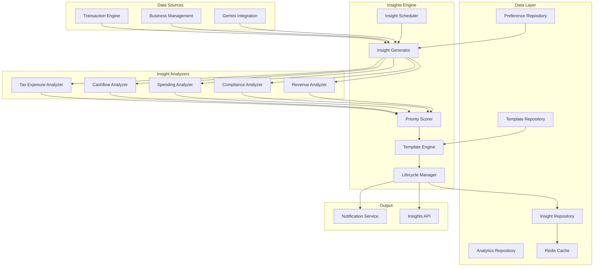

# Design Document: Insights Engine Module

## Overview

The Insights Engine Module provides AI-powered business insights, compliance tips, and actionable recommendations for Nigerian SMEs. This module aggregates data from transactions, business profiles, and AI services to generate personalized, timely insights that help business owners make informed financial decisions.

### Design Goals

1. **Actionable**: Every insight should include specific, practical recommendations
2. **Contextual**: Insights must be relevant to Nigerian business environment and regulations
3. **Timely**: Critical insights delivered immediately, routine insights batched appropriately
4. **Personalized**: Insights tailored to business sector, size, and user preferences
5. **Non-Intrusive**: Limit insight volume to prevent user fatigue

### Key Design Decisions

- **Kobo Storage**: All financial amounts stored as integers (Kobo) for precision
- **WAT Timezone**: All scheduling and date references use West Africa Time
- **Priority Scoring**: Multi-factor scoring for insight prioritization
- **Template-Based**: Consistent insight formatting via versioned templates
- **Event-Driven**: Real-time insight generation for significant events

## Architecture



````

## Components and Interfaces

### InsightGenerator

The main service for generating insights from business data.

```typescript
interface InsightGenerator {
  generateForBusiness(businessId: string): Promise<Insight[]>;
  generateByCategory(businessId: string, category: InsightCategory): Promise<Insight[]>;
  evaluateRealTime(businessId: string, event: BusinessEvent): Promise<Insight | null>;
  refreshInsights(businessId: string): Promise<void>;
}

interface BusinessEvent {
  type: 'transaction_created' | 'document_processed' | 'threshold_crossed';
  businessId: string;
  data: Record<string, unknown>;
  timestamp: Date;
}
````

### InsightAnalyzer

Base interface for category-specific analyzers.

```typescript
interface InsightAnalyzer {
  analyze(context: AnalysisContext): Promise<RawInsight[]>;
  getCategory(): InsightCategory;
  getRequiredData(): DataRequirement[];
}

interface AnalysisContext {
  businessId: string;
  businessProfile: BusinessProfile;
  transactions: Transaction[];
  dateRange: DateRange;
  previousInsights: Insight[];
}

interface RawInsight {
  category: InsightCategory;
  type: InsightType;
  title: string;
  body: string;
  data: Record<string, unknown>;
  actionItems: ActionItem[];
  financialImpact: number; // In Kobo
  urgency: number; // 0-100
  confidence: number; // 0-100
}

type InsightCategory =
  | "tax"
  | "compliance"
  | "cashflow"
  | "spending"
  | "revenue"
  | "operational";
```

### PriorityScorer

Calculates insight priority based on multiple factors.

```typescript
interface PriorityScorer {
  score(insight: RawInsight, context: ScoringContext): ScoredInsight;
  calculatePriority(score: number): InsightPriority;
}

interface ScoringContext {
  businessSize: BusinessSize;
  userEngagement: UserEngagement;
  existingInsights: Insight[];
}

interface ScoredInsight extends RawInsight {
  score: number;
  priority: InsightPriority;
  factors: ScoreFactor[];
}

interface ScoreFactor {
  name: string;
  weight: number;
  value: number;
  contribution: number;
}

type InsightPriority = "critical" | "high" | "medium" | "low" | "info";
```

### LifecycleManager

Manages insight state transitions and expiration.

```typescript
interface LifecycleManager {
  create(insight: ScoredInsight): Promise<Insight>;
  acknowledge(insightId: string, userId: string): Promise<void>;
  dismiss(insightId: string, userId: string, reason: string): Promise<void>;
  resolve(insightId: string, userId: string, notes: string): Promise<void>;
  expire(insightId: string): Promise<void>;
  checkExpiration(businessId: string): Promise<void>;
}
```

## Data Models

### Insight

```typescript
interface Insight {
  id: string;
  businessId: string;
  category: InsightCategory;
  type: InsightType;
  priority: InsightPriority;
  status: InsightStatus;
  title: string;
  body: string;
  actionItems: ActionItem[];
  data: InsightData;
  score: number;
  financialImpactKobo: number;
  createdAt: Date;
  acknowledgedAt: Date | null;
  acknowledgedBy: string | null;
  dismissedAt: Date | null;
  dismissedBy: string | null;
  dismissReason: string | null;
  resolvedAt: Date | null;
  resolvedBy: string | null;
  resolutionNotes: string | null;
  expiresAt: Date;
}

type InsightStatus =
  | "active"
  | "acknowledged"
  | "dismissed"
  | "resolved"
  | "expired";

interface ActionItem {
  id: string;
  description: string;
  actionType: "navigate" | "external_link" | "api_call";
  actionData: Record<string, unknown>;
  completed: boolean;
}

interface InsightData {
  transactions?: string[];
  amounts?: number[];
  dates?: string[];
  thresholds?: Record<string, number>;
  comparisons?: Record<string, unknown>;
}
```

### InsightTemplate

```typescript
interface InsightTemplate {
  id: string;
  version: string;
  category: InsightCategory;
  type: InsightType;
  titleTemplate: string;
  bodyTemplate: string;
  actionItemTemplates: ActionItemTemplate[];
  variables: TemplateVariable[];
  locale: "en" | "pcm"; // English or Pidgin
}
```

## Correctness Properties

### Property 1: Financial Precision

_For any_ insight involving financial amounts, all values SHALL be stored and calculated in Kobo (integers) to prevent floating-point errors.

Validates: Requirements 1.4

### Property 2: Priority Ordering

_For any_ set of insights for a business, they SHALL be ordered by priority (critical > high > medium > low > info) and then by score within each priority level.

Validates: Requirements 7.3

### Property 3: Insight Limit

_For any_ business, the number of active insights SHALL NOT exceed 10, with lower-priority insights being auto-expired when limit is reached.

Validates: Requirements 7.4

### Property 4: Dismissal Cooldown

_For any_ dismissed insight, an insight with the same type and similar conditions SHALL NOT be regenerated for 30 days.

Validates: Requirements 8.6

### Property 5: Status Transitions

_For any_ insight, status transitions SHALL follow valid paths: active → acknowledged → resolved, or active → dismissed, or active → expired.

Validates: Requirements 8.1, 8.2, 8.3, 8.4

### Property 6: WAT Timezone Consistency

_For any_ date/time in insight content, it SHALL be formatted in WAT (UTC+1) timezone.

Validates: Requirements 1.5, 14.5

### Property 7: Sector Relevance

_For any_ insight generated, it SHALL be relevant to the business's sector as defined in the business profile.

Validates: Requirements 9.1

### Property 8: Tax Threshold Accuracy

_For any_ tax exposure insight, the VAT threshold (₦25M) and quarterly liability threshold (₦500K) SHALL be correctly applied.

Validates: Requirements 1.2, 1.3

### Property 9: Cashflow Projection Accuracy

_For any_ cashflow risk insight, the projected shortfall date and amount SHALL be based on actual transaction patterns and recurring expenses.

Validates: Requirements 3.4, 3.5

### Property 10: Real-Time Trigger Response

_For any_ significant business event, insight evaluation SHALL complete within 5 seconds.

Validates: Requirements 10.4

## Error Handling

### Error Codes

| Code                         | HTTP Status | Description                              |
| ---------------------------- | ----------- | ---------------------------------------- |
| `INSIGHT_BUSINESS_NOT_FOUND` | 404         | Business ID not found                    |
| `INSIGHT_INSUFFICIENT_DATA`  | 400         | Not enough transaction data for analysis |
| `INSIGHT_ALREADY_RESOLVED`   | 400         | Insight already in resolved state        |
| `INSIGHT_INVALID_TRANSITION` | 400         | Invalid status transition requested      |
| `INSIGHT_GENERATION_FAILED`  | 500         | Insight generation encountered error     |

## Testing Strategy

### Property Tests

| Property    | Test Description                                            |
| ----------- | ----------------------------------------------------------- |
| Property 1  | Generate insights with various amounts, verify Kobo storage |
| Property 2  | Generate multiple insights, verify ordering                 |
| Property 3  | Generate >10 insights, verify limit enforcement             |
| Property 4  | Dismiss and regenerate, verify cooldown                     |
| Property 5  | Attempt invalid transitions, verify rejection               |
| Property 6  | Generate insights, verify WAT formatting                    |
| Property 7  | Generate for different sectors, verify relevance            |
| Property 8  | Generate tax insights, verify threshold accuracy            |
| Property 9  | Generate cashflow insights, verify projection accuracy      |
| Property 10 | Trigger real-time events, verify response time              |
