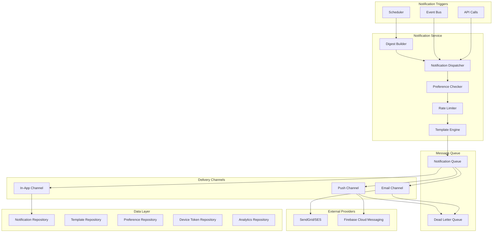

# Design Document: Notification System Module

## Overview

The Notification System Module provides multi-channel notification delivery for CashTrace, supporting email, in-app, and push notifications. The design prioritizes reliability, deliverability, and user preference management while respecting Nigerian data protection requirements.

### Design Goals

1. **Reliable**: No notification loss through persistent queuing
2. **Multi-Channel**: Email, in-app, and push notification support
3. **Personalized**: User-controlled preferences and frequency
4. **Compliant**: NDPR-compliant consent and unsubscribe management
5. **Efficient**: Batching and rate limiting to prevent spam

### Key Design Decisions

- **Queue-Based**: All notifications processed asynchronously via persistent queue
- **Template-Driven**: Consistent messaging through versioned templates
- **Channel Abstraction**: Pluggable providers for each channel
- **WAT Scheduling**: All scheduled notifications use West Africa Time
- **Digest Support**: Consolidated summaries to reduce notification volume

## Architecture



````

## Components and Interfaces

### NotificationDispatcher

The main entry point for creating and dispatching notifications.

```typescript
interface NotificationDispatcher {
  send(notification: NotificationRequest): Promise<NotificationResult>;
  sendBatch(notifications: NotificationRequest[]): Promise<NotificationResult[]>;
  schedule(notification: NotificationRequest, sendAt: Date): Promise<string>;
  cancel(notificationId: string): Promise<void>;
}

interface NotificationRequest {
  userId: string;
  businessId: string;
  category: NotificationCategory;
  templateId: string;
  variables: Record<string, unknown>;
  channels?: NotificationChannel[];
  priority?: NotificationPriority;
}

type NotificationCategory = 'security' | 'transactions' | 'insights' | 'compliance' | 'system' | 'marketing';
type NotificationChannel = 'email' | 'in_app' | 'push';
type NotificationPriority = 'critical' | 'high' | 'normal' | 'low';
````

### TemplateEngine

Renders notification content from templates.

```typescript
interface TemplateEngine {
  render(
    templateId: string,
    variables: Record<string, unknown>,
  ): Promise<RenderedTemplate>;
  validate(
    templateId: string,
    variables: Record<string, unknown>,
  ): ValidationResult;
  getTemplate(templateId: string): Promise<NotificationTemplate>;
}

interface RenderedTemplate {
  subject: string;
  bodyHtml: string;
  bodyText: string;
  pushTitle: string;
  pushBody: string;
}

interface NotificationTemplate {
  id: string;
  version: string;
  category: NotificationCategory;
  subject: string;
  bodyHtml: string;
  bodyText: string;
  pushTitle: string;
  pushBody: string;
  variables: TemplateVariable[];
}
```

### PreferenceService

Manages user notification preferences.

```typescript
interface PreferenceService {
  getPreferences(userId: string): Promise<NotificationPreferences>;
  updatePreferences(
    userId: string,
    preferences: Partial<NotificationPreferences>,
  ): Promise<void>;
  shouldDeliver(
    userId: string,
    category: NotificationCategory,
    channel: NotificationChannel,
  ): Promise<boolean>;
  getQuietHours(userId: string): Promise<QuietHours>;
}

interface NotificationPreferences {
  userId: string;
  enabledCategories: NotificationCategory[];
  channelPreferences: Record<NotificationCategory, NotificationChannel[]>;
  frequency: NotificationFrequency;
  quietHours: QuietHours;
  unsubscribedCategories: NotificationCategory[];
}

interface QuietHours {
  enabled: boolean;
  startTime: string; // HH:mm in WAT
  endTime: string; // HH:mm in WAT
}

type NotificationFrequency = "immediate" | "daily_digest" | "weekly_digest";
```

### EmailChannel

Handles email delivery via external providers.

```typescript
interface EmailChannel {
  send(email: EmailMessage): Promise<DeliveryResult>;
  getDeliveryStatus(messageId: string): Promise<DeliveryStatus>;
  handleBounce(bounceEvent: BounceEvent): Promise<void>;
  handleUnsubscribe(unsubscribeEvent: UnsubscribeEvent): Promise<void>;
}

interface EmailMessage {
  to: string;
  from: string;
  replyTo: string;
  subject: string;
  bodyHtml: string;
  bodyText: string;
  headers: Record<string, string>;
  metadata: Record<string, string>;
}

interface DeliveryResult {
  messageId: string;
  status: DeliveryStatus;
  timestamp: Date;
}

type DeliveryStatus =
  | "pending"
  | "sent"
  | "delivered"
  | "opened"
  | "clicked"
  | "bounced"
  | "failed";
```

## Data Models

### Notification

```typescript
interface Notification {
  id: string;
  userId: string;
  businessId: string;
  category: NotificationCategory;
  templateId: string;
  templateVersion: string;
  channels: NotificationChannel[];
  priority: NotificationPriority;
  status: NotificationStatus;
  deliveryAttempts: DeliveryAttempt[];
  createdAt: Date;
  scheduledAt: Date | null;
  sentAt: Date | null;
  readAt: Date | null;
  expiresAt: Date;
}

type NotificationStatus =
  | "pending"
  | "queued"
  | "sent"
  | "delivered"
  | "read"
  | "failed"
  | "expired";

interface DeliveryAttempt {
  channel: NotificationChannel;
  attemptNumber: number;
  status: DeliveryStatus;
  timestamp: Date;
  errorMessage: string | null;
}
```

### DeviceToken

```typescript
interface DeviceToken {
  id: string;
  userId: string;
  token: string;
  platform: "ios" | "android" | "web";
  deviceName: string;
  isValid: boolean;
  createdAt: Date;
  lastUsedAt: Date;
}
```

## Correctness Properties

### Property 1: Notification Delivery Guarantee

_For any_ notification request with valid user and template, the notification SHALL be persisted to the queue before returning success, ensuring no notification loss.

Validates: Requirements 6.1, 6.2

### Property 2: Preference Enforcement

_For any_ notification, delivery SHALL only occur on channels enabled by the user for that category, except for security notifications which are always delivered.

Validates: Requirements 5.1, 8.2

### Property 3: Rate Limit Compliance

_For any_ user, the number of email notifications delivered per day SHALL NOT exceed the configured limit (10), excluding security notifications.

Validates: Requirements 11.1, 11.5

### Property 4: Quiet Hours Respect

_For any_ non-critical notification during user's quiet hours, delivery SHALL be delayed until quiet hours end.

Validates: Requirements 5.3, 5.4

### Property 5: Template Variable Validation

_For any_ notification request, all required template variables SHALL be present and valid before queuing.

Validates: Requirements 4.4

### Property 6: Retry Behavior

_For any_ failed delivery attempt, retry SHALL occur with exponential backoff up to 3 times before marking as failed.

Validates: Requirements 6.3

### Property 7: Deduplication

_For any_ identical notification (same user, template, variables) within 1 hour, only one SHALL be delivered.

Validates: Requirements 9.3

### Property 8: Unsubscribe Effectiveness

_For any_ unsubscribe request, no further notifications of that category SHALL be delivered to that user.

Validates: Requirements 12.2, 12.6

### Property 9: Digest Aggregation

_For any_ digest period, all eligible notifications SHALL be included in the digest, grouped by category.

Validates: Requirements 7.3, 7.4

### Property 10: Device Token Cleanup

_For any_ invalid device token detected, it SHALL be removed from the user's devices within 24 hours.

Validates: Requirements 3.4

## Error Handling

### Error Codes

| Code                        | HTTP Status | Description                              |
| --------------------------- | ----------- | ---------------------------------------- |
| `NOTIF_INVALID_TEMPLATE`    | 400         | Template ID not found or invalid         |
| `NOTIF_MISSING_VARIABLES`   | 400         | Required template variables missing      |
| `NOTIF_USER_NOT_FOUND`      | 404         | User ID not found                        |
| `NOTIF_RATE_LIMITED`        | 429         | User rate limit exceeded                 |
| `NOTIF_CHANNEL_UNAVAILABLE` | 503         | Delivery channel temporarily unavailable |
| `NOTIF_PROVIDER_ERROR`      | 502         | External provider returned error         |

## Testing Strategy

### Property Tests

| Property    | Test Description                                                 |
| ----------- | ---------------------------------------------------------------- |
| Property 1  | Generate notifications, verify queue persistence                 |
| Property 2  | Generate preferences and notifications, verify channel filtering |
| Property 3  | Generate high-volume notifications, verify rate limiting         |
| Property 4  | Generate notifications during quiet hours, verify delay          |
| Property 5  | Generate notifications with missing variables, verify rejection  |
| Property 6  | Simulate failures, verify retry behavior                         |
| Property 7  | Generate duplicate notifications, verify deduplication           |
| Property 8  | Process unsubscribe, verify no further delivery                  |
| Property 9  | Generate notifications for digest, verify aggregation            |
| Property 10 | Simulate invalid tokens, verify cleanup                          |
