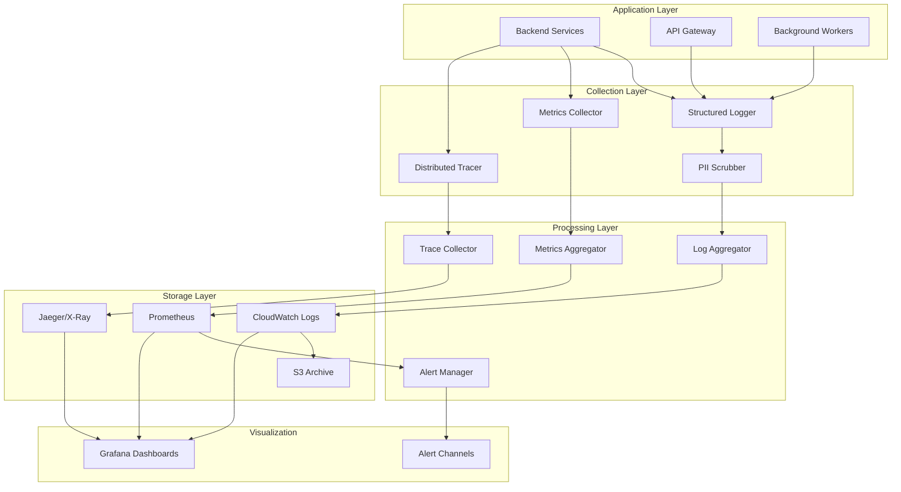

# Design Document: Observability Module

## Overview

The Observability Module provides comprehensive logging, metrics collection, distributed tracing, and alerting for CashTrace. The design enables proactive monitoring, rapid incident response, and data-driven optimization while respecting Nigerian data protection requirements.

### Design Goals

1. **Comprehensive**: Full visibility into system behavior
2. **Compliant**: PII protection in all logs
3. **Actionable**: Alerts with clear remediation steps
4. **Efficient**: Minimal performance overhead
5. **Cost-Effective**: Smart sampling and retention policies

### Key Design Decisions

- **Structured Logging**: JSON format for machine parsing
- **OpenTelemetry**: Standard tracing format
- **Prometheus**: Metrics collection and alerting
- **PII Scrubbing**: Automatic redaction of sensitive data
- **Tiered Retention**: Hot/cold storage for cost optimization

## Architecture



````

## Components and Interfaces

### Logger

Structured logging with automatic context enrichment.

```typescript
interface Logger {
  debug(message: string, metadata?: LogMetadata): void;
  info(message: string, metadata?: LogMetadata): void;
  warn(message: string, metadata?: LogMetadata): void;
  error(message: string, error?: Error, metadata?: LogMetadata): void;
  fatal(message: string, error?: Error, metadata?: LogMetadata): void;
  child(context: LogContext): Logger;
}

interface LogMetadata {
  [key: string]: unknown;
}

interface LogContext {
  correlationId?: string;
  userId?: string;
  businessId?: string;
  service?: string;
  operation?: string;
}

interface LogEntry {
  timestamp: string;
  level: LogLevel;
  message: string;
  service: string;
  correlationId: string;
  userId?: string;
  businessId?: string;
  metadata?: LogMetadata;
  error?: ErrorInfo;
}

type LogLevel = 'debug' | 'info' | 'warn' | 'error' | 'fatal';
````

### MetricsCollector

Prometheus-compatible metrics collection.

```typescript
interface MetricsCollector {
  counter(name: string, labels?: Labels): Counter;
  gauge(name: string, labels?: Labels): Gauge;
  histogram(name: string, buckets: number[], labels?: Labels): Histogram;
  summary(name: string, percentiles: number[], labels?: Labels): Summary;
}

interface Counter {
  inc(value?: number, labels?: Labels): void;
}

interface Gauge {
  set(value: number, labels?: Labels): void;
  inc(value?: number, labels?: Labels): void;
  dec(value?: number, labels?: Labels): void;
}

interface Histogram {
  observe(value: number, labels?: Labels): void;
}

type Labels = Record<string, string>;
```

### Tracer

Distributed tracing with OpenTelemetry compatibility.

```typescript
interface Tracer {
  startSpan(name: string, options?: SpanOptions): Span;
  getCurrentSpan(): Span | null;
  withSpan<T>(span: Span, fn: () => T): T;
}

interface Span {
  setAttributes(attributes: SpanAttributes): void;
  addEvent(name: string, attributes?: SpanAttributes): void;
  setStatus(status: SpanStatus): void;
  end(): void;
}

interface SpanOptions {
  parent?: Span;
  attributes?: SpanAttributes;
  kind?: SpanKind;
}

type SpanKind = "internal" | "server" | "client" | "producer" | "consumer";
type SpanStatus = "ok" | "error" | "unset";
type SpanAttributes = Record<string, string | number | boolean>;
```

### PIIScrubber

Automatic PII detection and redaction.

```typescript
interface PIIScrubber {
  scrub(text: string): string;
  scrubObject(obj: Record<string, unknown>): Record<string, unknown>;
  addPattern(name: string, pattern: RegExp, replacement: string): void;
}

interface PIIPattern {
  name: string;
  pattern: RegExp;
  replacement: string;
}
```

### AlertManager

Alert configuration and notification.

```typescript
interface AlertManager {
  defineAlert(alert: AlertDefinition): void;
  checkAlerts(): Promise<Alert[]>;
  acknowledge(alertId: string, userId: string): Promise<void>;
  resolve(alertId: string, userId: string, notes: string): Promise<void>;
}

interface AlertDefinition {
  name: string;
  query: string;
  threshold: number;
  comparison: "gt" | "lt" | "eq" | "gte" | "lte";
  duration: string;
  severity: AlertSeverity;
  channels: AlertChannel[];
  runbook?: string;
}

type AlertSeverity = "critical" | "warning" | "info";
type AlertChannel = "email" | "slack" | "pagerduty";
```

## Data Models

### AuditLogEntry

```typescript
interface AuditLogEntry {
  id: string;
  timestamp: Date;
  eventType: AuditEventType;
  userId: string;
  businessId: string;
  resourceType: string;
  resourceId: string;
  action: AuditAction;
  previousValue?: Record<string, unknown>;
  newValue?: Record<string, unknown>;
  ipAddress: string;
  userAgent: string;
  correlationId: string;
  checksum: string;
}

type AuditEventType = "data_access" | "data_modify" | "auth" | "admin";
type AuditAction = "create" | "read" | "update" | "delete" | "login" | "logout";
```

## Correctness Properties

### Property 1: PII Redaction Completeness

_For any_ log entry, all PII patterns (email, phone, BVN, account numbers) SHALL be redacted before storage.

Validates: Requirements 2.1, 2.2, 2.3, 2.4

### Property 2: Correlation ID Propagation

_For any_ request, the correlation ID SHALL be present in all log entries, metrics, and traces for that request.

Validates: Requirements 1.4, 4.2

### Property 3: Metric Accuracy

_For any_ HTTP request, latency histogram SHALL accurately reflect the actual request duration within 1ms.

Validates: Requirements 3.1

### Property 4: Trace Completeness

_For any_ traced request, all significant operations (DB queries, external calls) SHALL have corresponding spans.

Validates: Requirements 4.3

### Property 5: Alert Timeliness

_For any_ metric exceeding alert threshold for the defined duration, an alert SHALL be triggered within 1 minute.

Validates: Requirements 6.1

### Property 6: Audit Immutability

_For any_ audit log entry, modification or deletion SHALL be prevented, and tampering SHALL be detectable via checksum.

Validates: Requirements 10.5

### Property 7: Log Retention Compliance

_For any_ log entry, it SHALL be retained for the configured period (30 days hot, 1 year cold) before deletion.

Validates: Requirements 8.2

### Property 8: Sampling Consistency

_For any_ trace sampling decision, it SHALL be consistent across all spans in the same trace.

Validates: Requirements 4.6

## Error Handling

### Error Codes

| Code                          | Description                   |
| ----------------------------- | ----------------------------- |
| `OBS_LOG_WRITE_FAILED`        | Failed to write log entry     |
| `OBS_METRIC_INVALID`          | Invalid metric name or labels |
| `OBS_TRACE_CONTEXT_MISSING`   | Trace context not found       |
| `OBS_ALERT_CONFIG_INVALID`    | Invalid alert configuration   |
| `OBS_AUDIT_CHECKSUM_MISMATCH` | Audit log tampering detected  |

## Testing Strategy

### Property Tests

| Property   | Test Description                                |
| ---------- | ----------------------------------------------- |
| Property 1 | Generate logs with PII, verify redaction        |
| Property 2 | Trace requests, verify correlation ID presence  |
| Property 3 | Measure request latency, verify metric accuracy |
| Property 4 | Execute operations, verify span creation        |
| Property 5 | Exceed thresholds, verify alert timing          |
| Property 6 | Attempt audit modification, verify prevention   |
| Property 7 | Age logs, verify retention enforcement          |
| Property 8 | Sample traces, verify consistency               |
