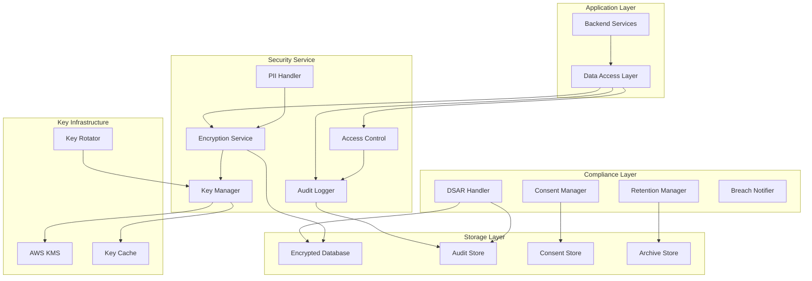

# Design Document: Security & Compliance Module

## Overview

The Security & Compliance Module provides data protection, encryption, audit trails, and regulatory compliance features for CashTrace. The design ensures NDPR compliance, secure data handling, and comprehensive audit capabilities for financial data.

### Design Goals

1. **Secure**: Defense in depth with encryption at rest and in transit
2. **Compliant**: Full NDPR compliance with audit trails
3. **Auditable**: Complete record of all data access and modifications
4. **Recoverable**: Support for data subject rights requests
5. **Resilient**: Key rotation and incident response capabilities

### Key Design Decisions

- **AES-256-GCM**: Industry-standard encryption for data at rest
- **Envelope Encryption**: Data keys encrypted by master keys
- **Append-Only Audit**: Tamper-evident audit trail
- **7-Year Retention**: Nigerian regulatory compliance
- **Per-Business Keys**: Data isolation between businesses

## Architecture



````

## Components and Interfaces

### EncryptionService

Data encryption and decryption operations.

```typescript
interface EncryptionService {
  encrypt(plaintext: string, keyId: string): Promise<EncryptedData>;
  decrypt(ciphertext: EncryptedData): Promise<string>;
  encryptField(value: unknown, fieldType: FieldType): Promise<string>;
  decryptField(encrypted: string, fieldType: FieldType): Promise<unknown>;
}

interface EncryptedData {
  ciphertext: string;
  keyId: string;
  keyVersion: number;
  algorithm: string;
  iv: string;
  tag: string;
}

type FieldType = 'pii' | 'financial' | 'sensitive' | 'standard';
````

### KeyManager

Encryption key lifecycle management.

```typescript
interface KeyManager {
  getKey(keyId: string): Promise<EncryptionKey>;
  createKey(businessId: string): Promise<EncryptionKey>;
  rotateKey(keyId: string): Promise<EncryptionKey>;
  revokeKey(keyId: string, reason: string): Promise<void>;
  listKeys(businessId: string): Promise<KeyMetadata[]>;
}

interface EncryptionKey {
  id: string;
  businessId: string;
  version: number;
  algorithm: string;
  status: KeyStatus;
  createdAt: Date;
  rotatedAt?: Date;
  expiresAt?: Date;
}

type KeyStatus = "active" | "rotating" | "deprecated" | "revoked";
```

### AuditService

Comprehensive audit trail management.

```typescript
interface AuditService {
  log(event: AuditEvent): Promise<void>;
  query(filter: AuditFilter): Promise<AuditEntry[]>;
  export(filter: AuditFilter, format: ExportFormat): Promise<string>;
  verifyIntegrity(entryId: string): Promise<IntegrityResult>;
}

interface AuditEvent {
  eventType: AuditEventType;
  userId: string;
  businessId: string;
  resourceType: string;
  resourceId: string;
  action: AuditAction;
  previousValue?: unknown;
  newValue?: unknown;
  metadata?: Record<string, unknown>;
}

interface AuditEntry extends AuditEvent {
  id: string;
  timestamp: Date;
  ipAddress: string;
  userAgent: string;
  correlationId: string;
  checksum: string;
}

type AuditEventType =
  | "data_access"
  | "data_modify"
  | "auth"
  | "admin"
  | "consent"
  | "export";
type AuditAction =
  | "create"
  | "read"
  | "update"
  | "delete"
  | "export"
  | "grant"
  | "revoke";
type ExportFormat = "json" | "csv";
```

### ConsentManager

NDPR consent tracking and management.

```typescript
interface ConsentManager {
  recordConsent(consent: ConsentRecord): Promise<void>;
  revokeConsent(userId: string, consentType: ConsentType): Promise<void>;
  getConsents(userId: string): Promise<ConsentRecord[]>;
  hasConsent(userId: string, consentType: ConsentType): Promise<boolean>;
  exportConsents(userId: string): Promise<ConsentExport>;
}

interface ConsentRecord {
  id: string;
  userId: string;
  consentType: ConsentType;
  version: string;
  grantedAt: Date;
  revokedAt?: Date;
  ipAddress: string;
  userAgent: string;
}

type ConsentType =
  | "terms"
  | "privacy"
  | "marketing"
  | "data_processing"
  | "third_party";
```

### DSARHandler

Data Subject Access Request handling.

```typescript
interface DSARHandler {
  submitRequest(request: DSARRequest): Promise<string>;
  processRequest(requestId: string): Promise<DSARResult>;
  getRequestStatus(requestId: string): Promise<DSARStatus>;
  exportUserData(userId: string): Promise<UserDataExport>;
  deleteUserData(
    userId: string,
    retainRequired: boolean,
  ): Promise<DeletionResult>;
}

interface DSARRequest {
  userId: string;
  requestType: DSARType;
  requestedBy: string;
  verificationMethod: string;
}

type DSARType = "access" | "portability" | "erasure" | "rectification";
type DSARStatus = "pending" | "processing" | "completed" | "rejected";
```

## Data Models

### DataClassification

```typescript
interface DataClassification {
  fieldName: string;
  classification: ClassificationLevel;
  encryptionRequired: boolean;
  retentionPeriod: number; // days
  piiCategory?: PIICategory;
}

type ClassificationLevel =
  | "public"
  | "internal"
  | "confidential"
  | "restricted";
type PIICategory = "identifier" | "financial" | "contact" | "biometric";
```

### SecurityIncident

```typescript
interface SecurityIncident {
  id: string;
  severity: IncidentSeverity;
  type: IncidentType;
  description: string;
  affectedUsers: string[];
  detectedAt: Date;
  containedAt?: Date;
  resolvedAt?: Date;
  notificationSentAt?: Date;
  rootCause?: string;
  remediation?: string;
}

type IncidentSeverity = "critical" | "high" | "medium" | "low";
type IncidentType =
  | "breach"
  | "unauthorized_access"
  | "data_loss"
  | "vulnerability";
```

## Correctness Properties

### Property 1: Encryption Coverage

_For any_ PII or financial data field, it SHALL be encrypted at rest using AES-256-GCM.

Validates: Requirements 1.1, 1.2

### Property 2: Key Isolation

_For any_ business, data SHALL be encrypted with business-specific keys, preventing cross-business decryption.

Validates: Requirements 1.3

### Property 3: Key Rotation

_For any_ encryption key older than 90 days, rotation SHALL be triggered automatically.

Validates: Requirements 3.2

### Property 4: Audit Completeness

_For any_ data access or modification, an audit entry SHALL be created with user, resource, action, and timestamp.

Validates: Requirements 4.1, 4.2, 4.3

### Property 5: Audit Immutability

_For any_ audit entry, modification or deletion SHALL be prevented, and tampering SHALL be detectable.

Validates: Requirements 4.5

### Property 6: Consent Enforcement

_For any_ data processing activity, it SHALL only proceed if valid consent exists for that activity type.

Validates: Requirements 7.1

### Property 7: DSAR Response Time

_For any_ data subject access request, response SHALL be provided within 30 days as required by NDPR.

Validates: Requirements 7.2, 7.3, 7.4

### Property 8: Retention Enforcement

_For any_ data past retention period, it SHALL be archived or deleted according to policy.

Validates: Requirements 8.2, 8.3

### Property 9: Breach Notification

_For any_ confirmed data breach, affected users SHALL be notified within 72 hours.

Validates: Requirements 7.6

### Property 10: Access Control Enforcement

_For any_ data access, it SHALL be permitted only if the user has appropriate role and business membership.

Validates: Requirements 6.1, 6.2

## Error Handling

### Error Codes

| Code                    | HTTP Status | Description                      |
| ----------------------- | ----------- | -------------------------------- |
| `SEC_ENCRYPTION_FAILED` | 500         | Encryption operation failed      |
| `SEC_DECRYPTION_FAILED` | 500         | Decryption operation failed      |
| `SEC_KEY_NOT_FOUND`     | 404         | Encryption key not found         |
| `SEC_KEY_REVOKED`       | 400         | Encryption key has been revoked  |
| `SEC_CONSENT_REQUIRED`  | 403         | Required consent not granted     |
| `SEC_ACCESS_DENIED`     | 403         | Insufficient permissions         |
| `SEC_AUDIT_INTEGRITY`   | 500         | Audit log integrity check failed |
| `SEC_DSAR_INVALID`      | 400         | Invalid DSAR request             |

## Testing Strategy

### Property Tests

| Property    | Test Description                              |
| ----------- | --------------------------------------------- |
| Property 1  | Store PII data, verify encryption             |
| Property 2  | Access cross-business data, verify denial     |
| Property 3  | Age keys, verify rotation trigger             |
| Property 4  | Perform operations, verify audit entries      |
| Property 5  | Attempt audit modification, verify prevention |
| Property 6  | Process without consent, verify rejection     |
| Property 7  | Submit DSAR, verify response timing           |
| Property 8  | Age data, verify retention enforcement        |
| Property 9  | Simulate breach, verify notification timing   |
| Property 10 | Access unauthorized data, verify denial       |
