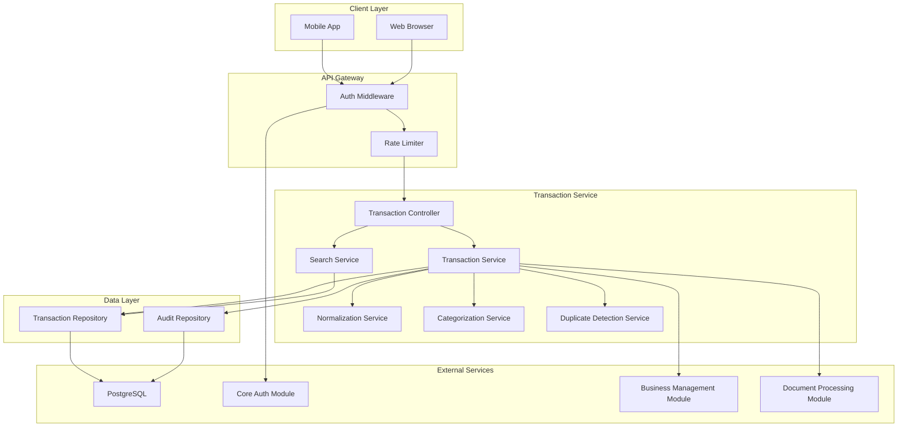
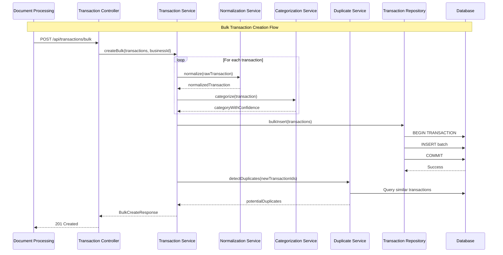

# Design Document: Transaction Engine Module

## Overview

The Transaction Engine Module (transaction-engine) provides comprehensive transaction management capabilities for CashTrace. This module is designed as a fully modular component that depends on core-auth for user authentication, business-management for business context, and document-processing for source document linkage. It handles transaction normalization from multiple sources, automatic categorization using Nigerian SME categories, duplicate detection, and full-text search capabilities.

### Design Goals

1. **Data Integrity**: Store amounts as integers (kobo) to avoid floating-point precision issues
2. **Traceability**: Link every transaction to its source document for audit trail
3. **Intelligence**: Auto-categorize transactions with confidence scoring
4. **Performance**: Efficient bulk operations and full-text search
5. **Nigerian Context**: Support Nigerian SME expense/revenue categories

### Key Design Decisions

- **Kobo Storage**: All amounts stored as integers (kobo = NGN × 100) for precision
- **Soft Delete**: Transactions are never hard-deleted, preserving audit trail
- **Dual Category Tracking**: Store both original auto-category and current category
- **PostgreSQL Full-Text Search**: Native search without external dependencies
- **Batch Processing**: Optimized bulk inserts for document processing integration
- **Duplicate Detection**: Fuzzy matching on amount, date, and description similarity

## Architecture



### Request Flow - Bulk Creation



## Components and Interfaces

### TransactionController

The main entry point for all transaction operations. Handles HTTP requests and delegates to appropriate services.

```typescript
interface TransactionController {
  // List transactions with filters
  listTransactions(
    request: ListTransactionsRequest,
  ): Promise<TransactionListResponse>;

  // Get transaction details
  getTransaction(request: GetTransactionRequest): Promise<TransactionResponse>;

  // Update transaction (category, personal flag, etc.)
  updateTransaction(
    request: UpdateTransactionRequest,
  ): Promise<TransactionResponse>;

  // Bulk create from document processing
  bulkCreate(request: BulkCreateRequest): Promise<BulkCreateResponse>;

  // Full-text search
  searchTransactions(request: SearchRequest): Promise<TransactionListResponse>;

  // Get potential duplicates
  getDuplicates(request: GetDuplicatesRequest): Promise<DuplicateListResponse>;

  // Resolve duplicate
  resolveDuplicate(request: ResolveDuplicateRequest): Promise<GenericResponse>;

  // Soft delete transaction
  deleteTransaction(
    request: DeleteTransactionRequest,
  ): Promise<GenericResponse>;
}
```

### TransactionService

Core business logic for transaction management.

```typescript
interface TransactionService {
  // Create single transaction
  createTransaction(
    data: CreateTransactionData,
    businessId: string,
  ): Promise<Transaction>;

  // Bulk create transactions
  bulkCreate(
    transactions: CreateTransactionData[],
    businessId: string,
    sourceDocumentId: string,
  ): Promise<BulkCreateResult>;

  // Get transaction by ID with ownership check
  getTransactionById(
    transactionId: string,
    userId: string,
  ): Promise<Transaction | null>;

  // List transactions for business with filters
  listTransactions(
    businessId: string,
    filters: TransactionFilters,
  ): Promise<PaginatedTransactions>;

  // Update transaction
  updateTransaction(
    transactionId: string,
    userId: string,
    updates: TransactionUpdates,
  ): Promise<Transaction>;

  // Soft delete transaction
  deleteTransaction(transactionId: string, userId: string): Promise<void>;

  // Verify ownership
  verifyOwnership(transactionId: string, userId: string): Promise<boolean>;
}

interface TransactionFilters {
  startDate?: Date;
  endDate?: Date;
  minAmount?: number; // in kobo
  maxAmount?: number; // in kobo
  category?: TransactionCategory;
  sourceType?: SourceType;
  transactionType?: TransactionType;
  isPersonal?: boolean;
  page: number;
  pageSize: number;
  sortBy: "transactionDate" | "amount" | "createdAt";
  sortOrder: "asc" | "desc";
}

interface TransactionUpdates {
  description?: string;
  transactionDate?: Date;
  category?: TransactionCategory;
  isPersonal?: boolean;
  notes?: string;
}

interface BulkCreateResult {
  created: number;
  transactions: Transaction[];
  duplicatesDetected: number;
}
```

### NormalizationService

Handles conversion of raw extracted data into normalized transaction format.

```typescript
interface NormalizationService {
  // Normalize single transaction from extracted data
  normalize(
    raw: RawExtractedTransaction,
    sourceType: SourceType,
  ): NormalizedTransaction;

  // Normalize batch of transactions
  normalizeBatch(
    raw: RawExtractedTransaction[],
    sourceType: SourceType,
  ): NormalizedTransaction[];

  // Convert Naira to kobo
  nairaToKobo(naira: number): number;

  // Convert kobo to Naira
  koboToNaira(kobo: number): number;

  // Format kobo as Naira string
  formatAsNaira(kobo: number): string;

  // Determine transaction type from raw data
  determineTransactionType(raw: RawExtractedTransaction): TransactionType;

  // Extract counterparty from description
  extractCounterparty(
    description: string,
    sourceType: SourceType,
  ): string | null;
}

interface RawExtractedTransaction {
  date: string | Date;
  description: string;
  amount: number; // in Naira (may have decimals)
  type?: "credit" | "debit";
  reference?: string;
  counterparty?: string;
  metadata?: Record<string, unknown>;
}

interface NormalizedTransaction {
  transactionDate: Date;
  description: string;
  amountKobo: number; // integer
  transactionType: TransactionType;
  counterparty: string | null;
  reference: string | null;
  rawMetadata: Record<string, unknown>;
}
```

### CategorizationService

Handles automatic transaction categorization using Nigerian SME categories.

```typescript
interface CategorizationService {
  // Categorize single transaction
  categorize(transaction: NormalizedTransaction): CategorizationResult;

  // Categorize batch of transactions
  categorizeBatch(
    transactions: NormalizedTransaction[],
  ): CategorizationResult[];

  // Get category suggestions for a transaction
  getSuggestions(transaction: NormalizedTransaction): CategorySuggestion[];

  // Validate category against allowed list
  validateCategory(category: string, transactionType: TransactionType): boolean;

  // Get all categories for transaction type
  getCategoriesForType(transactionType: TransactionType): TransactionCategory[];
}

interface CategorizationResult {
  category: TransactionCategory;
  confidence: number; // 0-100
  source: CategorySource;
  alternativeCategories: CategorySuggestion[];
}

interface CategorySuggestion {
  category: TransactionCategory;
  confidence: number;
  reason: string;
}

type CategorySource = "AUTO" | "MANUAL";
```

### DuplicateDetectionService

Handles detection and resolution of potential duplicate transactions.

```typescript
interface DuplicateDetectionService {
  // Detect duplicates for new transactions
  detectDuplicates(
    transactionIds: string[],
    businessId: string,
  ): Promise<DuplicatePair[]>;

  // Get all unresolved duplicates for business
  getUnresolvedDuplicates(businessId: string): Promise<DuplicatePair[]>;

  // Calculate similarity score between two transactions
  calculateSimilarity(t1: Transaction, t2: Transaction): SimilarityScore;

  // Mark duplicate pair as reviewed (not duplicates)
  markAsReviewed(duplicatePairId: string, userId: string): Promise<void>;

  // Resolve duplicate by soft-deleting one
  resolveDuplicate(
    duplicatePairId: string,
    keepTransactionId: string,
    userId: string,
  ): Promise<void>;
}

interface DuplicatePair {
  id: string;
  transaction1: Transaction;
  transaction2: Transaction;
  similarityScore: number; // 0-100
  amountMatch: boolean;
  dateProximity: number; // days apart
  descriptionSimilarity: number; // 0-100
  status: DuplicateStatus;
  createdAt: Date;
}

interface SimilarityScore {
  overall: number;
  amountMatch: boolean;
  dateProximity: number;
  descriptionSimilarity: number;
}

type DuplicateStatus = "PENDING" | "REVIEWED" | "RESOLVED";
```

### SearchService

Handles full-text search across transactions.

```typescript
interface SearchService {
  // Full-text search with filters
  search(
    query: string,
    businessId: string,
    filters: TransactionFilters,
  ): Promise<SearchResult>;

  // Build search vector for transaction
  buildSearchVector(description: string, counterparty: string | null): string;

  // Rank search results by relevance
  rankResults(results: Transaction[], query: string): RankedTransaction[];
}

interface SearchResult {
  transactions: RankedTransaction[];
  total: number;
  page: number;
  pageSize: number;
  totalPages: number;
}

interface RankedTransaction extends Transaction {
  relevanceScore: number;
  matchedFields: string[];
}
```

## Data Models

### Transaction

```typescript
interface Transaction {
  id: string; // UUID v4
  businessId: string; // Foreign key to Business
  sourceDocumentId: string | null; // Foreign key to Document (null for manual)
  sourceType: SourceType; // RECEIPT, BANK_STATEMENT, POS_EXPORT, MANUAL
  transactionType: TransactionType; // INFLOW, OUTFLOW
  transactionDate: Date; // Date of transaction
  description: string; // Transaction description
  amountKobo: number; // Amount in kobo (integer)
  counterparty: string | null; // Merchant/payer name
  reference: string | null; // Transaction reference

  // Categorization
  category: TransactionCategory; // Current category
  categorySource: CategorySource; // AUTO or MANUAL
  categoryConfidence: number | null; // Confidence score (0-100) for auto
  originalCategory: TransactionCategory | null; // Original auto-assigned category

  // Flags
  isPersonal: boolean; // Personal vs business expense
  isDuplicate: boolean; // Flagged as potential duplicate
  duplicateOfId: string | null; // Link to duplicate transaction

  // Metadata
  notes: string | null; // User notes
  rawMetadata: Record<string, unknown>; // Original extracted data

  // Search
  searchVector: string; // PostgreSQL tsvector for full-text search

  // Timestamps
  createdAt: Date;
  updatedAt: Date;
  deletedAt: Date | null; // Soft delete timestamp
}

type SourceType = "RECEIPT" | "BANK_STATEMENT" | "POS_EXPORT" | "MANUAL";
type TransactionType = "INFLOW" | "OUTFLOW";
type CategorySource = "AUTO" | "MANUAL";

// Expense Categories
type ExpenseCategory =
  | "INVENTORY_STOCK"
  | "RENT_UTILITIES"
  | "SALARIES_WAGES"
  | "TRANSPORTATION_LOGISTICS"
  | "MARKETING_ADVERTISING"
  | "PROFESSIONAL_SERVICES"
  | "EQUIPMENT_MAINTENANCE"
  | "BANK_CHARGES_FEES"
  | "TAXES_LEVIES"
  | "MISCELLANEOUS_EXPENSES";

// Revenue Categories
type RevenueCategory = "PRODUCT_SALES" | "SERVICE_REVENUE" | "OTHER_INCOME";

type TransactionCategory = ExpenseCategory | RevenueCategory;
```

### TransactionAudit

```typescript
interface TransactionAudit {
  id: string; // UUID v4
  transactionId: string; // Foreign key to Transaction
  userId: string; // User who made the change
  action: AuditAction; // CREATE, UPDATE, DELETE, RESTORE
  changes: AuditChanges; // What changed
  ipAddress: string; // Client IP
  userAgent: string | null; // Client user agent
  createdAt: Date;
}

type AuditAction =
  | "CREATE"
  | "UPDATE"
  | "DELETE"
  | "RESTORE"
  | "CATEGORIZE"
  | "DUPLICATE_RESOLVE";

interface AuditChanges {
  field: string;
  previousValue: unknown;
  newValue: unknown;
}
[];
```

### DuplicatePair

```typescript
interface DuplicatePair {
  id: string; // UUID v4
  businessId: string; // Foreign key to Business
  transaction1Id: string; // First transaction
  transaction2Id: string; // Second transaction
  similarityScore: number; // Overall similarity (0-100)
  amountMatch: boolean; // Exact amount match
  dateProximity: number; // Days between transactions
  descriptionSimilarity: number; // Text similarity (0-100)
  status: DuplicateStatus; // PENDING, REVIEWED, RESOLVED
  resolvedBy: string | null; // User who resolved
  resolvedAt: Date | null; // Resolution timestamp
  keptTransactionId: string | null; // Which transaction was kept
  createdAt: Date;
  updatedAt: Date;
}

type DuplicateStatus = "PENDING" | "REVIEWED" | "RESOLVED";
```

### Category Reference

```typescript
const EXPENSE_CATEGORIES: Record<ExpenseCategory, CategoryInfo> = {
  INVENTORY_STOCK: {
    code: "INVENTORY_STOCK",
    name: "Inventory & Stock",
    keywords: [
      "stock",
      "inventory",
      "goods",
      "merchandise",
      "supplies",
      "wholesale",
    ],
  },
  RENT_UTILITIES: {
    code: "RENT_UTILITIES",
    name: "Rent & Utilities",
    keywords: [
      "rent",
      "electricity",
      "nepa",
      "phcn",
      "water",
      "internet",
      "dstv",
      "gotv",
    ],
  },
  SALARIES_WAGES: {
    code: "SALARIES_WAGES",
    name: "Salaries & Wages",
    keywords: ["salary", "wage", "payroll", "staff", "employee"],
  },
  TRANSPORTATION_LOGISTICS: {
    code: "TRANSPORTATION_LOGISTICS",
    name: "Transportation & Logistics",
    keywords: [
      "transport",
      "fuel",
      "petrol",
      "diesel",
      "delivery",
      "shipping",
      "logistics",
      "uber",
      "bolt",
    ],
  },
  MARKETING_ADVERTISING: {
    code: "MARKETING_ADVERTISING",
    name: "Marketing & Advertising",
    keywords: [
      "marketing",
      "advertising",
      "ads",
      "promotion",
      "flyer",
      "banner",
    ],
  },
  PROFESSIONAL_SERVICES: {
    code: "PROFESSIONAL_SERVICES",
    name: "Professional Services",
    keywords: [
      "lawyer",
      "accountant",
      "consultant",
      "legal",
      "audit",
      "professional",
    ],
  },
  EQUIPMENT_MAINTENANCE: {
    code: "EQUIPMENT_MAINTENANCE",
    name: "Equipment & Maintenance",
    keywords: ["equipment", "repair", "maintenance", "service", "parts"],
  },
  BANK_CHARGES_FEES: {
    code: "BANK_CHARGES_FEES",
    name: "Bank Charges & Fees",
    keywords: [
      "bank",
      "charge",
      "fee",
      "commission",
      "transfer",
      "atm",
      "sms alert",
    ],
  },
  TAXES_LEVIES: {
    code: "TAXES_LEVIES",
    name: "Taxes & Levies",
    keywords: ["tax", "levy", "vat", "withholding", "firs", "lirs"],
  },
  MISCELLANEOUS_EXPENSES: {
    code: "MISCELLANEOUS_EXPENSES",
    name: "Miscellaneous Expenses",
    keywords: [], // Default category
  },
};

const REVENUE_CATEGORIES: Record<RevenueCategory, CategoryInfo> = {
  PRODUCT_SALES: {
    code: "PRODUCT_SALES",
    name: "Product Sales",
    keywords: ["sale", "sold", "purchase", "order", "customer"],
  },
  SERVICE_REVENUE: {
    code: "SERVICE_REVENUE",
    name: "Service Revenue",
    keywords: ["service", "consultation", "fee", "commission"],
  },
  OTHER_INCOME: {
    code: "OTHER_INCOME",
    name: "Other Income",
    keywords: [], // Default category
  },
};

interface CategoryInfo {
  code: string;
  name: string;
  keywords: string[];
}
```

### API Request/Response Types

```typescript
// Requests
interface ListTransactionsRequest {
  startDate?: string; // ISO 8601
  endDate?: string; // ISO 8601
  minAmount?: number; // in kobo
  maxAmount?: number; // in kobo
  category?: TransactionCategory;
  sourceType?: SourceType;
  transactionType?: TransactionType;
  isPersonal?: boolean;
  page?: number; // Default 1
  pageSize?: number; // Default 20, max 100
}

interface GetTransactionRequest {
  transactionId: string;
}

interface UpdateTransactionRequest {
  transactionId: string;
  description?: string;
  transactionDate?: string; // ISO 8601
  category?: TransactionCategory;
  isPersonal?: boolean;
  notes?: string;
}

interface BulkCreateRequest {
  sourceDocumentId: string;
  sourceType: SourceType;
  transactions: RawExtractedTransaction[];
}

interface SearchRequest {
  query: string;
  startDate?: string;
  endDate?: string;
  category?: TransactionCategory;
  transactionType?: TransactionType;
  page?: number;
  pageSize?: number;
}

interface GetDuplicatesRequest {
  status?: DuplicateStatus;
  page?: number;
  pageSize?: number;
}

interface ResolveDuplicateRequest {
  duplicatePairId: string;
  action: "KEEP_FIRST" | "KEEP_SECOND" | "NOT_DUPLICATE";
}

interface DeleteTransactionRequest {
  transactionId: string;
}

// Responses
interface TransactionListResponse {
  success: boolean;
  transactions: TransactionPublic[];
  pagination: PaginationInfo;
  requestId: string;
}

interface TransactionResponse {
  success: boolean;
  transaction: TransactionPublic;
  requestId: string;
}

interface BulkCreateResponse {
  success: boolean;
  created: number;
  duplicatesDetected: number;
  transactions: TransactionPublic[];
  requestId: string;
}

interface DuplicateListResponse {
  success: boolean;
  duplicates: DuplicatePairPublic[];
  pagination: PaginationInfo;
  requestId: string;
}

interface TransactionPublic {
  id: string;
  sourceType: SourceType;
  sourceTypeDisplay: string;
  sourceDocumentId: string | null;
  transactionType: TransactionType;
  transactionTypeDisplay: string;
  transactionDate: string; // ISO 8601
  description: string;
  amountKobo: number;
  amountNaira: string; // Formatted: "₦1,234.56"
  counterparty: string | null;
  reference: string | null;
  category: TransactionCategory;
  categoryDisplay: string;
  categorySource: CategorySource;
  categoryConfidence: number | null;
  isPersonal: boolean;
  isDuplicate: boolean;
  notes: string | null;
  createdAt: string;
  updatedAt: string;
}

interface DuplicatePairPublic {
  id: string;
  transaction1: TransactionPublic;
  transaction2: TransactionPublic;
  similarityScore: number;
  amountMatch: boolean;
  dateProximity: number;
  descriptionSimilarity: number;
  status: DuplicateStatus;
  createdAt: string;
}

interface PaginationInfo {
  page: number;
  pageSize: number;
  total: number;
  totalPages: number;
  hasNext: boolean;
  hasPrevious: boolean;
}

interface GenericResponse {
  success: boolean;
  message: string;
  requestId: string;
}

interface ErrorResponse {
  success: false;
  error: {
    code: string;
    message: string;
    fields?: Record<string, string[]>;
  };
  requestId: string;
}
```

### Database Schema

```sql
-- Source type enum
CREATE TYPE source_type AS ENUM (
  'RECEIPT',
  'BANK_STATEMENT',
  'POS_EXPORT',
  'MANUAL'
);

-- Transaction type enum
CREATE TYPE transaction_type AS ENUM (
  'INFLOW',
  'OUTFLOW'
);

-- Category source enum
CREATE TYPE category_source AS ENUM (
  'AUTO',
  'MANUAL'
);

-- Transaction category enum
CREATE TYPE transaction_category AS ENUM (
  'INVENTORY_STOCK',
  'RENT_UTILITIES',
  'SALARIES_WAGES',
  'TRANSPORTATION_LOGISTICS',
  'MARKETING_ADVERTISING',
  'PROFESSIONAL_SERVICES',
  'EQUIPMENT_MAINTENANCE',
  'BANK_CHARGES_FEES',
  'TAXES_LEVIES',
  'MISCELLANEOUS_EXPENSES',
  'PRODUCT_SALES',
  'SERVICE_REVENUE',
  'OTHER_INCOME'
);

-- Duplicate status enum
CREATE TYPE duplicate_status AS ENUM (
  'PENDING',
  'REVIEWED',
  'RESOLVED'
);

-- Audit action enum
CREATE TYPE audit_action AS ENUM (
  'CREATE',
  'UPDATE',
  'DELETE',
  'RESTORE',
  'CATEGORIZE',
  'DUPLICATE_RESOLVE'
);

-- Transactions table
CREATE TABLE transactions (
  id UUID PRIMARY KEY DEFAULT gen_random_uuid(),
  business_id UUID NOT NULL,
  source_document_id UUID,
  source_type source_type NOT NULL,
  transaction_type transaction_type NOT NULL,
  transaction_date DATE NOT NULL,
  description TEXT NOT NULL,
  amount_kobo BIGINT NOT NULL,
  counterparty VARCHAR(255),
  reference VARCHAR(255),

  -- Categorization
  category transaction_category NOT NULL,
  category_source category_source NOT NULL DEFAULT 'AUTO',
  category_confidence SMALLINT,
  original_category transaction_category,

  -- Flags
  is_personal BOOLEAN NOT NULL DEFAULT FALSE,
  is_duplicate BOOLEAN NOT NULL DEFAULT FALSE,
  duplicate_of_id UUID,

  -- Metadata
  notes TEXT,
  raw_metadata JSONB DEFAULT '{}',

  -- Full-text search
  search_vector TSVECTOR,

  -- Timestamps
  created_at TIMESTAMP WITH TIME ZONE DEFAULT NOW(),
  updated_at TIMESTAMP WITH TIME ZONE DEFAULT NOW(),
  deleted_at TIMESTAMP WITH TIME ZONE,

  CONSTRAINT amount_positive CHECK (amount_kobo > 0),
  CONSTRAINT confidence_range CHECK (category_confidence IS NULL OR (category_confidence >= 0 AND category_confidence <= 100))
);

-- Indexes for transactions
CREATE INDEX idx_transactions_business_id ON transactions(business_id) WHERE deleted_at IS NULL;
CREATE INDEX idx_transactions_source_document ON transactions(source_document_id) WHERE deleted_at IS NULL;
CREATE INDEX idx_transactions_date ON transactions(transaction_date DESC) WHERE deleted_at IS NULL;
CREATE INDEX idx_transactions_type ON transactions(transaction_type) WHERE deleted_at IS NULL;
CREATE INDEX idx_transactions_category ON transactions(category) WHERE deleted_at IS NULL;
CREATE INDEX idx_transactions_source_type ON transactions(source_type) WHERE deleted_at IS NULL;
CREATE INDEX idx_transactions_is_personal ON transactions(is_personal) WHERE deleted_at IS NULL;
CREATE INDEX idx_transactions_is_duplicate ON transactions(is_duplicate) WHERE deleted_at IS NULL;
CREATE INDEX idx_transactions_search ON transactions USING GIN(search_vector) WHERE deleted_at IS NULL;
CREATE INDEX idx_transactions_amount ON transactions(amount_kobo) WHERE deleted_at IS NULL;

-- Trigger to update search vector
CREATE OR REPLACE FUNCTION update_transaction_search_vector()
RETURNS TRIGGER AS $$
BEGIN
  NEW.search_vector :=
    setweight(to_tsvector('english', COALESCE(NEW.description, '')), 'A') ||
    setweight(to_tsvector('english', COALESCE(NEW.counterparty, '')), 'B');
  RETURN NEW;
END;
$$ LANGUAGE plpgsql;

CREATE TRIGGER transactions_search_vector_update
  BEFORE INSERT OR UPDATE ON transactions
  FOR EACH ROW
  EXECUTE FUNCTION update_transaction_search_vector();
```

-- Transaction audit table
CREATE TABLE transaction_audits (
id UUID PRIMARY KEY DEFAULT gen_random_uuid(),
transaction_id UUID NOT NULL REFERENCES transactions(id),
user_id UUID NOT NULL,
action audit_action NOT NULL,
changes JSONB NOT NULL DEFAULT '[]',
ip_address INET NOT NULL,
user_agent TEXT,
created_at TIMESTAMP WITH TIME ZONE DEFAULT NOW()
);

CREATE INDEX idx_transaction_audits_transaction ON transaction_audits(transaction_id);
CREATE INDEX idx_transaction_audits_user ON transaction_audits(user_id);
CREATE INDEX idx_transaction_audits_created ON transaction_audits(created_at DESC);

-- Duplicate pairs table
CREATE TABLE duplicate_pairs (
id UUID PRIMARY KEY DEFAULT gen_random_uuid(),
business_id UUID NOT NULL,
transaction1_id UUID NOT NULL REFERENCES transactions(id),
transaction2_id UUID NOT NULL REFERENCES transactions(id),
similarity_score SMALLINT NOT NULL,
amount_match BOOLEAN NOT NULL,
date_proximity SMALLINT NOT NULL,
description_similarity SMALLINT NOT NULL,
status duplicate_status NOT NULL DEFAULT 'PENDING',
resolved_by UUID,
resolved_at TIMESTAMP WITH TIME ZONE,
kept_transaction_id UUID,
created_at TIMESTAMP WITH TIME ZONE DEFAULT NOW(),
updated_at TIMESTAMP WITH TIME ZONE DEFAULT NOW(),

CONSTRAINT similarity_range CHECK (similarity_score >= 0 AND similarity_score <= 100),
CONSTRAINT description_similarity_range CHECK (description_similarity >= 0 AND description_similarity <= 100),
CONSTRAINT different_transactions CHECK (transaction1_id != transaction2_id)
);

CREATE INDEX idx_duplicate_pairs_business ON duplicate_pairs(business_id);
CREATE INDEX idx_duplicate_pairs_status ON duplicate_pairs(status) WHERE status = 'PENDING';
CREATE INDEX idx_duplicate_pairs_transactions ON duplicate_pairs(transaction1_id, transaction2_id);

````

### Prisma Schema

```prisma
enum SourceType {
  RECEIPT
  BANK_STATEMENT
  POS_EXPORT
  MANUAL
}

enum TransactionType {
  INFLOW
  OUTFLOW
}

enum CategorySource {
  AUTO
  MANUAL
}

enum TransactionCategory {
  INVENTORY_STOCK
  RENT_UTILITIES
  SALARIES_WAGES
  TRANSPORTATION_LOGISTICS
  MARKETING_ADVERTISING
  PROFESSIONAL_SERVICES
  EQUIPMENT_MAINTENANCE
  BANK_CHARGES_FEES
  TAXES_LEVIES
  MISCELLANEOUS_EXPENSES
  PRODUCT_SALES
  SERVICE_REVENUE
  OTHER_INCOME
}

enum DuplicateStatus {
  PENDING
  REVIEWED
  RESOLVED
}

enum AuditAction {
  CREATE
  UPDATE
  DELETE
  RESTORE
  CATEGORIZE
  DUPLICATE_RESOLVE
}
````

model Transaction {
id String @id @default(uuid())
businessId String @map("business_id")
sourceDocumentId String? @map("source_document_id")
sourceType SourceType @map("source_type")
transactionType TransactionType @map("transaction_type")
transactionDate DateTime @map("transaction_date") @db.Date
description String @db.Text
amountKobo BigInt @map("amount_kobo")
counterparty String? @db.VarChar(255)
reference String? @db.VarChar(255)

category TransactionCategory
categorySource CategorySource @default(AUTO) @map("category_source")
categoryConfidence Int? @map("category_confidence") @db.SmallInt
originalCategory TransactionCategory? @map("original_category")

isPersonal Boolean @default(false) @map("is_personal")
isDuplicate Boolean @default(false) @map("is_duplicate")
duplicateOfId String? @map("duplicate_of_id")

notes String? @db.Text
rawMetadata Json @default("{}") @map("raw_metadata")
searchVector Unsupported("tsvector")? @map("search_vector")

createdAt DateTime @default(now()) @map("created_at")
updatedAt DateTime @updatedAt @map("updated_at")
deletedAt DateTime? @map("deleted_at")

audits TransactionAudit[]
duplicatePairs1 DuplicatePair[] @relation("Transaction1")
duplicatePairs2 DuplicatePair[] @relation("Transaction2")
duplicateOf Transaction? @relation("DuplicateOf", fields: [duplicateOfId], references: [id])
duplicates Transaction[] @relation("DuplicateOf")

@@index([businessId])
@@index([sourceDocumentId])
@@index([transactionDate(sort: Desc)])
@@index([transactionType])
@@index([category])
@@index([sourceType])
@@index([isPersonal])
@@index([isDuplicate])
@@index([amountKobo])
@@map("transactions")
}

model TransactionAudit {
id String @id @default(uuid())
transactionId String @map("transaction_id")
userId String @map("user_id")
action AuditAction
changes Json @default("[]")
ipAddress String @map("ip_address")
userAgent String? @map("user_agent")
createdAt DateTime @default(now()) @map("created_at")

transaction Transaction @relation(fields: [transactionId], references: [id])

@@index([transactionId])
@@index([userId])
@@index([createdAt(sort: Desc)])
@@map("transaction_audits")
}

model DuplicatePair {
id String @id @default(uuid())
businessId String @map("business_id")
transaction1Id String @map("transaction1_id")
transaction2Id String @map("transaction2_id")
similarityScore Int @map("similarity_score") @db.SmallInt
amountMatch Boolean @map("amount_match")
dateProximity Int @map("date_proximity") @db.SmallInt
descriptionSimilarity Int @map("description_similarity") @db.SmallInt
status DuplicateStatus @default(PENDING)
resolvedBy String? @map("resolved_by")
resolvedAt DateTime? @map("resolved_at")
keptTransactionId String? @map("kept_transaction_id")
createdAt DateTime @default(now()) @map("created_at")
updatedAt DateTime @updatedAt @map("updated_at")

transaction1 Transaction @relation("Transaction1", fields: [transaction1Id], references: [id])
transaction2 Transaction @relation("Transaction2", fields: [transaction2Id], references: [id])

@@index([businessId])
@@index([status])
@@index([transaction1Id, transaction2Id])
@@map("duplicate_pairs")
}

```

```

## Correctness Properties

_A property is a characteristic or behavior that should hold true across all valid executions of a system—essentially, a formal statement about what the system should do. Properties serve as the bridge between human-readable specifications and machine-verifiable correctness guarantees._

### Property 1: Kobo Conversion Round-Trip

_For any_ valid Naira amount (non-negative number with at most 2 decimal places), converting to kobo and back to Naira SHALL produce the original amount. Mathematically: `koboToNaira(nairaToKobo(amount)) === amount`.

**Validates: Requirements 1.2**

### Property 2: Normalization Completeness

_For any_ raw extracted transaction from any source type (RECEIPT, BANK_STATEMENT, POS_EXPORT), the normalized output SHALL contain: a valid transaction date, a non-empty description, a positive integer amount in kobo, a valid transaction type (INFLOW or OUTFLOW), and the original source type preserved.

**Validates: Requirements 1.1, 1.3, 1.4, 1.5, 1.6, 1.7**

### Property 3: Transaction Type Determination

_For any_ raw transaction with a credit indicator, the normalized transaction type SHALL be INFLOW. _For any_ raw transaction with a debit indicator, the normalized transaction type SHALL be OUTFLOW.

**Validates: Requirements 1.3**

### Property 4: Categorization Completeness

_For any_ created transaction, it SHALL have a non-null category from the valid category set, a category source of AUTO or MANUAL, and if AUTO, a confidence score between 0 and 100 inclusive.

**Validates: Requirements 2.1, 2.2, 2.3, 2.5, 2.6**

### Property 5: Default Category Assignment

_For any_ transaction where auto-categorization confidence is below threshold, if the transaction type is OUTFLOW, the category SHALL be MISCELLANEOUS_EXPENSES; if INFLOW, the category SHALL be OTHER_INCOME.

**Validates: Requirements 2.4**

### Property 6: Category Validation

_For any_ category update request, if the provided category is not in the predefined category list, the update SHALL be rejected with a validation error. _For any_ successful category update, the category source SHALL be MANUAL and the original auto-assigned category SHALL be preserved.

**Validates: Requirements 3.1, 3.2, 3.3**

### Property 7: Ownership Enforcement

_For any_ transaction operation (get, update, delete) where the requesting user's business ID does not match the transaction's business ID, the operation SHALL be rejected with a 403 Forbidden error and the transaction SHALL remain unchanged.

**Validates: Requirements 3.5, 7.5, 10.5, 11.5**

### Property 8: Default Personal Flag

_For any_ newly created transaction, the isPersonal flag SHALL be false unless explicitly set otherwise.

**Validates: Requirements 4.2**

### Property 9: Personal Transaction Exclusion

_For any_ business total calculation, the sum SHALL equal the sum of all non-deleted transactions where isPersonal is false. Transactions marked as personal SHALL NOT be included in business totals.

**Validates: Requirements 4.4**

### Property 10: Filter Correctness

_For any_ transaction listing with filters applied, every returned transaction SHALL satisfy ALL specified filter criteria (date range, amount range, category, source type, transaction type, isPersonal flag). No transaction that fails any filter criterion SHALL be returned.

**Validates: Requirements 5.1, 5.2, 5.3, 5.4, 5.5, 5.6**

### Property 11: Pagination Correctness

_For any_ paginated transaction listing with page P and page size S, the returned transactions SHALL be at most S transactions. _For any_ two consecutive pages, the transactions SHALL not overlap. _For any_ complete pagination through all pages, the union of all returned documents SHALL equal the total set of matching transactions.

**Validates: Requirements 5.7**

### Property 12: Default Sort Order

_For any_ transaction listing without explicit sort parameters, the transactions SHALL be sorted by transactionDate in descending order (newest first).

**Validates: Requirements 5.8**

### Property 13: Search Field Coverage

_For any_ full-text search query, if a transaction's description OR counterparty contains the search term, that transaction SHALL be included in results. If neither field contains the search term, the transaction SHALL NOT be included.

**Validates: Requirements 6.1, 6.3**

### Property 14: Search and Filter Combination

_For any_ search request with additional filters, every returned transaction SHALL match the search query AND satisfy all filter criteria.

**Validates: Requirements 6.5**

### Property 15: Transaction Details Completeness

_For any_ transaction detail request for an existing, non-deleted transaction owned by the user, the response SHALL include all transaction fields, the source document ID (if not manual), the current and original categories with sources, and audit history.

**Validates: Requirements 7.1, 7.2, 7.3, 7.4**

### Property 16: Bulk Creation Atomicity

_For any_ bulk creation request, either ALL transactions are created successfully OR none are created (rollback). If any single transaction fails validation, the entire batch SHALL be rejected and no transactions SHALL be persisted.

**Validates: Requirements 8.3, 8.6**

### Property 17: Bulk Creation Count Accuracy

_For any_ successful bulk creation, the returned count SHALL equal the actual number of transactions created in the database.

**Validates: Requirements 8.2, 8.4**

### Property 18: Duplicate Detection Criteria

_For any_ two transactions, they SHALL be flagged as potential duplicates if and only if: (1) their amounts are exactly equal, (2) their transaction dates are within 3 days of each other, AND (3) their description similarity score is above 70%.

**Validates: Requirements 9.1, 9.6**

### Property 19: Duplicate Flagging Symmetry

_For any_ detected duplicate pair, BOTH transactions SHALL have isDuplicate set to true and SHALL be linked in a DuplicatePair record.

**Validates: Requirements 9.2**

### Property 20: Duplicate Resolution Correctness

_For any_ duplicate resolution where user confirms they ARE duplicates, exactly one transaction SHALL be soft-deleted and the other SHALL have duplicateOfId set to the deleted transaction's ID. _For any_ resolution where user confirms they are NOT duplicates, both transactions SHALL remain active and the pair status SHALL be REVIEWED.

**Validates: Requirements 9.4, 9.5**

### Property 21: Soft Delete Behavior

_For any_ soft-deleted transaction, the deletedAt timestamp SHALL be non-null. _For any_ listing or search request, soft-deleted transactions SHALL NOT be returned. The transaction data SHALL remain in the database for audit purposes.

**Validates: Requirements 10.1, 10.2, 10.3**

### Property 22: Immutable Fields Protection

_For any_ transaction update request, the following fields SHALL remain unchanged regardless of update payload: amountKobo, sourceType, sourceDocumentId, transactionType, id, businessId, createdAt.

**Validates: Requirements 11.2**

### Property 23: Audit Trail Completeness

_For any_ transaction modification (create, update, delete, category change, duplicate resolution), an audit record SHALL be created containing: the transaction ID, user ID, action type, timestamp, IP address, and for updates, the previous and new values of changed fields.

**Validates: Requirements 3.4, 4.5, 10.4, 11.3**

### Property 24: Updated Timestamp Invariant

_For any_ transaction update operation, the updatedAt timestamp SHALL be greater than or equal to its previous value and greater than or equal to createdAt.

**Validates: Requirements 11.4**

### Property 25: API Response Consistency

_For any_ API response, it SHALL be valid JSON containing either a success response with the expected data structure (including requestId) OR an error response with error code, message, and requestId. _For any_ transaction amount in a response, both amountKobo (integer) and amountNaira (formatted string) SHALL be present.

**Validates: Requirements 12.1, 12.2, 12.3, 12.4, 12.5**

## Error Handling

### Error Response Format

All errors follow a consistent JSON structure:

```typescript
interface ErrorResponse {
  success: false;
  error: {
    code: string; // Machine-readable error code
    message: string; // Human-readable message
    fields?: {
      // Field-specific errors for validation
      [fieldName: string]: string[];
    };
  };
  requestId: string; // Correlation ID for debugging
}
```

### Error Codes

| Code                             | HTTP Status | Description                                |
| -------------------------------- | ----------- | ------------------------------------------ |
| `TXN_NOT_FOUND`                  | 404         | Transaction not found                      |
| `TXN_FORBIDDEN`                  | 403         | User does not own this transaction         |
| `TXN_INVALID_CATEGORY`           | 400         | Category not in predefined list            |
| `TXN_INVALID_AMOUNT`             | 400         | Amount must be positive                    |
| `TXN_INVALID_DATE`               | 400         | Invalid transaction date                   |
| `TXN_INVALID_TYPE`               | 400         | Invalid transaction type                   |
| `TXN_INVALID_SOURCE`             | 400         | Invalid source type                        |
| `TXN_IMMUTABLE_FIELD`            | 400         | Attempted to update immutable field        |
| `TXN_BULK_VALIDATION`            | 400         | One or more transactions failed validation |
| `TXN_DUPLICATE_NOT_FOUND`        | 404         | Duplicate pair not found                   |
| `TXN_DUPLICATE_ALREADY_RESOLVED` | 400         | Duplicate pair already resolved            |
| `DOC_NOT_FOUND`                  | 404         | Source document not found                  |
| `VALIDATION_ERROR`               | 400         | General validation failure                 |
| `INTERNAL_ERROR`                 | 500         | Unexpected server error                    |

### Error Handling Strategies

1. **Validation Errors**: Return 400 with specific field errors
2. **Not Found Errors**: Return 404 with message about missing resource
3. **Authorization Errors**: Return 403 with ownership error message
4. **Bulk Validation Errors**: Return 400 with array of per-transaction errors
5. **Database Errors**: Return 500, log full details, rollback any partial changes

### Graceful Degradation

- If categorization service fails, assign default category with confidence 0
- If duplicate detection fails, create transactions without duplicate check (log for retry)
- If audit logging fails, still complete the operation but alert for manual audit entry
- If search index is stale, return results with warning header

## Testing Strategy

### Dual Testing Approach

This module requires both unit tests and property-based tests for comprehensive coverage:

- **Unit Tests**: Verify specific examples, edge cases, integration points, and error conditions
- **Property Tests**: Verify universal properties across randomly generated inputs

### Property-Based Testing Configuration

- **Library**: fast-check (TypeScript/JavaScript)
- **Minimum Iterations**: 100 per property test
- **Tag Format**: `Feature: transaction-engine, Property {N}: {property_text}`

### Unit Test Coverage

| Component                 | Test Focus                                                         |
| ------------------------- | ------------------------------------------------------------------ |
| NormalizationService      | Naira/kobo conversion, type determination, counterparty extraction |
| CategorizationService     | Keyword matching, confidence scoring, default assignment           |
| DuplicateDetectionService | Similarity calculation, threshold behavior, resolution logic       |
| SearchService             | Full-text search, ranking, filter combination                      |
| TransactionService        | CRUD operations, ownership checks, audit logging                   |
| TransactionController     | Request validation, response formatting, error handling            |

### Property Test Coverage

| Property    | Test Description                                                              |
| ----------- | ----------------------------------------------------------------------------- |
| Property 1  | Generate random Naira amounts, verify round-trip conversion                   |
| Property 2  | Generate raw transactions from all sources, verify normalization completeness |
| Property 3  | Generate transactions with credit/debit indicators, verify type assignment    |
| Property 4  | Generate transactions, verify categorization fields are complete              |
| Property 5  | Generate low-confidence categorizations, verify default assignment            |
| Property 6  | Generate category updates with valid/invalid categories, verify validation    |
| Property 7  | Generate cross-business operations, verify 403 responses                      |
| Property 8  | Generate new transactions, verify isPersonal defaults to false                |
| Property 9  | Generate mixed personal/business transactions, verify total calculation       |
| Property 10 | Generate transactions with various attributes, verify filter correctness      |
| Property 11 | Generate large transaction sets, verify pagination correctness                |
| Property 12 | Generate listings without sort params, verify default order                   |
| Property 13 | Generate search queries, verify field coverage                                |
| Property 14 | Generate search with filters, verify combination logic                        |
| Property 15 | Generate detail requests, verify response completeness                        |
| Property 16 | Generate bulk requests with invalid items, verify atomicity                   |
| Property 17 | Generate bulk requests, verify count accuracy                                 |
| Property 18 | Generate transaction pairs, verify duplicate detection criteria               |
| Property 19 | Generate duplicate pairs, verify symmetric flagging                           |
| Property 20 | Generate duplicate resolutions, verify correct behavior                       |
| Property 21 | Generate deletions, verify soft delete behavior                               |
| Property 22 | Generate updates with immutable fields, verify protection                     |
| Property 23 | Generate modifications, verify audit trail completeness                       |
| Property 24 | Generate updates, verify timestamp invariant                                  |
| Property 25 | Generate API calls, verify response consistency                               |

### Integration Test Scenarios

1. **Full Transaction Flow**: Document processed → Bulk create → List → Update → Delete
2. **Duplicate Detection Flow**: Create similar transactions → Detect → Resolve
3. **Search Flow**: Create transactions → Full-text search → Filter → Paginate
4. **Cross-Module Integration**: Auth → Business → Document → Transaction
5. **Bulk Processing**: Create 100 transactions → Verify all normalized and categorized
6. **Audit Trail**: Perform operations → Verify complete audit history

### Test Data Generators

```typescript
// Example fast-check arbitraries for property tests

// Valid Naira amount (0 to 2 decimal places)
const nairaAmountArb = fc
  .double({ min: 0.01, max: 10000000, noNaN: true })
  .map((n) => Math.round(n * 100) / 100);

// Valid kobo amount (positive integer)
const koboAmountArb = fc.integer({ min: 1, max: 1000000000 });

// Transaction type
const transactionTypeArb = fc.constantFrom("INFLOW", "OUTFLOW");

// Source type
const sourceTypeArb = fc.constantFrom(
  "RECEIPT",
  "BANK_STATEMENT",
  "POS_EXPORT",
  "MANUAL",
);

// Expense category
const expenseCategoryArb = fc.constantFrom(
  "INVENTORY_STOCK",
  "RENT_UTILITIES",
  "SALARIES_WAGES",
  "TRANSPORTATION_LOGISTICS",
  "MARKETING_ADVERTISING",
  "PROFESSIONAL_SERVICES",
  "EQUIPMENT_MAINTENANCE",
  "BANK_CHARGES_FEES",
  "TAXES_LEVIES",
  "MISCELLANEOUS_EXPENSES",
);

// Revenue category
const revenueCategoryArb = fc.constantFrom(
  "PRODUCT_SALES",
  "SERVICE_REVENUE",
  "OTHER_INCOME",
);

// Any valid category
const categoryArb = fc.oneof(expenseCategoryArb, revenueCategoryArb);

// Invalid category
const invalidCategoryArb = fc
  .string({ minLength: 1, maxLength: 50 })
  .filter(
    (s) =>
      !Object.values(EXPENSE_CATEGORIES).some((c) => c.code === s) &&
      !Object.values(REVENUE_CATEGORIES).some((c) => c.code === s),
  );

// Transaction description
const descriptionArb = fc.string({ minLength: 1, maxLength: 500 });

// Counterparty name
const counterpartyArb = fc.option(fc.string({ minLength: 1, maxLength: 255 }));

// Transaction date (within last 2 years)
const transactionDateArb = fc.date({
  min: new Date(Date.now() - 2 * 365 * 24 * 60 * 60 * 1000),
  max: new Date(),
});

// Raw extracted transaction
const rawTransactionArb = fc.record({
  date: transactionDateArb,
  description: descriptionArb,
  amount: nairaAmountArb,
  type: fc.constantFrom("credit", "debit"),
  reference: fc.option(fc.string({ minLength: 1, maxLength: 50 })),
  counterparty: counterpartyArb,
});

// Business and user IDs
const businessIdArb = fc.uuid();
const userIdArb = fc.uuid();
const transactionIdArb = fc.uuid();

// Confidence score
const confidenceArb = fc.integer({ min: 0, max: 100 });

// Similarity score for duplicates
const similarityArb = fc.integer({ min: 0, max: 100 });

// Date proximity (days)
const dateProximityArb = fc.integer({ min: 0, max: 30 });
```
